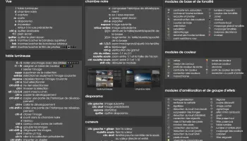

+++
title= "Carte des Raccourcis"
reward = false
postDate = false
readingTime = false
+++

darktable propose de très nombreux raccourcis. Même s'ils sont tous décrits dans le manuel, il est parfois difficile de retrouver le bon raccourci au bon moment. Pour ne pas être pris au dépourvu, voici un document regroupant en une page l'ensemble des raccourcis. N'hésitez pas à l'imprimer et la garder près de votre clavier !

Télécharger [la version "bright"](https://github.com/x9foo/darktable-refcard/releases/download/v0.5/darktable-refcard-a4paper-french-bright-0.5.pdf) ou [la version "dark"](https://github.com/x9foo/darktable-refcard/releases/download/v0.5/darktable-refcard-a4paper-french-dark-0.5.pdf)
