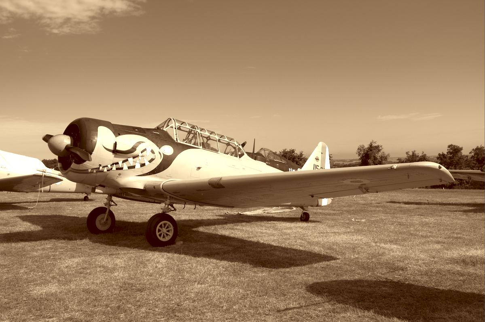

Depuis quelques jours il y a une nouvelle section sur le forum, celle-ci est consacrée à **la création de styles pour darktable**. Certains d'entre-vous utilisaient peut être le logiciel Lightroom avant de passer à darktable. Avec Lightroom, il existe un tas de presets que l'on peut télécharger sur internet, ces presets sont ni plus ni moins que des pré-réglages que l'on peut appliquer en un seul clic, ainsi c'est un gain de temps considérable dans le workflow du photographe.

Avec darktable, on retrouve cette possibilité sauf que cela s'appelle des styles. Notre logiciel libre n'ayant pas la même popularité que Lightroom, il n'existe pas de beaucoup de styles (même si des dépôts comme [dtstyle.net](https://dtstyle.net/) existe). La communauté peut remédier à ce manque ! Tout comme [les défis "éditez mon RAW"](https://darktable.fr/2016/03/13/les-defis-editez-mon-raw/), n'hésitez pas à participer au forum pour tenter des reproduire des styles et même en proposer de nouveaux !

Section du forum: [https://darktable.fr/forums/forum/traitement-photo/creation-de-styles/](https://darktable.fr/forums/forum/traitement-photo/creation-de-styles/)

Par la suite, les nouveaux styles crées seront présentés sur ce blog et hébergés sur le dépôt de la communauté darktable-fr. On en a déjà quelques uns :)

Liste des styles présentés sur darktable-fr: [https://darktable.fr/category/styles/](https://darktable.fr/category/styles/)

À vous de jouer ! :-)

