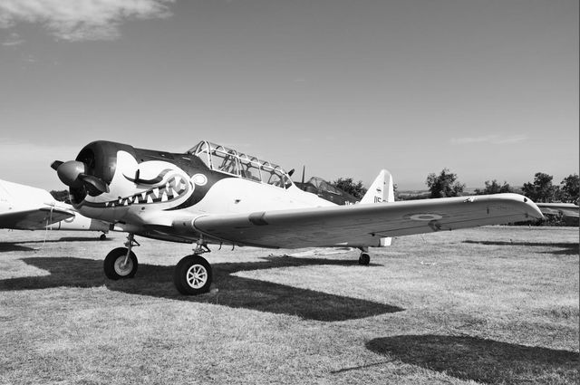

Style pour darktable pour donner un look HDR Noir & Blanc à vos photos !

## Version Soft

\[twentytwenty\]

\[/twentytwenty\]

 

**[Télécharger](/download/Styles/HDR%20Black%26White%20-%20Light.dtstyle)**

## Version Strong

\[twentytwenty\]

\[/twentytwenty\]

 

**[Télécharger](/download/Styles/HDR%20Black%26White%20-%20Strong.dtstyle)**

 

**Comment Installer un style dans darktable ?**

Après avoir téléchargé le fichier .dtstyle, démarrez le logiciel darktable, allez dans table lumineuse, sur la droite vous avez un module **_Styles_** où sont listés tout les styles importés, il ne vous reste plus qu'à cliquer sur le _**bouton importer**_ et puis de sélectionner le fichier .dstyle précédemment téléchargé. Et voilà le style est importé dans votre installation de darktable et vous pouvez dès maintenant l'utiliser :-)
