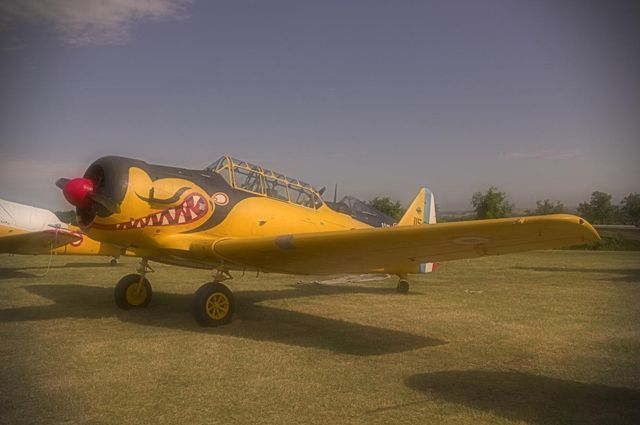

Voici un style pour darktable proposé par @leinadfr. Le style Peinture donne un effet vieilli à une photo, et on peut désactiver le filtre passe haut pour un effet moins dessiné

\[twentytwenty\]

\[/twentytwenty\]

 

**[Télécharger](/download/Styles/Peinture.dtstyle)**

 

**Comment Installer un style dans darktable ?**

Après avoir téléchargé le fichier .dtstyle, démarrez le logiciel darktable, allez dans table lumineuse, sur la droite vous avez un module **_Styles_** où sont listés tout les styles importés, il ne vous reste plus qu'à cliquer sur le _**bouton importer**_ et puis de sélectionner le fichier .dstyle précédemment téléchargé. Et voilà le style est importé dans votre installation de darktable et vous pouvez dès maintenant l'utiliser :-)
