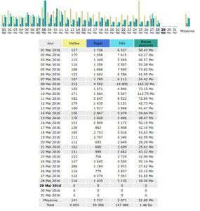
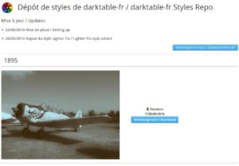
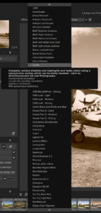

Cela fait un peu plus de 3 mois que le site darktable FR a été lancé. Un petit bilan s'impose !

Le site reste assez actif avec a**u moins une centaine de visites par jour**.

Les statistiques sont disponibles [ici](https://stats.tuxfamily.org/darktable-fr.tuxfamily.org) pour les curieux. On peut dire sans prétention que le site a atteint sa vitesse de croisière.

Comme vous avez pu le remarquer depuis quelques jours, le site arbore un nouveau thème plus claire, plus simple, c'est le thème 2016 de base de Wordpress. En fait, beaucoup se sont plaints de lenteurs lors de l'accès au site. La thème actuel est plus léger, de plus, certains plugins ont été supprimés. Bref, la rapidité d'accès au site a été optimisée au mieux. Bien sûr, toute aide dans la gestion de l’hébergement de darktable FR est la bienvenue.

Conformément à l'arrivé de [https avec notre hébergeur](https://tuxfamily.org/fr/news/2016040201), darktable Fr utilise désormais cette technologie plus sécurisée. L'adresse en http est redirigée automatiquement vers celle en https.

Petit bonus, le site héberge maintenant [un dépôt de styles pour darktable](https://darktable.fr/download/Styles/index.html).

Bien évidemment vous y retrouverez les styles déjà présentés sur darktable FR et vous aurez un moyen simple de tous les télécharger d'un coup. Certains diront qu'il existe déjà [dtstyle.net](https://dtstyle.net/) mais vous aurez noté que ce site est un peu à l'abandon, par exemple, les vignettes ne sont plus générées correctement. Pour en revenir à notre dépôt, les fichiers dtstyle sont même revus pour que le style soit affiché avec une lettre en majuscule en premier, cela évite donc d'avoir une liste un peu désordonnée dans darktable.

Enfin, il est désormais possible d'utiliser l'espace de téléchargement de 2Go gracieusement fourni par Tuxfamily pour y héberger des images, donc dorénavant, les billets du blog seront davantage composés d'images !

N'hésitez pas, au passage, [à faire un don à notre hébergeur](https://tuxfamily.org/fr/support) !

En attendant la prochaine vidéo de Carafife, si vous désirez collaborer au site, n'hésitez pas à nous contacter, que ce soit pour écrire des billets, traduire les news du site officiel de darktable...etc
