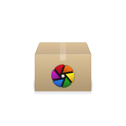

Nouvelle mise à jour mineure de la série darktable 2.0 !

Par rapport à la version 2.0.3, voici ce qu'apporte la 2.0.4:

#### Nouvelles Fonctionnalités

- Support des profiles d'entrée de niveaux de gris
- Ajour d'un profil BRG pour des tests

#### Correction du bogues

- Correction de l'Interface graphique avec GTK 3.20
- Correction des profils de couleurs embarqués
- Correction des deux problèmes avec le deflicker (exposure iop, mode = automatic)
- Correction de la suppression de fichier sous OSX
- Correction du champs Rights dans Lua

#### Support de base

- Nikon D5
- Sony ILCA-68

#### Préréglages de Balance des Blancs

- Pentax K-S1
- Sony ILCA-68

#### Nouveaux profils de bruit

- Canon PowerShot G15
- Fujifilm X70
- Olympus PEN-F
- Panasonic DMC-GF7

#### Traduction ajoutée

- Slovène

#### Mises à jour des traductions

- Catalan
- Hollandais
- Allemand
- Hébreu
- Slovaque
- Espagnol

Source: [https://github.com/darktable-org/darktable/releases/tag/release-2.0.4](https://github.com/darktable-org/darktable/releases/tag/release-2.0.4)
