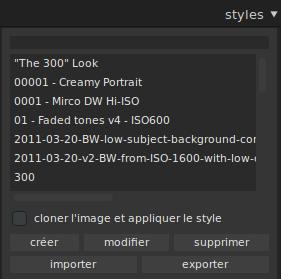

Deux styles pour darktable dans les tons de couleur du film _Sin City_.

## Version Dark Red

\[twentytwenty\]

\[/twentytwenty\]

 

**[Télécharger](/download/Styles/Sin%20City%20Dark%20Red.dtstyle)**

## Version Light Red

\[twentytwenty\]

\[/twentytwenty\]

 

**[Télécharger](/download/Styles/Sin%20City%20Light%20Red.dtstyle)**

**Comment Installer un style dans darktable ?**

Après avoir téléchargé le fichier .dtstyle, démarrez le logiciel darktable, allez dans table lumineuse, sur la droite vous avez un module **_Styles_** où sont listés tout les styles importés, il ne vous reste plus qu'à cliquer sur le _**bouton importer**_ et puis de sélectionner le fichier .dstyle précédemment téléchargé. Et voilà le style est importé dans votre installation de darktable et vous pouvez dès maintenant l'utiliser :-)
