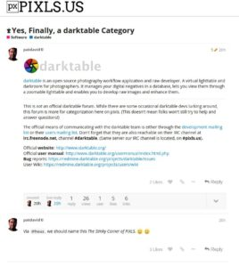

[Pixls.us](https://discuss.pixls.us/) est le blog / forum anglophone des logiciels opensource de photographie. Sur le forum de Pixls.us, il y a désormais [une catégorie dédiée à darktable](https://discuss.pixls.us/c/software/darktable) (enfin!) en plus de celles pour Rawtherapee ou G'MIC.

Si la langue de Shakespeare ne vous fait pas peur, n'hésitez pas à y aller faire un tour :-)
