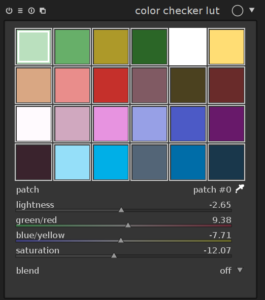

Après HaldClut, parlons cette fois de color checker lut, le prochain module officiel (contrairement à HaldCLUT) de darktable qui fait aussi parlé de lui.

Je vais vous épargner la théorie et les explications, tout est sur [cet article de PIXLS.US](https://pixls.us/blog/2016/06/color-manipulation-with-the-colour-checker-lut-module/) avec même la formule mathématique. En gros, ce module se rapproche, dans la démarche, à HaldCLUT. Cette fois au lieu de choisir une image d'entrée d'où on tire un set de couleurs à appliquer sur notre photo, le module color checker lut permet de directement choisir la couleur.

Si vous utilisez darktable dans sa version développement, voici à quoi ressemble le module que vous trouverez dans la chambre noire:

Vous avez le choix entre 24 patchs de couleurs (il est aussi possible de choisir une couleur bien précise via la pipette). Les autres paramètres sont la luminosité (L), vert-rouge (a), bleu-jaune (b) et la saturation (C). Une fois de plus, le module peut utiliser les modes de fusion.

Dans la pratique, ce module sera utile, comme le montre l'article de PIXLS.US, dans le cas des portraits par exemple pour la retouche de peau, ton de peau, les yeux...etc

Et comme HaldCLUT, on peut émuler les styles de certains appareils photo comme ceux de Fujifilm, d'ailleurs vous pouvez en tester en téléchargeant ce fichier: [https://jo.dreggn.org/blog/darktable-fuji-styles.tar.xz](https://jo.dreggn.org/blog/darktable-fuji-styles.tar.xz). À l'intérieur se trouve les fichiers dstyle (provia velvia astia classic-chrome) à importer via la table lumineuse dans darktable.

Une fois que ce module sera disponible dans la version stable de darktable, on peut imaginer que des utilisateurs créeront des styles imitant par exemple les tons de couleurs des appareils Canon ou encore comme [les émulations de films de Pat David que l'on trouve dans G'MIC](http://gmic.eu/film_emulation/).
