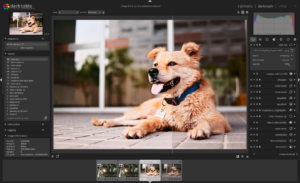
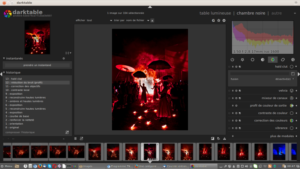
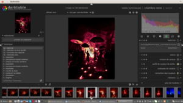

Sur [le forum de Pixls.us](https://discuss.pixls.us/t/haldclut-module-in-darktable/1735), un utilisateur a développé un module HaldCLUT.

## HaldCLUT ?

Si vous voulez en savoir plus sur HaldCLUT, vous pouvez consulter [cette page](http://www.graphicsmagick.org/api/hclut.html), pour faire court, c'est un algorithme qui utilise une image d'entrée afin d'appliquer ses couleurs sur une autre image. On retrouve cette fonction [avec Rawtherapee](http://www.digicrea.be/film-simulation-in-rawtherapee-with-hald-clut/) et Pat David a même crée [un film emulation pack](http://blog.patdavid.net/2015/03/film-emulation-in-rawtherapee.html) (ensemble d'images d'entrée à utiliser).

## Avec darktable ?

Pour avoir ce module, il suffit de compiler darktable en utilisant [le dépôt git de PkmX](https://github.com/PkmX/darktable/tree/haldclut). Une fois installé, dans la table lumineuse, vous aurez un nouveau module nommé _hald clut_.

## Résultats

 Le module HaldCLUT en action

Dans ce nouveau module, il vous suffira d'indiquer le chemin de l'image d'entrée, pourquoi pas une incluse dans le pack de Pat David. Le module dispose bien sûr des modes de fusion.

Notre ami, JPG, l'a même testé pour nous:

Avant

 

Après (avec l'image d'entrée Lomography Redscale 100 )

 

Comme vous pouvez le constater, ce module est particulièrement intéressant mais n'est pas officiel. Il est toujours possible que l'équipe de développement puisse être suffisamment intéressée pour l'inclure dans une future version de darktable, qui sait...
