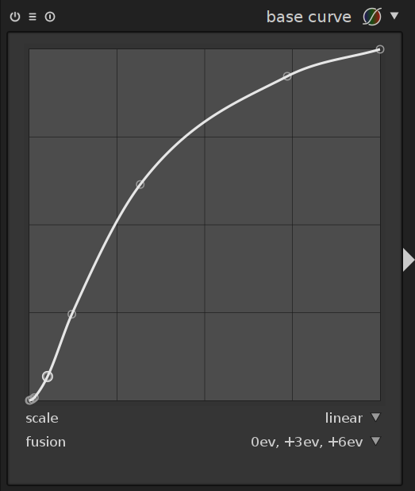

Une nouvelle fonctionnalité (oui encore une autre!) est actuellement en cours de développement et devrait être disponible dans la prochaine version majeure de darktable.

Il s'agit de la fusion d'exposition. Concrètement cette fonctionnalité apparaîtra dans le module de **courbe de base** au niveau des modes de fusion.

Le principe est de fusionner des images prises à différentes expositions. Pour en savoir plus sur la fusion d'exposition, vous pouvez consulter [ce lien](http://web.stanford.edu/class/cs231m/project-1/exposure-fusion.pdf). Cela peut s'apparenter à la technique du HDR mais cet outil est plus proche de ce que peut faire [enfuse](http://wiki.panotools.org/Enfuse), c'est à dire du tonemapping sans passer par la création d'une image HDR (qui nécessite plusieurs prises de vue).

L'outil de fusion d'exposition permet donc **de fusionner 2 ou 3 fois la même photo** dépendamment si vous avez sélectionnez **0ev,+3ev** ou **0ev,+3ev+6ev**. En fait, darktable crée automatiquement des copies de la photo boostées par 3 stops additionnels (+3EV et +6EV).

N'hésitez pas à laisser vos avis sur ce nouvel outil dans les commentaires. Plus d'infos et des exemples d'images sont disponibles sur le blog officiel de darktable: http://www.darktable.org/2016/08/compressing-dynamic-range-with-exposure-fusion/
