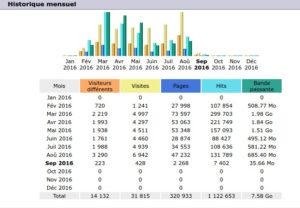
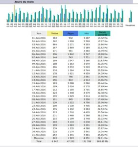
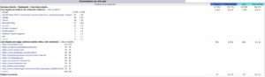

Je vais vous expliquer la raison d'un tel titre. Généralement le mois d'août est un mois estival propice aux vacances, les gens ont tendance à profiter du soleil plutôt surfer sur Internet (et on les comprends). Seulement voilà, je ne sais pas quels sont les statistiques des autres sites mais celles de darktable FR sont excellentes. Et oui, cela fait six mois que le site est en ligne et le records de visites à été atteint au mois d'août.

Je connais pas trop la raison, peut être le retour des tutoriels de carafife ?

Chose étrange, la plupart des accès aux site ont pour origine Facebook.

Côté membres, il y a régulièrement des inscriptions (j'ai dû procédé à un ménage d'ailleurs à cause de quelques comptes qui ressemblaient à des robots de spam). Bref, darktable semble attirer de nouveaux adeptes en dépit de l'abandon du portage pour Windows par Partha.

Continuez à faire connaître le logiciel darkatble et ainsi faire vivre ce site. Merci :-)
