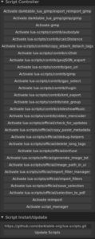

Voilà une nouvelle qui devrait intéresser les utilisateurs de scripts en langage LUA avec darktable. Un Scripts manager ou Gestionnaire de scripts va peut-être être inséré dans le code de darktable d'après [ce Pull Request](https://github.com/darktable-org/darktable/pull/1254#issuecomment-244706787).

Il s'agit d'un script lua qui pourra gérer vos scripts lua mais aussi mettre à jour certains d'entre-eux, en fait, ceux faisant parti du dépôt suivant:

[https://github.com/darktable-org/lua-scripts.git](https://github.com/darktable-org/lua-scripts.git)

Je me suis amusé à récupérer le script en question:

[https://github.com/wpferguson/darktable/raw/008d5e7284b9f03dd8035d7317b1d04de737a422/data/lua/script_manager.lua](https://github.com/wpferguson/darktable/raw/008d5e7284b9f03dd8035d7317b1d04de737a422/data/lua/script_manager.lua)

Je l'ai placé dans $HOME/.config/darktable/lua/ puis j'ai rajouté au fichier lua.rc (du dossier darktable) la ligne suivante:

> require "script_manager"

Le script a l'air de fonctionner plus ou moins bien avec la version stable 2.0.5 de darktable. Il a apparaît sur le panneau de gauche de la table lumineuse:

Le script affiche la liste de tout les scripts lua installés avec pour certain la possibilité de les activer.

Plus bas, il est possible de mettre à jour les scripts du dépôt git comme je l'ai expliqué plus haut.

Espérons que cette requête soit validée ou, dans le pire des cas, que le script puisse être disponible sur le dépôt officiel:

[https://github.com/darktable-org/lua-scripts](https://github.com/darktable-org/lua-scripts)
