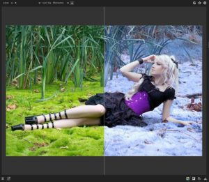
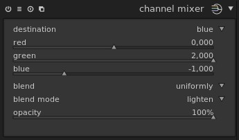
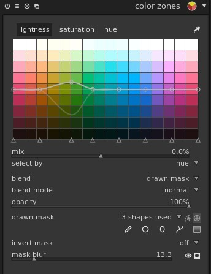
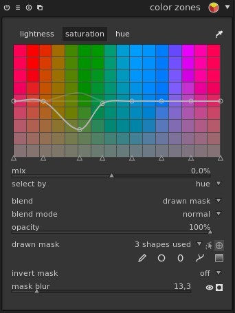
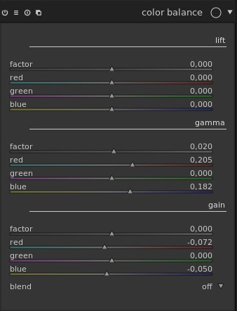
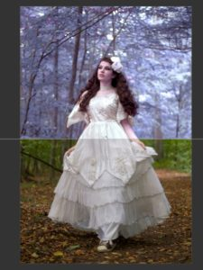

Voici un tutoriel de Benja1972 présenté sur le forum PIXLS.US (lien en fin d'article). Le but de ce tutoriel est de reproduire le même effet de neige de noel qu'il est possible de faire avec Photoshop:

Voici la procédure en trois étapes:

## 1. Mixeur de canaux

## 2. Zones de couleurs

C'est un peu astucieux car ici on change les tons VERTS sur la photo alors qu'en réalité c'est les tons BLEUS.

a)

b)

## 3. Balance des couleurs

Là c'est pour rendre la peau du modèle plus naturelle, selon les goûts.

Exemple:

N'hésitez pas à partager vos clichés utilisant cette technique :-)

Source: [https://discuss.pixls.us/t/winter-snow-photo-effect-in-darktable/2913](https://discuss.pixls.us/t/winter-snow-photo-effect-in-darktable/2913)
