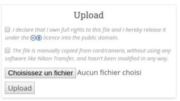
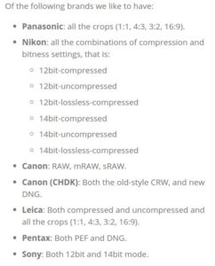
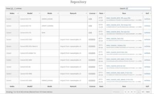

Le site [PIXLS.US](https://pixls.us/) de Patrick David dispose d'une nouvelle section !

Peut-être que vous connaissez le site [Rawsamples.ch](http://rawsamples.ch/), si ce n'est pas le cas, ce site permet d'uploader des fichiers RAW et d'ainsi contribuer à la prise en charge d'appareils photo par des logiciels comme darktable.

Désormais Rawsamples.ch laisse ca place à [raw.pixls.us](https://raw.pixls.us/) ! Plus moderne, plus claire, les fichiers doivent être sous licence **Creatives Commons Zero**.

Les gestionnaires sont à la recherche de fichiers RAW bien précis, n'hésitez pas à consulter le site régulièrement.

Le site dispose d'une base de données (issue de celle de rawsamples.ch) mais n'hésitez pas l'agrandir si votre appareil n'est pas listé ;-)

Bonne initiative de la part de nos amis de PIXLS.US !
