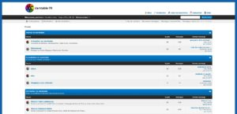
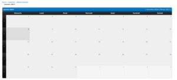
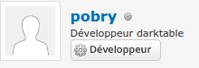
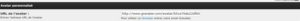
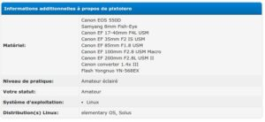

Quand j'ai lancé le site darktable FR, j'avais opté pour une plateforme de forum bbpress car je voulais quelques chose de simple et surtout de relié au blog sur lequel vous êtes et qui utilise Wordpress.

Avec le temps, le site accueille plus d'utilisateurs et ces derniers éprouvent quelques faiblesses dans l'utilisation (parfois limitée) de bbpress. Après quelques tests, j'ai opté pour un nouveau forum: MyBB

Avant de faire le passage, j'ai d'abord fait en sorte que le design se rapproche du thème du blog. Je ne suis pas un super expert en CSS mais j'ai réussi à obtenir le fond bleu avec le cadre blanc:

Un plugin assure la passerelle entre les comptes du forum et du blog, donc en théorie, un utilisateur du forum est en mesure de laisser un commentaire sur un article en réutilisant le même compte.

Ce nouveau forum vient avec une fonction calendrier qui sera utile pour les utilisateurs afin d signaler des événements comme des rencontres photo, des soirées formation à darktable...etc

Certains membres peuvent même avoir des titres spéciaux:

Pour des raisons de quota limité avec l'hébergeur, la possibilité d'uploader des pièces jointes est désactivée, toutefois il y a un plugin qui permet facilement d'héberger vos images sur le site imgbb et des les afficher dans vos messages de manière très simple.

De plus, si vous voulez un avatar il suffit de l'héberger ailleurs et d'inscrire le lien direct ou, plus facile, d'utiliser le service Gravatar comme indiqué dans les paramètres de votre profil:

Sur votre profil, vous pourrez s'il vous le souhaitez des informations pertinentes comme votre matos photo, votre OS, votre niveau en photographie, votre distribution linux...etc

Un système de messages privés est également disponible. Il est possible que de petits soucis demeurent, n'hésitez pas à le signaler directement sur le forum à la section darktable FR. ;-)
