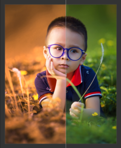
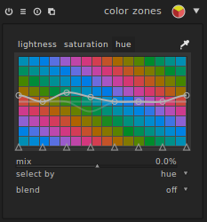
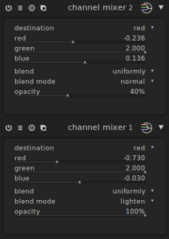

Voici un style présenté sur [le forum PIXLS.US](https://discuss.pixls.us/t/autumn-effect-for-portrait-in-greens-in-darktable/3498) qui permet d'appliquer un effet _automne_ sur un portrait comportant des tons vert.

Exemple:

Le style tire son inspiration de cette vidéo: [https://www.youtube.com/watch?v=Hm6z9nIA72c&t=0s](https://www.youtube.com/watch?v=Hm6z9nIA72c&t=0s)

Il utilise deux modifications des mixeurs de canaux et l'utilisation du module de zone de couleurs:

Vous pouvez télécharger le style sur ce lien: [https://pixls-discuss.s3.amazonaws.com/original/2X/b/b4bbb3e687cda88604a6eeafe1969274c83d4a17.dtstyle](https://pixls-discuss.s3.amazonaws.com/original/2X/b/b4bbb3e687cda88604a6eeafe1969274c83d4a17.dtstyle)
