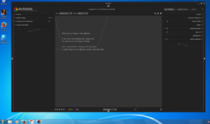

Et oui, à en croire le dernière commentaire de houz [ici](https://github.com/darktable-org/darktable/pull/1327#issuecomment-294936498), darktable peut fonctionner **nativement** sous Microsoft Windows sans trop de problème et les modifications ont été apportées directement au code source. Voilà de quoi faire plaisir aux réfractaires à GNU/Linux et Mac.

Attention Lightroom et les autres n'ont qu'à bien se tenir :-)
