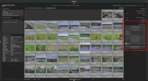
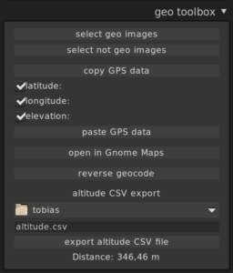
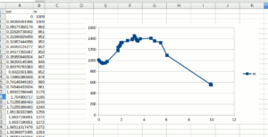

Il existe désormais un script geo toolbox pour darktable !

C'est uns script lua qui vous pouvez télécharger [ici](https://github.com/darktable-org/lua-scripts/blob/master/contrib/geoToolbox.lua).

Concrètement, ce script rajoute un nouvelle toolbox dans la Table Lumineuse:

Voyons de plus près:

Avec les deux premiers boutons vous pouvez sélectionner toutes les images avec ou sans informations de localisation dans les exifs.

Avec les boutons 3 et 4, vous pouvez copier les informations GPS d'une image à l'autre. Il est même possible de choisir quelles informations (latitude, longitude et altitude).

Le bouton 5 ouvre l'application Gnome Maps pour montrer la position directement avec ce logiciel.

Le bouton reverse geocode permet d'utiliser le service web [Mapbox](https://www.openstreetmap.org/) pour récupérer les informations depuis [OpenStreetMap](http://openstreetmap/) sur le lieu de la photo sélectionnée et montrer le tout dans une fenêtre.

Le bouton export altitude CSV file permet d'exporter les informations, vers un fichier CSV, des images sélectionnées avec l'altitude en mètre dans une colonne et la distance entre les images ajoutées entre elles en kilomètre dans une seconde colonne. Par exemple avec LibreOffice Calc vous pouvez avoir un diagramme comme ceci:

Source: [https://dablogter.blogspot.fr/2017/04/darktable-geotoolbox-script.html](https://dablogter.blogspot.fr/2017/04/darktable-geotoolbox-script.html)
