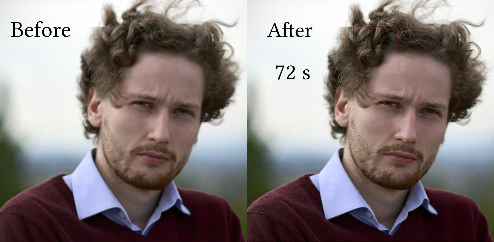

Aurélien Pierre, membre de la communauté, développe un algorithme de défloutage, particulièrement impressionnant au passage, qui pourrait de devenir un module de darktable.

Vous trouverez plus de détails [sur son site](https://photo.aurelienpierre.com/maths-appliquees/) et [le code sur github](https://github.com/aurelienpierre/Image-Cases-Studies).

N'hésitez pas à dire ce que vous en pensez sur [le forum](https://darktable.fr/forum/showthread.php?tid=1892). En tout cas, les développeurs semblent intéressés et on espère une intégration dans darktable :-)
