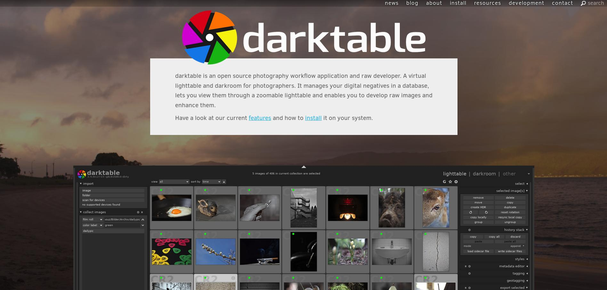

Certains diront qu'il était temps ! [Le site officiel de darktable](https://www.darktable.org) fait peau neuve !

On doit cela à houz qui a travaillé dur pour migrer le site depuis Wordpress vers un nouveau statique utilisant [Python](https://www.python.org/ "Python homepage")/[Pelican](https://blog.getpelican.com/ "Pelican Static Site Generator"). Outre que cela améliore les problèmes de sécurité, il est maintenant possible de contribuer directement grâce [au dépôt Github du site](https://github.com/darktable-org/dtorg). Vous noterez également que darktable se rapproche de [PIXLS.US](https://pixls.us "PIXLS.US - Free Software Photography") qui regroupe la communauté d'utilisateurs de logiciel libre en photographie. Les commentaires seront directement transmis sur [le forum de Pixls.us](https://discuss.pixls.us/).
