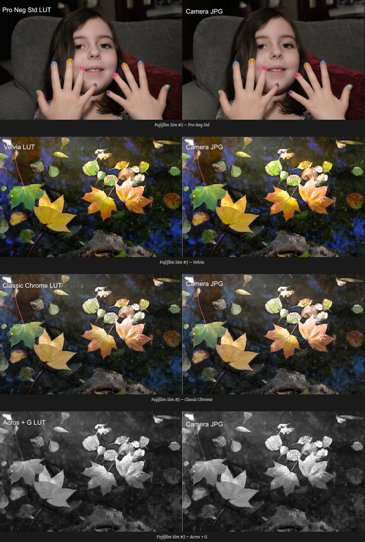

Grace à la détermination de [Jean-Paul Gauche](https://www.facebook.com/jeanpaul.gauche) et [Andy Costanza](https://andycostanza.com), ils ont réussi à transformer en style darktable, les 15 modes de simulation de film officiel de Fujifilm que [Stuart Sowerby](https://blog.sowerby.me/fuji-film-simulation-profiles/) a créé pour rawtherapee.

Ces styles vous permettront de retrouver le rendu de simulation de film directement issu des JPEG des boitiers Fujifilm de dernière génération à base de X-Trans CMOS III, à savoir le [X-Pro2](http://amzn.to/2ASlFkd), le [X-T2](http://amzn.to/2DmWby3), le [X-T20](http://amzn.to/2ARV4nb) et le [X100F](http://amzn.to/2D2tYPB)

Vous y retrouverez, plus précisément, le mode de simulation de film :

- PROVIA/STANDARD
- Velvia/VIVID
- ASTIA/SOFT
- CLASSIC CHROME
- PRO Neg.Hi
- PRO Neg.Std
- ACROS, ACROS +Ye, ACROS +R et ACROS +G
- MONOCHROME, MONOCHROME +Ye, MONOCHROME +R et MONOCHROME +G
- SEPIA

Nous les avons rassemblés dans un Zip que vous pourrez télécharger en cliquant [**ICI**](https://darktable.fr/download/Fuji_XTrans_III_dtstyles.zip)

Comme pour n'importe quel autre style, il vous suffira de l'importer depuis le module "styles" de la table lumineuse
