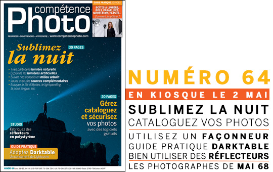
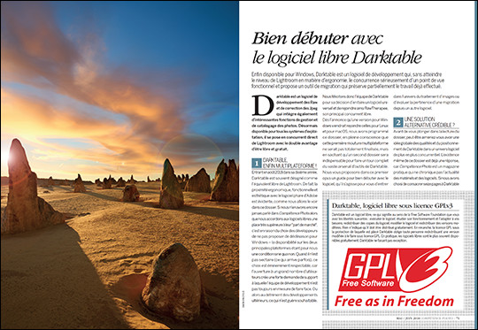
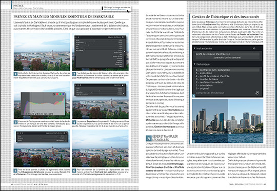

C'est avec un grand plaisir que nous vous annonçons qu'un dossier, écrit par Patrick Moll, de pas moins 16 pages, consacré à darktable se trouve dans le numéro 64 de Compétence Photo disponible en kiosque depuis le 2 mai. De la bonne pub pour notre logiciel préféré :-)

Source: [https://www.competencephoto.com/Competence-Photo-Numero-64-en-kiosque-le-2-mai-2018\_a2990.html](https://www.competencephoto.com/Competence-Photo-Numero-64-en-kiosque-le-2-mai-2018_a2990.html)
