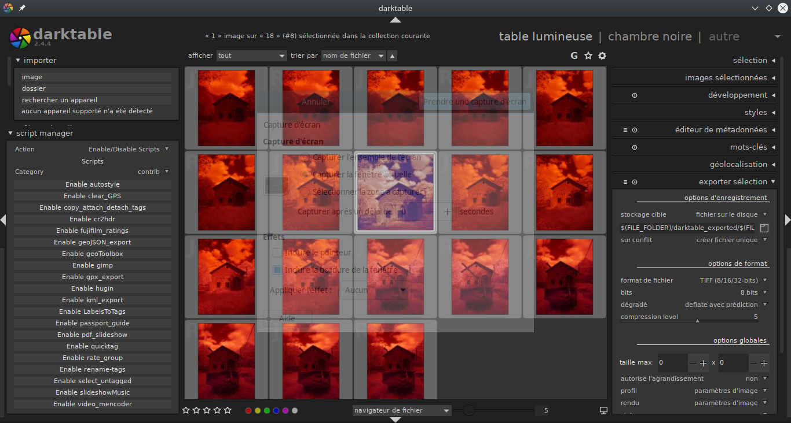

[Bill Ferguson](https://discuss.pixls.us/u/wpferguson) a écrit un script Lua qui permet d'activer/désactiver les autres scripts Lua avec un menu en bas à gauche de la "table lumineuse" :  il le partage : https://github.com/wpferguson/script-manager Il utilise Git pour se mettre à jour et peut être utilisé dans les 3 systèmes d'exploitation. Philippe (@valmy) avait fait un tuto sur une autre façon d'avoir tous les scripts Lua : https://darktable.fr/2018/03/installatio...ous-linux/ Bon usage.
