Si vous avez déjà essayé de traiter une photo prise en contre-jour ou en plein soleil, vous avez déjà rencontré ce problème : le contraste est tellement violent que :

- soit vous sacrifiez les hautes lumières,
- soit vous sacrifiez les basses lumières,
- soit vous essayez de récupérer les tonalités extrêmes, et là vous avez des couleurs délavées ou sursaturées, ou des pertes de texture.

## Comprendre le problème

Vous êtes en voiture sur une route de campagne, de nuit. Tout à coup, une voiture surgit dans le sens inverse, pleins-phares. Éblouit, vous ne voyez plus le bord de la route, trop sombre. Pourquoi ? Vous avez un problème de plage dynamique : la différence de luminosité entre les phares et le bord de la route est trop importante, et donc tout ce qui n'est pas sur la route vous semble indistinctement noir.

L'œil humain a une plage dynamique estimée à 20 EV. L'EV (_exposure value_, en français : IL, [indice de lumination](https://fr.wikipedia.org/wiki/Indice_de_lumination)) est une unité logarithmique (en base 2) de mesure de la luminance : ajouter 1 EV revient à multiplier l'intensité lumineuse par 2.

Dans un bureau, on conseille généralement une luminosité de 300 lux. Si votre plage dynamique oculaire est de 20 EV, cela signifie que vous pouvez distinguer des objets dont l'éclairement minimal est de 300/2/2/2/2/2/2… = 0,0003 lux. Si vous avez un objet éclairé à 0,0003 lux posé sur un fond éclairé à 0,00001 lux, vous ne verrez que du noir, et aucune démarcation. En gros, tout ce qui sort de la plage dynamique est indiscernable.

Un appareil photo fonctionne à peu près pareil… si ce n'est que sa plage dynamique est de 10-15 EV. Là ou ça se corse, c'est qu'un écran photo étalonné, n'a qu'une plage dynamique de 8 EV (soit un contraste d'environ 300:1), et un tirage papier moins de 7.5 EV (ce qui correspond à un Dmax de 2.3, valeur typique d'un papier baryté photochimique). On a alors un gros problème : faire rentrer la grande plage dynamique de l'appareil, au chausse-pied, dans celle de l'écran ou du tirage, sans perdre trop de détails ni de contraste. Pour ce faire, on dispose de plusieurs stratégies, et vous vous doutez bien que ce ne sont pas les plus simples qui sont les plus efficaces. Tout se paie.

La difficulté est d'assombrir les hautes lumières, d'éclaircir les basses lumières, tout ça sans perdre de contraste global ni de contraste local, et en conservant des couleurs correctement saturées. Parce que, en RGB, on ne peut pas modifier séparément les couleurs et la luminosité, et les couleurs peuvent finer soit délavées soit trop saturées.

## La fausse bonne idée

darktable dispose d'un module ombres et hautes lumières qui permet de faire ceci facilement. Mais voilà, ce que fait ce module est une correction spatiale : il identifie des zones sombres et des zones claires, et corrige les pixels suivant qu'ils appartiennent ou non à une zone claire ou sombre, et pas en fonction de leur luminanc individuelle. C'est un fait un filtre passe-bas dont le contraste est inversé et fusionné en incrustation dans l'image :

\[caption id="attachment\_5942" align="aligncenter" width="684"\][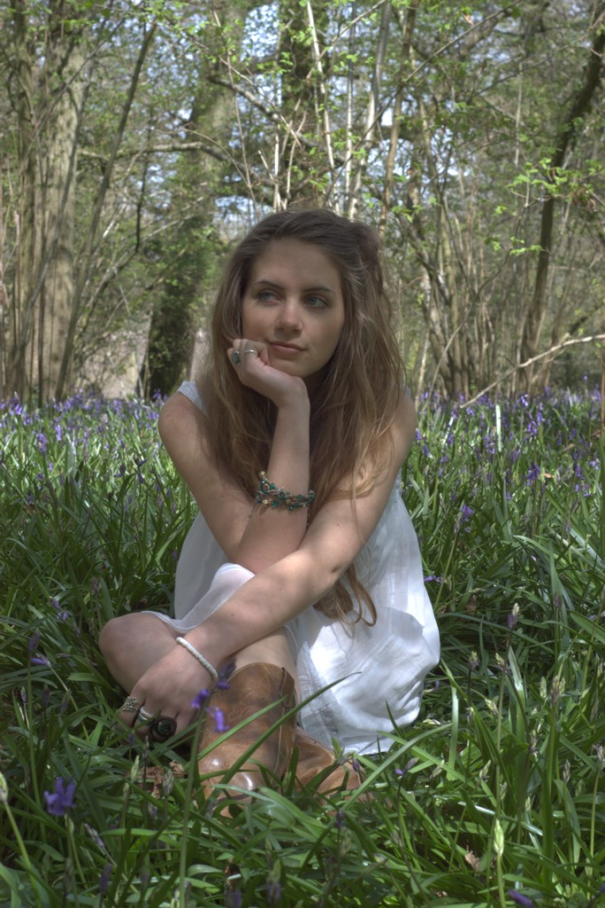](http://darktable.fr/wp-content/uploads/2018/08/DSC_0012-original.jpg) Original\[/caption\]

\[caption id="attachment\_5940" align="aligncenter" width="1292"\][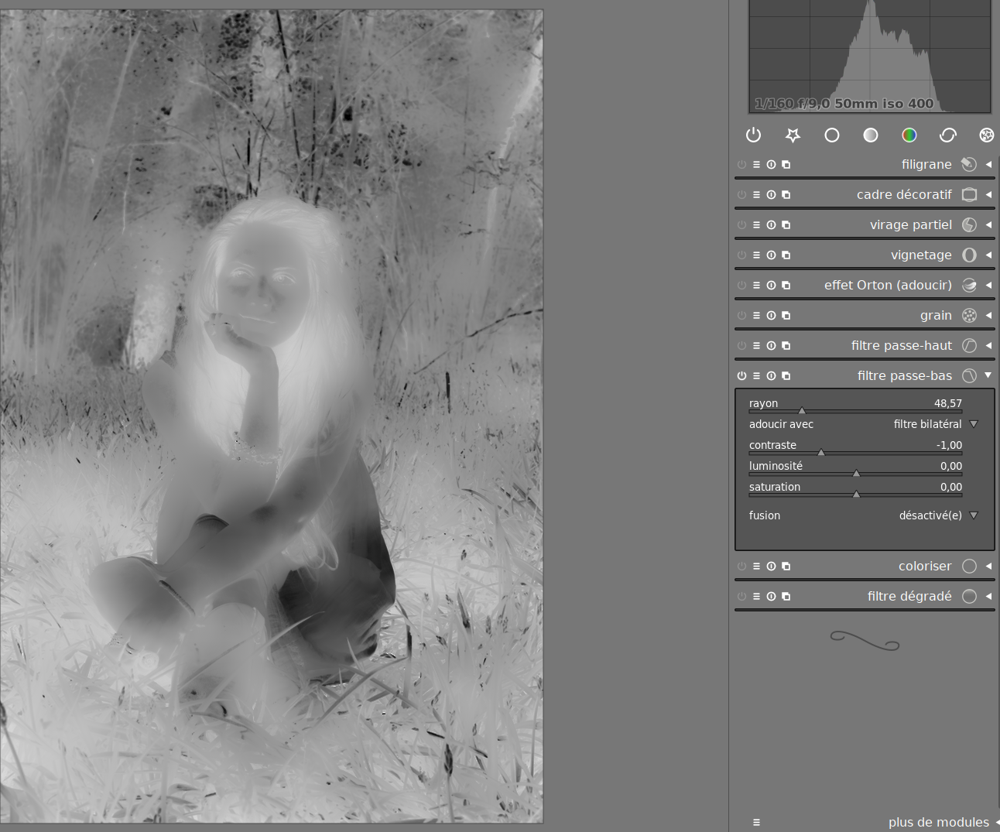](http://darktable.fr/wp-content/uploads/2018/08/passe-bas.png) Carte de luminance inversée utilisée pour corriger le contraste par le module ombres et hautes lumières (simulée avec le module passe-bas).\[/caption\]

\[caption id="attachment\_5941" align="aligncenter" width="684"\][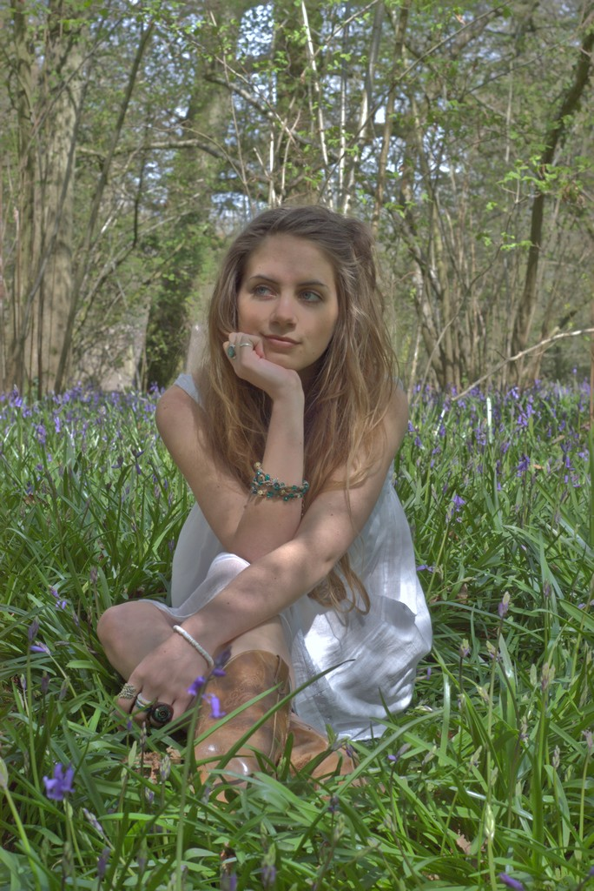](http://darktable.fr/wp-content/uploads/2018/08/DSC_0012-basses-frequences.jpg) Contraste inversé avec le module passe-bas en appliquant la carte de luminance ci-dessus en fusion incrustation — notez que le module ombres et hautes lumières donne un meilleur résultat puisqu'il offre des contrôles plus précis.\[/caption\]

En paysage, où vous avez des zones bien séparées (ciel, mer, terrain), ça marche bien. C'est alors l'équivalent d'un dodge & burn à la Ansel Adams :

https://www.youtube.com/watch?v=e9v18cQ0f2E

En portrait, vous le voyez dans l'exemple ci-dessus, le résultat a tendance à avaler du contraste local et donc à aplatir le modelé du visage et du corps. En effet, on n'a pas, sur un visage, des démarcations aussi franches qu'en paysage entre les zones claires et les zones sombres. Par contre, ce module fait des merveilles, bien réglé, pour supprimer des zones brillantes sur un visage (arrête du nez, front huileux), précisément parce que, dans ce cas là, vous voulez retirer du contraste.

## Mode d'emploi

_Note : j'ai créé un style contenant l'essentiel des modules utilisés dans la suite pour vous permettre de gagner du temps. Évidemment, ce style est un point de départ pour vos réglages, pas une formule magique qui marche tout le temps. [Téléchargez le](https://www.dropbox.com/s/w9harzr6kzxvs5j/Fix%20dynamic%20range.dtstyle?dl=0)._

Si j'ouvre une photo prise en plein soleil, avec les courbe de base par défaut (ici, similaire Nikon), voici ce qu'on obtient :

\[caption id="attachment\_5944" align="aligncenter" width="684"\][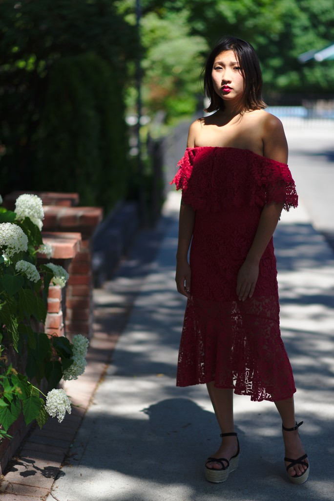](http://darktable.fr/wp-content/uploads/2018/08/Shoot-Minh-Ly-Toronto-0043-_DSC0251-base.jpg) À l'ouverture de la photo, exposition et balance des blancs ajustées\[/caption\]

Le nez est aplati dans le visage, la peau est jaune trop saturée (même pour une asiatique), les ombres sont très marquées : on ne voit pas grand chose. Première chose à faire : changer la courbe de base.

On applique une courbe de base spéciale, tirée du [profil Tassinflat](http://photographio.com/nikon-flat-picture-control-videography-photographios-cineflat/) créé pour enregistrer des vidéos sans perte de détail, pour faciliter le post-traitement. Ces profils neutres et plats (N-log, S-log, etc.) sont très populaires chez les vidéastes qui filment au réflex car les encodages et compressions vidéos appliquées évacuent complètement les zones sans détails. Il est donc important, à l'enregistrement, d'avoir un profil très neutre, peu contrasté, pour avoir un enregistrement complet qui permettent ensuite, en post-production, de jouer avec une image entière (la vidéo sur réflex n'est pas en raw). Ici, c'est un autre objectif que nous visons : il s'agit de récupérer les détails le plus bas possible dans la pile des modules (le module courbe de base est l'un des premiers à s'appliquer, juste après l'exposition).

 

[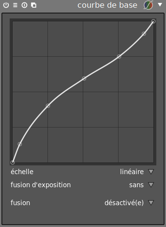](http://darktable.fr/wp-content/uploads/2018/08/courbes-de-base.png)On voit que cette courbe va atténuer les hautes lumières et éclaircir dramatiquement les ombres, sans toucher aux extrêmes.

On ajoute ensuite la correction du profil d'entrée, avec le gamma à 0.45 (ce qui correspond à un gamma réel de 2.2 = 1/0.45) et le linéaire à 0.5. Le linéaire indique en dessous de quelle valeur de luminance la correction du profil ne s'applique pas. Ceci réalise [une correction du gamma](https://fr.wikipedia.org/wiki/Correction_gamma), et va à nouveau donner un peu plus de présence aux tons moyens, au risque toutefois de cramer les hautes lumières (augmentez de préférence le linéaire, dans ce cas).

[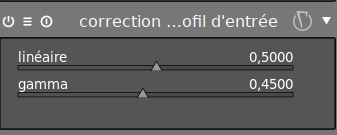](http://darktable.fr/wp-content/uploads/2018/08/profil-entrée.png)On a alors ce résultat :

\[caption id="attachment\_5947" align="aligncenter" width="684"\][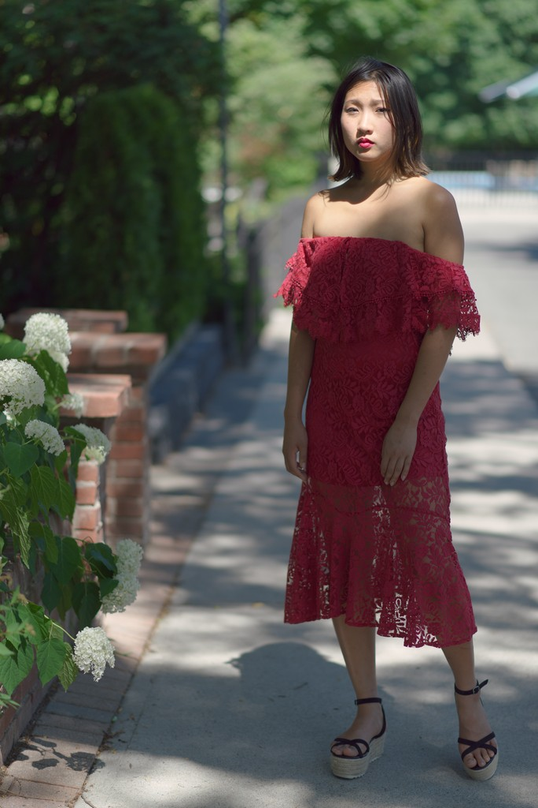](http://darktable.fr/wp-content/uploads/2018/08/Shoot-Minh-Ly-Toronto-0043-_DSC0251-neutre.jpg) Application du profil neutre\[/caption\]

C'est déjà beaucoup plus lisible. On a donc une base saine, il va falloir ensuite ajuster l'exposition de façon à caler l'histogramme bien à droite mais sans avoir de zone brûlée. Ici, c'est l'arrête du nez qui nous fournit la référence d'exposition. On s'arrête juste avant de perdre la texture de peau.

[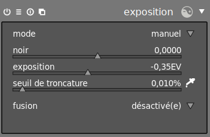](http://darktable.fr/wp-content/uploads/2018/08/exposition.png)Pour protéger les hautes lumières, on a dû assombrir, ce qui est mal car ce n'est pas ce qu'on cherche. On a alors deux options :

1. diminuer le linéaire, dans la correction du profil, pour éclaircir les tons moyens,
2. utiliser la fusion d'exposition, dans la courbe de base.

La première méthode donne de bons résultat en contre-jour, quand le sujet ne reçoit pas directement la lumière du soleil. Ici, le sujet est éclairé directement, et cette méthode va provoquer la perte des détails sur le visage. On va donc préférer la deuxième méthode qui, en revanche, va donner des effets de bords dans les photos en contre-jour.

[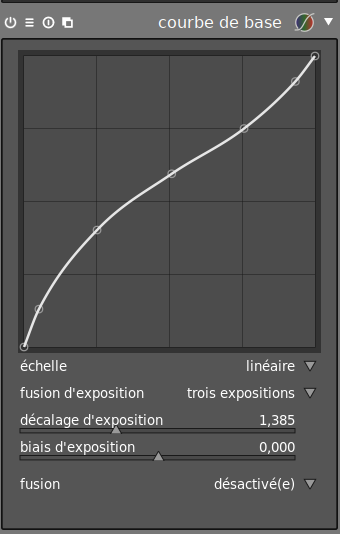](http://darktable.fr/wp-content/uploads/2018/08/courbe-fusion.png)Le résultat est alors :

\[caption id="attachment\_5950" align="aligncenter" width="684"\] Avec fusion d'exposition\[/caption\]

Tout ceci est très fade, mais c'était le but : récupérer la plage dynamique. À présent, on va rajouter du contraste en passant par la courbe des tonalités en mode manuel. Il s'agit de remettre une très légère courbe en S en luminance.

[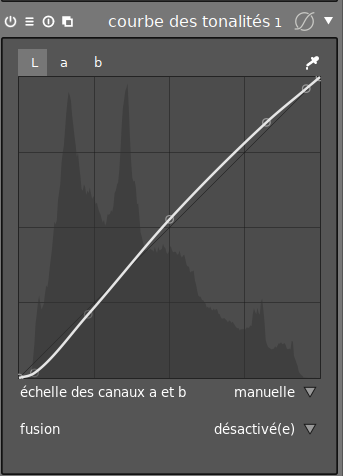](http://darktable.fr/wp-content/uploads/2018/08/tonalites-L.png)Et, pour ajuster les couleurs, on procède de même sur les canaux a et b.

[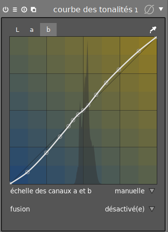](http://darktable.fr/wp-content/uploads/2018/08/tonalites-a.png)

\[caption id="attachment\_5954" align="aligncenter" width="684"\][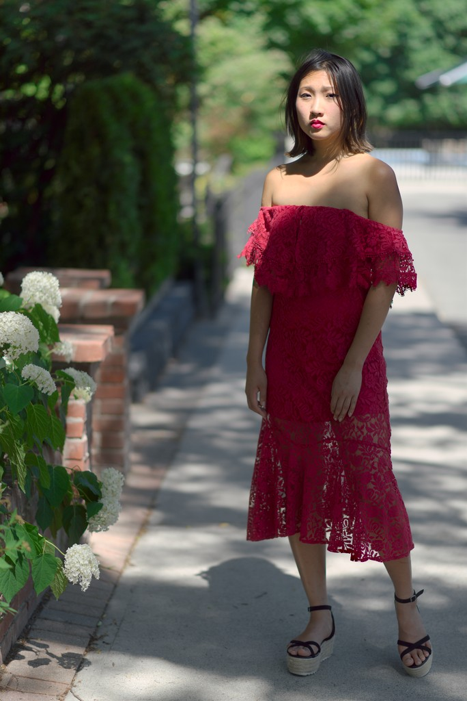](http://darktable.fr/wp-content/uploads/2018/08/Shoot-Minh-Ly-Toronto-0043-_DSC0251-contraste.jpg) Après ajout de contraste\[/caption\]

Dernière étape : on se rend compte que les hautes lumières sont étrangement saturées, ce qui arrive très souvent quand on manipule trop les valeurs RGB. En effet, la charte de couleurs utilisée pour réaliser de profil de couleur d'entrée a une plage dynamique de 8 EV environ, on a donc dilaté ce profil et ajouté des erreurs. Pour compenser cette dérive, on va désaturer sélectivement les hautes lumières avec le module zones de couleurs.

\[caption id="attachment\_5956" align="aligncenter" width="684"\] Après la correction de saturation des hautes lumières.\[/caption\]

Restent alors les petits détails, suivant votre goût personnel : j'ai retiré 0.5 EV sur le visage en utilisant le module exposition et un masque dessiné oval, ajouté 0.33 EV d'exposition sur les fleurs avec un masque dessiné pinceau et une légère vignette.

Optionnellement, le modules zones permet, en utilisant le [_zone system_ d'Ansel Adams](https://fr.wikipedia.org/wiki/Zone_system), de fignoler délicatement le contraste local. Ici, on veut remettre du contraste sur la robe, qui est dans la 2e zone de luminance (depuis la gauche), c'est pourquoi on étire ses limites haute et basse :

[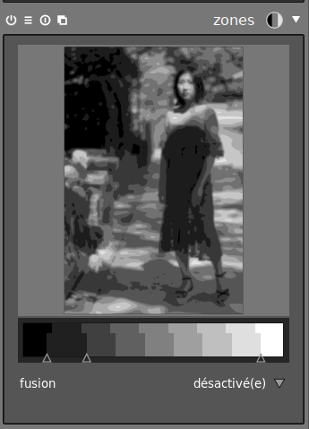](http://darktable.fr/wp-content/uploads/2018/08/zones.png)Le résultat n'est pas la photo du siècle (l'expression de la modèle, la lumière, etc. laissent à désirer), mais un exemple assez parlant de ce type de retouche. Notez que l'augmentation du constraste local sur la robe se fait au détriment du modelé des jambes, qui sont dans la 3e zone, qui est du coup réduite. C'est le défaut principal de ce module, où l'on est obligé de déshabiller Paul pour habiller Jean…

\[caption id="attachment\_5959" align="aligncenter" width="684"\][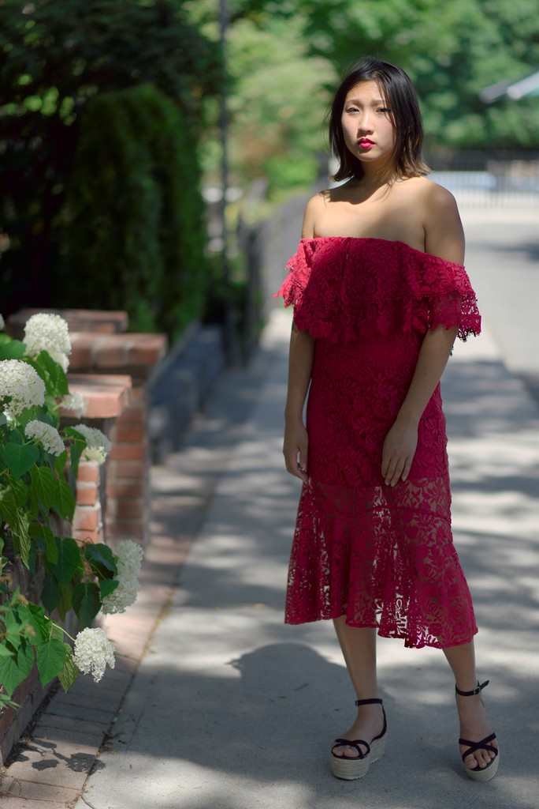](http://darktable.fr/wp-content/uploads/2018/08/Shoot-Minh-Ly-Toronto-0043-_DSC0251-zones.jpg) Final\[/caption\]

## Autre exemple

Je vais reprendre la photo du début, issue d'un [concours RAW de Jared Polin](https://froknowsphoto.com/raw-edit-of-the-week-25/) dont j'ai déjà parlé dans mon [précédent article](http://darktable.fr/2018/08/darktable-logiciel-gratuit-pour-non-professionnel/).

\[caption id="attachment\_5919" align="aligncenter" width="681"\] Retouche Jared Polin - Lightroom\[/caption\]

La photo date de 2011, et la retouche porte la trace de son époque : un goût prononcé pour les couleurs saturées et les contrastes marqués, alors même que les appareils photos de l'époque affichaient à peine plus de 10 EV de plage dynamique à 100 ISO, donc contrastaient naturellement plus. Ce style est passé de mode depuis quelques années, avec le renouveau de la pellicule couleur et un engouement pour les styles qui émulent ce rendu plus doux, plus pastel, et finalement plus poétique. Voici donc ma retouche personnelle, faite avec la méthode présentée ici :

\[caption id="attachment\_5961" align="aligncenter" width="684"\][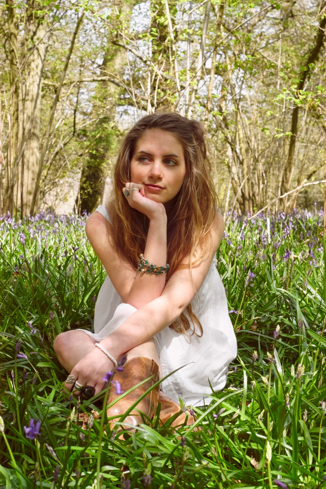](http://darktable.fr/wp-content/uploads/2018/08/DSC_0012-retouche-perso.jpg) Retouche Aurélien Pierre/darktable\[/caption\]

Vous remarquez que, dans ma version, la  modèle est blonde des racines au pointes, alors que la version de Jared, au contraste renforcé, donne un rendu « fausse blonde » avec des racines foncées. La teinte de peau est aussi plus naturelle à mon avis. Je trouve mon image globalement moins dure.

## Conclusion et commentaires

Ces deux photos ont un point commun : elles sont correctement exposées. Pas un seul pixel n'est brûlé (en tout cas pas sur les 3 canaux à la fois). Ceci rend les choses beaucoup plus simples, et on ne le répètera jamais assez : la retouche se prépare dès la prise de vue. En conditions de fort contraste, pensez à exposer pour protéger les hautes lumières, quitte à sous-exposer de 1 EV s'il le faut. Il y a encore des gens qui pensent qu'il faut exposer pour les basses lumières : c'était vrai en argentique, mais la physique d'un capteur photoélectronique n'est pas la même que la physico-chimie d'une émulsion d'halogénure d'argent. Une pellicule ne sature pas de la même manière qu'un capteur numérique.

Comme d'habitude, avoir un profil d'étalonnage de l'appareil photo va accélérer beaucoup l'ajustement des couleurs et limiter les chances de vous tromper. On y reviendra, mais utiliser de bons profils de couleur divise le temps de retouche par au moins 3.

En paysage, on aurait pu se reposer d'avantage sur le module ombres et hautes lumières, mais il est efficace jusqu'à un certain point et n'aurait pas suffit. Du reste, il n'est pas possible de l'utiliser à haute dose sans voir apparaître des pertes de contraste local et de texture.

N'oubliez pas qu'il est toujours possible, dans le cas de zones de luminance bien séparées, d'utiliser un simple masque dessiné avec le module exposition pour ajuster manuellement la luminosité où vous le souhaitez. Ça n'est pas toujours possible, et pas sur toute l'image, mais lorsque ça marche, c'est encore la méthode la plus simple.

De même, il aurait été possible d'utiliser les modules de mappage des tonalités, mais là encore, leur usage sur des fichers normaux (non HDR) est très délicat car la gestion des couleurs est un vrai casse-tête, et il faut alors passer un temps considérable à ajuster les saturations à la main. Dans ce cas, n'hésitez pas à utiliser le module contraste de couleur pour saturer rapidement les couleurs de façon naturelle, dans l'espace Lab.

Je déconseille fortement, en général mais surtout dans ces cas pénibles, l'utilisation du module contraste, luminosité et saturation car il ne permet pas un contrôle assez précis de la couleur et des tonalités. Pour ce faire, le module courbe des tonalités est beaucoup plus puissant. En général, il vaut mieux l'utiliser en mode manuel, en ajustant aussi les canaux a et b. Pour plus de simplicité et de rapidité, il est possible de le laisser en mode automatique, auquel cas il ajuste automatiquement la saturation en fonction de la luminance, dans l'espace Lab. Dernièrement, des modes automatiques XYZ et RGB ont été ajoutés (au moins dans la version de développement), et peuvent être utilisés pour ajouter plus de saturation. Le mode RGB est particulièrement utile lorsque votre appareil photo n'est pas profilé, ce qui génère souvent des images assez fades lorsque la courbe de base du boîtier est désactivée. Dans ce cas, le module courbe des tonalités (en mode RGB, donc) se comporte exactement comme le module courbe de base, si ce n'est qu'il est placé plus tard dans la pile, avec les mêmes problèmes de saturation excessive dans certains cas.
