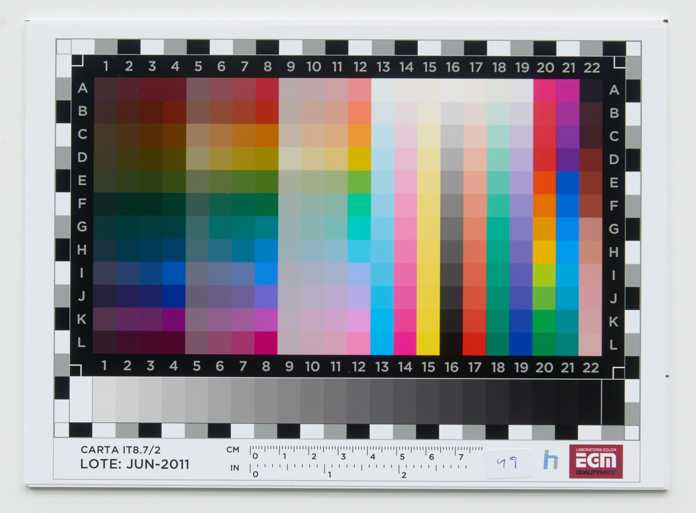

À l'heure actuelle, le meilleur éditeur de photos brutes de capteur, c'est à mon avis Capture One. Développé depuis environ 2005 par Phase One, fabricant d'appareils moyen-format numériques, il est remarquable par son interface particulièrement intuitive et son excellente gestion de la couleur, avec des contrôles qui peuvent être poussés très fort sans jamais donner de résultats excessifs. Depuis 5 ans, il s'est taillé une part de marché croissante chez les portraitistes, qui sont friands des teintes de peau naturelles et riches qu'ils peuvent en tirer. Plus important : Capture One n'a jamais cherché à copier Lightroom, pourtant leader sur ce marché. Par contre, à 180 $ US la licence annuelle, ça calme.

Pourquoi darktable n'est ni Lightroom, ni Capture One ?

## Les profils couleur

Votre capteur d'appareil photo mesure l'intensité lumineuse reçue sur 3 canaux (rouge, vert, bleu : on est dans un espace RGB). Comme n'importe quel capteur, il se plante : il commet une erreur, autrement dit les valeurs RGB qu'il mesure sont plus ou moins fausses par rapport à la réalité. L'erreur se calcule en mesurant des valeurs RGB de mires d'étalonnages  dont on connaît la valeur théorique. erreur² = (théorie - mesure)².

\[caption id="" align="aligncenter" width="1600"\] Une mire IT8 standard - CC Wikimedia / Hugo Rodriguez\[/caption\]

Vous me direz : il suffit d'ajouter (ou de retrancher) l'erreur ainsi enregistrée par dessus la mesure pour retomber sur la valeur attendue. Oui, ça marche exactement pour toutes les couleurs qui sont sur la mire d'étalonnage. C'est même le principe d'un profil ICC : caractériser l'erreur pour un jeu de couleur défini, et la corriger mathématiquement après mesure. Mais pour les couleurs qui ne sont pas sur la mire ? On interpole, c'est à dire qu'on vise entre les 2, 3, 4… couleurs voisines les plus proches. Et devinez quoi… L'erreur de mesure d'un capteur ainsi étalonné n'est toujours pas nulle. Le calcul numérique est une plaie, on n'est jamais exact.

Donc on ne s'en sortira pas, la technique est limitée et il va falloir vivre avec une erreur dans la colorimétrie de l'appareil photo, et faire des compromis. Les équipes d'ingénieurs de Lightroom et de Capture One font alors des compromis basés sur l'esthétique : on privilégie des couleurs saturées chez Adobe, et la précisions des teintes de peau chez Phase One. C'est faisable parce qu'ils ont le budget pour étalonner un grand nombre d'appareils photos en interne, donc corriger les profils d'étalonnages imparfaits de façon cohérente et systématique.

Pour darktable, c'est chaque utilisateur motivé qui fournit son profil d'appareil photo aux développeurs. Et là, ça coince… Déjà que ce ne sont pas toujours les mêmes mires qui sont utilisées pour l'étalonnage, ce ne sont pas les mêmes conditions d'éclairage non plus, et il n'y a pas de post-traitement humain, a fortiori homogène, ni de contrôle qualité, après la réalisation du profil. En gros : soit vous faites votre propre profil, soit vous faites entièrement confiance au contributeur de votre profil capteur, sans moyen de vérifier. Et il n'y a aucune homogénéité d'un capteur à l'autre, d'un contributeur à l'autre. À tel point que les développeurs de darktable se demandent depuis plusieurs années s'il ne vaudrait pas mieux ne plus intégrer les profils couleur par défaut, et laisser les utilisateurs se débrouiller avec leur matériel. D'autant plus que ça peut varier d'un exemplaire à l'autre, même si le modèle est le même. Et ça varie au cours de la vie du capteur aussi.

**Solution :** financer un laboratoire de métrologie qui étalonne tous les capteurs connus de façon rigoureuse, systématique et reproductible, et publie les résultats sous licence GPL v3.0.

## La cohérence de l'interface

La structure de Lightroom ou de Capture One est probablement décidée en réunion des équipes et gérée de façon pyramidale : on décide alors quel algorithme va sous quelle fonctionnalité, comment on organise l'interface, etc.

Chez darktable, on développe chacun dans son coin, et les contributions externes sont intégrées par les développeurs principaux à l'ensemble si elles paraissent robustes et intelligentes. Il faut dire que l'architecture du logiciel y est favorable : chaque pixel traverse un long tuyau virtuel composé de plusieurs étages de filtres. Les filtres sont des algorithmes qui sont reliés aux modules, ces derniers étant les interfaces de pilotage des algorithmes. C'est ainsi qu'on peut ajouter ou retrancher des instances de modules à volonté : on ne fait que rajouter ou supprimer un filtre dans la pile, et il n'y a qu'à se brancher au tuyau (le _pixelpipe_, en anglais). Idem, si un contributeur extérieur arrive avec un module, on peut facilement le raccorder à l'ensemble. Tout ceci parce que les modules sont indépendants les uns des autres, ce qui implique que certains modules sont redondants (ils effectuent la même fonctionnalité, par exemple : débruitage) mais différents sur le plan algorithmique. Ça implique aussi que les modules ne communiquent pas entre eux, ce qui les rend plus faciles à maintenir, chose importante dans un contexte de développement bénévole où les développeurs travaillent dans leur temps libre. C'est donc une architecture modulaire facilement extensible.

Par contre, côté utilisateur, on reproche un manque d'unité et une interface à tiroirs plutôt repoussante, loin de la mode actuelle qui fait la part belle au design intuitif. Une fois qu'on a compris la logique de l'empilement de filtres dans le tuyau et de l'équivalence module = algorithme, ça va mieux, et les possibilités de combinaisons de modules sont sans fin. Et, pour un logiciel libre développé de façon informelle, c'est un choix très astucieux, garant d'une certaine pérennité tout en conservant une facilité et une souplesse de développement qui encourage et favorise les contributions de code.

**Solution :** utiliser Rawtherapee, qui a une interface non modulaire, et donc une gouvernance plus rigide au niveau du projet (50 contributeurs, contre 237 pour darktable). Donc potentiellement moins de contributions à long terme, donc moins d'innovations. Tout se paye.

## Et l'intelligence artificielle ?

Les dernières innovations, chez Adobe et les autres, reposent surtout sur l'apprentissage machine et l'intelligence artificielle, appliquées à la détection de contours (pour faire des masques précis), pour modifier des portions de l'image (remplacement/copie d'éléments, agrandissement du cadre, génération automatique de texture), ou pour faire du débruitage et de la reconstruction avancés. Il existe des articles de recherches, publiques, qui permettraient d'intégrer des technologies similaires dans darktable, sous réserve d'avoir quelqu'un pour les coder. Et pourtant, les core devs sont souvent réticents. Pourquoi ?

L'intelligence artificielle a l'inconvénient de consommer beaucoup de puissance de calcul. Il ne s'agit pas de simples filtres, mais de solveurs qui résolvent ou minimisent des équations. Quand vous êtes Adobe, vous pouvez simplement décider autoritairement que votre prochaine version ne fonctionnera pas sur des ordinateurs ayant moins de 8 Go de RAM, dépourvus de carte graphique, etc. Mais les développeurs de darktable essaient de préserver une expérience d'utilisation assez fluide, même pour des utilisateurs avec un matériel modeste. Du coup, il ne s'agit pas d'introduire des usines à gaz qui ne fonctionneront que sur des ordinateurs à 3000 €.

Ensuite, il faut des matheux. Les mathématiques sous-jacentes, en intelligence artificielle, font appel à des notions très poussées de probabilités, à des solveurs numériques parfois exotiques, à des transformations bizarres, à des représentations multidimensionnelles et multi-échelles de phénomènes abstraits, sans parler des moyens techniques d'accélérer les calculs sur le processeur… Bref, ce sont des compétences spécialisées que tous les matheux n'ont pas forcément, et le projet darktable manque de scientifiques de haut niveau (en gros, il y a Johannes Hannika, fondateur, docteur en informatique fondamentale, spécialisé en synthèse 3 D, et Heiko Bauke, docteur en physique quantique, spécialisé en simulation numérique de processus quantiques). Bon, en fait, on manque de scientifiques de haut niveau partout, parce qu'il faudrait que les matheux arrêtent de s'enfuir systématiquement dans la banque et dans la finance…

Mais… encore une fois, la nature modulaire et cloisonnée de darktable rend les contributions plus simples que certains autres logiciels. Donc tout est possible dans un futur proche.

**Solution :** attendre un peu, [reprendre vos études et vous y coller](https://www.edx.org/course/sparse-representations-in-signal-and-image-processing-fundamentals), payer Adobe, ou payer des bons ingénieurs à coder pour darktable à temps plein.

## Conclusion

Le développement logiciel est plein de compromis en permanence : privilégier les fonctionnalités innovantes ou la stabilité, offrir plus de contrôle ou plus de simplicité, privilégier le design de l'interface ou la maintenabilité du code, tout ça dans un contexte où les ressources financières sont nulles, les compétences inégalement réparties et pas toujours disponibles, et le temps disponible très limité. À la fin, darktable s'en tire de façon exemplaire, avec des choix souvents intelligents à long terme. C'est une base très saine pour aller loin, mais il va falloir que les utilisateurs jouent le jeu et comprennent ce dans quoi ils s'engagent.

Ce qui manque vraiment à darktable, en fait, c'est surtout quelques développeurs à temps plein, donc payés par la communauté, pour effectuer les tâches ingrates qui n'amusent personne (et qu'aucun bénévole ne veut effectuer), et pour accélerer le développement des requêtes utilisateurs.

Sur la mailing-list des développeurs, j'ai proposé l'ouverture de primes offertes à des développeurs freelance pour développer des fonctionnalités demandées par la communauté. Ceci est possible sur [Bounty Source](https://www.bountysource.com/teams/darktable/issues) et permet aux utilisateurs de choisir spécifiquement combien ils veulent donner et sur quel projet. Les développeurs soumettent alors des propositions de code qui, si elles sont validées par l'équipe, sont alors payées et intégrées. Le code source reste ouvert et libre, ce sont juste les heures de travail qui sont ainsi payées aux développeurs, leur permettant d'y consacrer plus de temps.

Je vous propose de répondre à [ce court sondage](https://framaforms.org/politique-de-financement-de-darktable-1536558315) (4 questions) pour évaluer la faisabilité de la chose. Merci !
