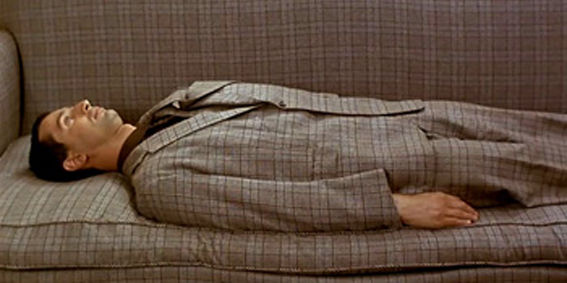
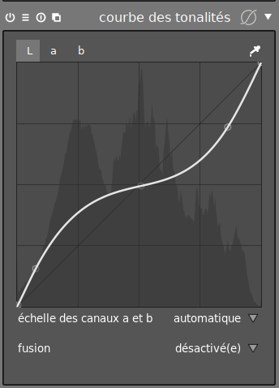
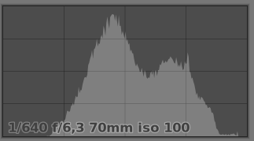

La question a été posée aujourd'hui [sur le forum](https://darktable.fr/forum/showthread.php?tid=2864&pid=25720#pid25720), et elle est légitime, car on endend tout et son contraire. Et la réponse n'est pas simple.

## Poser les bases

Avant d'y répondre, il faut comprendre que l'exposition est une superposition de 3 concepts qui s'appliquent dans cet ordre :

1. l'intention,
2. le medium,
3. l'observateur.

Et on va les détailler dans l'ordre inverse.

## L'observateur

L'œil est fait de 2 types de capteurs, qui sont des cellules spécialisées convertissant un flux électromagnétique en signal électrique transmis au cerveau par le nerf optique :

1. les [bâtonnets](https://fr.wikipedia.org/wiki/B%C3%A2tonnet), qui sont sensibles à la luminosité, et s'activent en faible lumière,
2. les [cônes](https://fr.wikipedia.org/wiki/C%C3%B4ne_(photor%C3%A9cepteur)), qui sont sensibles soit à la lumière verte, soit soit à la lumière rouge, soit à la lumière bleue, et s'activent en haute lumière. D'où le RGB des capteurs photos.

Cependant, ce que le cerveau analyse, ce n'est pas de la lumière, mais des contrastes, c'est à dire des écarts relatifs de luminance. Du coup, en l'absence de contraste suffisant, on ne « voit » rien, ou plus exactement on voit sans discerner.

 L'homme invisible (Le père Noël est une ordure)

Une photo bien exposée doit tenir compte de ce paramètre, et présenter un contraste suffisant pour qu'on puisse, physiologiquement, discerner ce qui s'y passe.

De plus, la réponse de l'œil (en fait, du cerveau) est logarithmique, et non linéaire. Ça veut dire que le cerveau amplifie basses lumières, donc casse le contraste, et que nous ne voyons jamais de noir, mais seulement un gris très profond. On va y revenir.

## Le medium

En latin, le medium c'est ce qui se trouve au milieu. On utilise principalement 4 media en photographie :

1. Deux media de capture :
    1. l'émulsion gélatino-argentique, c'est la bonne vieille pellicule,
    2. le capteur semiconducteur photo-électrique, c'est ce qu'on a dans un appareil photo numérique
2. Deux media de restitution :
    1. l'écran, le plus souvent à cristaux liquides ou à diodes électro-luminescentes (un semiconducteur qui fait exactement l'inverse du capteur),
    2. le papier, encré ou imbibé de pigments photosensibles.

Chacun de ces media a une plage dynamique caractéristique, c'est à dire une amplitude de luminance qu'il peut restituer.

Sur les media de capture, on mesure la plage dynamique en divisant la luminosité maximale admissible du medium par la luminosité minimale détectable, puis en prenant le logarithme en base 2 de ce rapport. Typiquement, en argentique, suivant les développeurs et les pellicules utilisées, la plage dynamique se situe entre 8 à 16 EV (plage de la pellicule obtenue après numérisation en HDR, ce n'est pas ce que vous obtiendrez sous l'agrandisseur optique). En numérique, suivant la sensibilité, pour de vieux appareils, on tourne à 6-8 EV, et pour des appareils récents, entre 10 et 15 EV.

Numérique et argentique ont deux comportements différents vis à vis des valeurs de luminance qui sortent de leur plage dynamique :

- le numérique sature par la droite (quand vous regardez l'histogramme), c'est à dire que tout ce qui a une luminosité supérieure à ce qu'il peut tolérer est « vu » par le capteur comme égal à la luminosité maximale et donc on perd des détails dans les hautes lumières. En revanche, il peut enregistrer très loin dans les basses lumières, c'est juste qu'à un moment donné, l'intensité du bruit va être supérieure à celle de signal lumineux.
- l'argentique sature par la gauche, c'est à dire que tout ce qui a une luminosité inférieure à son seuil de détection est « vu » par le film comme égal à son seuil de détection, donc on perd les détails dans les basses lumières. En revanche, il peut enregistrer loin vers les hautes lumières, c'est juste que les couleurs seront alors très délavées.

Conséquemment, on « expose à droite » en numérique pour caler les hautes lumières juste avant la saturation haute, et on « expose à gauche » en argentique, pour caler les basses lumières juste avant la saturation basse. Mais on ne fait cela que lorsque la plage dynamique de la scène est supérieure ou environ égale à celle du medium, de façon à l'utiliser au mieux. Autrement, on expose au milieu. Exposer à droite ou à gauche produit une exposition fausse qui va décaler le gris et implique, au moment du traitement, de replacer le gris au milieu de l'histogramme (d'une façon ou d'une autre).

Sur les media de restitution, on mesure cette plage dynamique de deux façons :

- Par le rapport entre la luminance du blanc et la luminance du noir, par exemple 3000:1. C'est typique pour les écrans, rétro-éclairés, où la plage dynamique (improprement appelée contraste, la plupart du temps) dépend surtout de la luminosité du blanc.
- Par la luminosité relative du point noir, en logarithme décimal. C'est la valeur appelée Dmax (densité maximale) que donnent les fabricants de papier photo (haut de gamme). Pour les tirages, éclairés par l'avant, la luminosité du blanc est limité par l'éclairage (et la réflectance du papier), sur lequel le fabricant ne peut pas grand chose, donc la plage dynamique dépend surtout de la profondeur du noir, c'est à dire de la façon dont les pigments réagissent avec le papier.

Un papier photochimique argentique brillant a une valeur Dmax qui tourne autour de 2.3, soit un « contraste » (encore une fois, ici c'est un abus de langage) équivalent de 200:1, traduit en métrique écran, ou une plage dynamique équivalente de 7.6 EV, traduit en métrique capteur. Pour un papier couleur et pour les papiers jet-d'encre, le Dmax tourne autour de 1.7, soit un « contraste » équivalent de 50:1, ou une plage dynamique équivalente de 5.6 EV.

Sorti d'usine, un écran tape à minimum 3000:1, soit un Dmax équivalent de 3.5 ou une plage dynamique (optique) équivalente de 11.6 EV. Voilà pourquoi le passage de l'écran au papier donne souvent de mauvaises surprises. Pour cette raison, vous devez étalonner votre écran au contraste de 285:1 (Dmax équivalent de 2.45, plage dynamique équivalente de 8.15 EV), pour suivre la norme ISO 12647, relative au traitement pré-presse.

Ceci dit, en réalité, comme les signaux RGB qui arrivent à l'écran sont généralement encodés sur 8 bits, la plage dynamique logique de l'écran est 8 EV. Ça veut dire que si la plage dynamique optique est supérieur à la plage dynamique logique, vous [postérisez](https://fr.wikipedia.org/wiki/Posterisation). Donc, à moins d'avoir un écran 10 bits, avoir un contraste supérieur à 300:1 est le meilleur moyen de bousiller la précision colorimétrique.

On a dit plus haut que l'œil et le cerveau cassent le contraste de façon logarithmique, c'est à dire rapprochent la luminosité des tons sombres de celle des tons clairs (le vrai contraste). Qualitativement, ça veut dire que pour voir un gris deux fois plus foncé qu'un gris de référence, on ne peut pas simplement multiplier la concentration de pigments noir par deux, il faut réaliser une [correction du gamma](https://en.wikipedia.org/wiki/Gamma_correction) avant, et probablement multiplier la concentration par 4. Le problème, c'est que cette correction gamma, si elle fait gagner en lisibilité (puisqu'elle renforce le contraste), fait perdre en plage dynamique. Jugez vous-même :

 https://en.wikipedia.org/wiki/Gamma_correction#/media/File:GammaCorrection_demo.jpg

Plus on casse le contraste, plus on fait apparaître de détails, mais plus on perd en clarté. Plus on rajoute de contraste, plus on gagne en clarté, mais plus on bouche les ombres.

Comment on fait, alors ? Les maths ne sont ici d'aucun secours, c'est le photographe qui, sur un écran étalonné, doit ajuster à l'œil suivant son intention.

## L'intention

L'intention est le choix artistique du photographe. On peut vouloir une image sombre, pour une ambiance… sombre. On peut vouloir une image claire, pour une ambiance plus optimiste. On peut vouloir un grand contraste, pour accentuer le modelé ou pour un effet dramatique. On peut vouloir un faible contraste, pour accentuer la douceur et la sensation d'intimité.

Le problème, c'est que cette intention doit faire des compromis avec le medium et l'observateur.

Au moment de la capture, exposer le gris ailleurs qu'au centre de l'histogramme va fausser toutes les couleurs. Si l'on veut une photo sombre, il vaut mieux exposer normalement à la prise de vue, et assombrir au moment du traitement, pour conserver des couleurs exactes.

Parfois, on n'a pas le choix d'exposer à gauche ou à droite, limité par le medium de capture. Il faut alors se souvenir de rétablir la densité du gris au moment du traitement (et de corriger les couleurs), pour que l'observateur ait un contraste également réparti entre les hautes et les basses lumières.

Parfois, on veut un contraste dramatique. Mais là, il faut se souvenir qu'un fort contraste sur un medium à faible plage dynamique a pour effet de comprimer les détails aux extrémités de la plage dynamique. Mais en même temps, un faible contraste nuit à la lisibilité (la clarté).

Ensuite, tout ce qui est sombre sur un écran (rétro-éclairé) devient plus difficile à lire sur un tirage papier (plus sombre par nature), car le contraste local dépend… du contraste global ET de la plage dynamique.

## Parenthèse : contraste ou plage dynamique ?

La plage dynamique, c'est votre marge de manœuvre, en tant qu'utilisateur : c'est la plage de luminances autorisées par le médium.

Le contraste, c'est l'écart relatif entre les hautes et les basses lumières. Ça dépend de la lumière sur la scène initiale (à la prise de vue), et de votre retouche. La façon classique de rajouter du contraste, c'est avec une courbe en S :

On amplifie les hautes lumières, on atténue les basses lumières : on a rajouté du contraste.

À l'inverse, pour retirer du contraste, on inverse le S :finir

## 

Un contraste idéalement ajusté fait en sorte que :

- on utilise 100 % du la plage dynamique du medium, pas plus, pas moins,
- le gris est environ à 50 % de luminance,
- on corrige des luminances autour du gris, mais on ne touche pas au gris (sur les courbes ci-dessus, le gris sert de pivot : on fait tourner les branches du S autour, mais il n'est pas affecté)
- la correction est presque linéaire (au moins au milieu), ce qui limite la compression du contraste local aux bords de la plage dynamique (les lobes aux extrémités de la courbe en S vont diluer le contraste local dans luminances extrêmes et faire perdre des détails).

Évidemment, le contraste idéal est comme le Code des pirates, c'est plus un guide qu'une loi.

## Synthèse

Vous l'avez compris, c'est l'enfer. À chaque fois que vous voulez habiller Paul, il faut déshabiller Jean. Comment on expose « bien » une photo ?

### À la prise de vue

Les détails importants doivent être aussi proches que possible de 50 % de luminosité, soit au centre de l'histogramme. Si la scène a une forte plage dynamique, il faut alors trouver un compromis en décalant le gris pour sauver la gauche de l'histogramme (en argentique) ou la droite de l'histogramme (en numérique). Souvenez-vous que la prévisualisation à l'écran de l'appareil photo est un fichier JPG traité par l'appareil, pas le fichier RAW que vous avez en vrai. Il est plus prudent de mesurer la plage dynamique et le point gris avec un posemètre/flashmètre.

### Lors de la retouche

Il faut remapper la plage dynamique, avant l'ajustement des couleurs, de sorte que le blanc pur soit à environ 96 % de luminance, le noir pur à 18 %, le gris moyen à 50 %, tout ça avec une balance des blancs parfaitement neutre. Une fois que c'est fait, vous appliquez le profil de correction des couleurs d'entrée. Ceci est beaucoup plus facile si vous avez une photo référence avec une mire d'étalonnage photographiée dans les conditions d'éclairage des autres photos.

Ensuite, vous pouvez ajuster les couleurs, mais il faut surtout rétablir le contraste et corriger le gamma pour la vision humaine, en tenant compte de la plage dynamique du medium de destination. Si votre écran et votre imprimante sont étalonnés correctement, vous pouvez vous en remettre à votre œil. Sinon, vous êtes en slip dans la forêt. Et dans la forêt, il y a des moustiques, des tiques, et maintenant des loups.

### Outils disponibles

Le traitement d'image se base sur trois disciplines :

- la physique, plus précisément l'optique et l'électromagnétisme,
- les maths, et plus précisément le traitement de signal,
- les arts graphiques.

La physique vous dit ce qu'il se passe, les maths vous donnent un langage pour l'exprimer, et l'art… c'est votre objectif. Les maths peuvent donc vous donner quelques indications pour essayer de comprendre ce qui se passe.

Même s'il ne faut pas le prendre comme une vérité absolue, c'est l'histogramme qui peut généralement vous aider. Habituellement, il devrait ressembler à une gaussienne centrée en 50 %.

Évidemment, si vous faites du [low-key](https://www.lesnumeriques.com/photo/realiser-une-photo-low-key-pu101061.html) ou [high-key](https://www.lesnumeriques.com/photo/la-photographie-high-key-avec-les-moyens-du-bord-pu101051.html), ça ne s'applique plus. Mais, ça peut encore vous alerter que quelque-chose va mal si vous voyez des pics aux bords :

[gallery size="medium" columns="2" link="file" ids="6057,6056"]

### De l'importance de l'étalonnage

L'étalonnage, mathématiquement, c'est une transformation qui permet de convertir l'information d'un espace à un autre. Chaque medium a un comportement spécial : il amplifie les luminances (ou pas), il a des couleurs plus ou moins saturées et une plage dynamique propre. On va donc lui attribuer un espace, avec des coordonnées bien à lui, une taille spécifique etc.

Pour convertir d'un espace à un autre, donc d'un médium imparfait à un autre, on passe par un espace symbolique intermédiaire, linéaire, (presque) parfait et idéal : le [Lab](https://fr.wikipedia.org/wiki/L*a*b*_CIE_1976). Cet espace est composé de toutes les couleurs visibles, et indépendant des media. Il sert donc de « dénominateur commun » à tout la chaîne graphique. Lors de ces conversions, on ajuste le gamma, la plage dynamique, le gamut, etc. La conversion d'espace, c'est simplement changer de référentiel, et ajuster les coordonnées de l'espace source pour les traduire dans l'espace cible.

L'étalonnage de l'écran, c'est comme votre clé d'accès à cet espace neutre et parfait, qui n'existe pas hors du monde magique des maths et de votre ordinateur. C'est ce qui permet de traduire cet espace invisible en quelque chose de visible.

Du coup, si vous n'étalonnez pas votre écran, vous n'avez pas la moindre idée de ce que vous voyez. Je lis souvent des beaufs de la photo qui expliquent qu'ils ont de très bons résultats sans étalonnage, et que de toute façon, les gens qui vont voir les photos n'ont pas d'écran étalonné.

C'est complètement idiot. Le principe de l'étalonnage n'est pas de s'assurer de ce que le client va voir, mais de vous assurer de la cohérence de votre chaîne de traitement, du début jusqu'à la fin, ainsi que d'obtenir des résultat reproductibles, prévisibles et surtout, représentatifs de la réalité des données que vous manipulez. C'est surtout capital quand vous échangez des données avec quelqu'un d'autre (un imprimeur par exemple), car il ne connaît pas votre intention, il n'a que des données.

Et accessoirement, ça fait gagner beaucoup de temps et de confort.
