De l'eau a coulé depuis mon précédent [article sur la plage dynamique](http://darktable.fr/2018/08/recuperer-la-plage-dynamique-sous-darktable/).

Depuis 2 semaines, j'ai appris à programmer en C, incluant l'OpenCL et les instructions SSE2. J'ai travaillé à temps plein pour comprendre comment darktable marchait, à l'intérieur, et vous/me/nous développer deux nouveaux modes pour des modules déjà existants, qui vont grandement simplifier la retouche et donner de meilleurs résultats. Le nouveau tutoriel aura passablement moins d'étapes.

## 1. Récupérer le contraste

Vous vous souvenez comme on a superposé les modules « correction du profil d'entrée », « courbes de base » et l'exposition ? Oubliez tout ça.

Dans le module « correction du profil d'entrée », j'ai ajouté un nouveau mode : logarithmique. Ce que fait cet algorithme est mathématiquement équivalent aux profils neutres N-Log et S-Log qui sont utilisés dans les encodeurs vidéo des réflexs modernes afin de préserver tous les détails dans les basses lumières. Ici, on va s'en servir comme de compression de la plage dynamique :

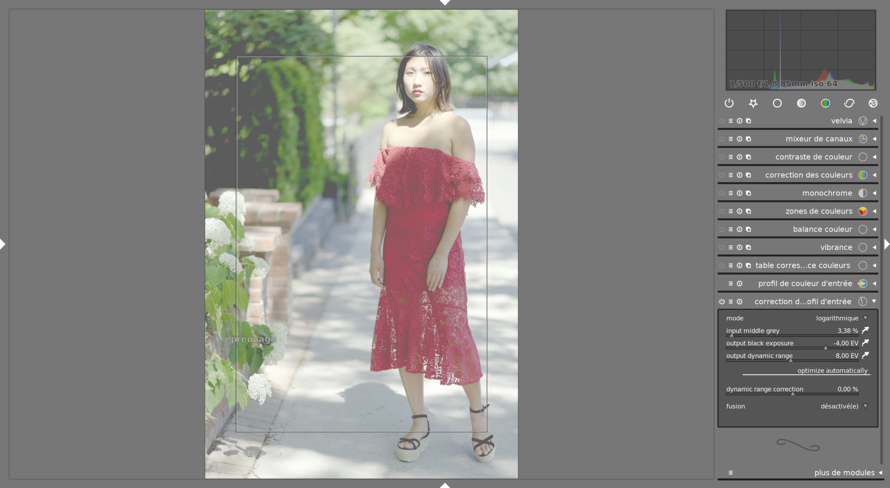

Notez que l'interface n'est pas encore traduite et que, n'en déplaise à certains, on programme en anglais. La première étape consiste à régler le gris moyen de la scène (input middle grey). Vous êtes feignant ? Moi aussi, c'est pouquoi vous pouvez simplement utiliser la pipette pour sélectionner la tonalité correspondante. Celle-ce sera ensuite redirigée vers le milieu de l'histogramme par l'algorithme. Si vous sélectionnez toute l'image, c'est la luminosité moyenne qui est retenue.

Ensuite, il faut régler l'intensité du noir (output black exposure), en indice de lumination (EV en anglais) à partir du point gris (qui est considéré à 0 EV). Idem, ça se fait en 2 secondes grâce à la pipette, en allant choisir la zone la plus sombre de l'image. Ici, je mets le noir à 4.18 EV à gauche du gris.

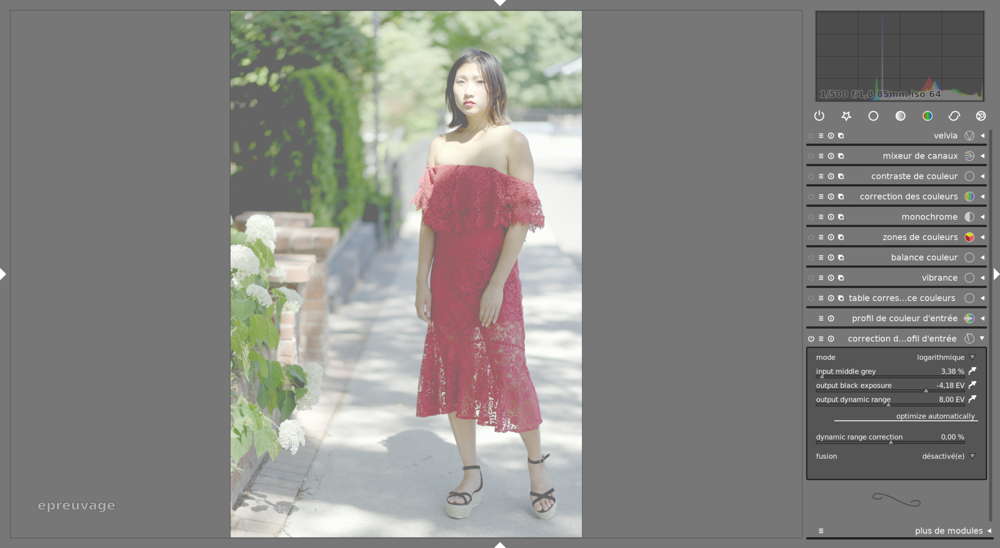

Dernière étape, la plage dynamique (dynamic range). Si vous sélectionnez toute l'image avec la pipette, il va simplement pendre la luminosité maximale et considérer que ce sera l'extrémité droite de la plage dynamique.

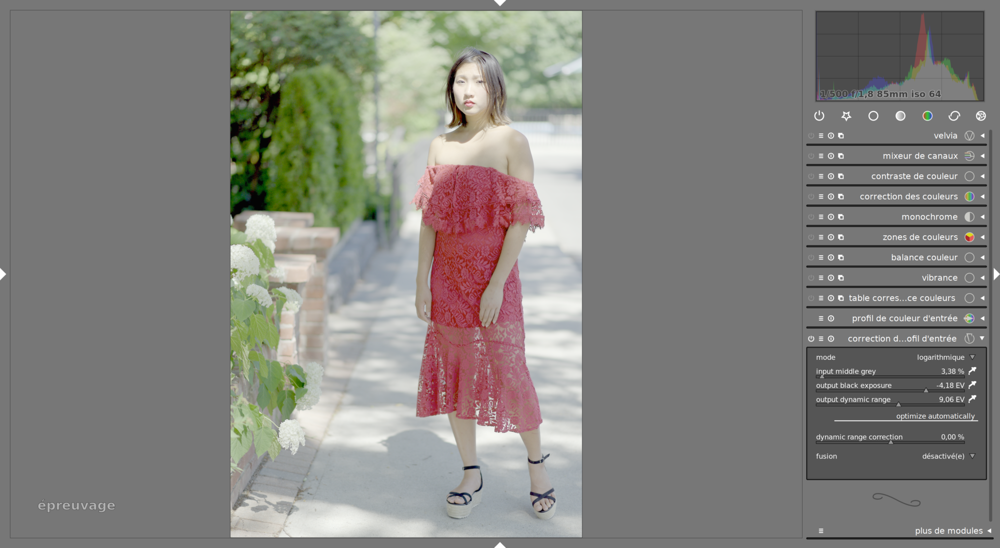

Et paf ! L'histogramme est à peu près centré, rien n'est brûlé. Il reste le buisson, derrière, qui est un peu bouché. Il suffit de le déboucher en diminuant le point noir dans le module exposition :

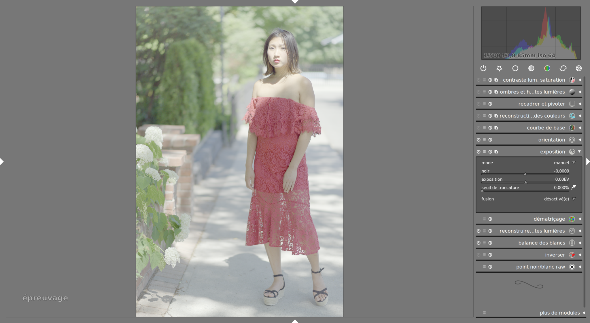

Là, vous allez me dire « c'est fade et désaturé ». Oui, mais c'est une base de travail. Et c'est là qu'entre en jeu mon deuxième module.

## 2. La couleur

La balance couleur a un nouveau mode, « slope - offset - power ». Ce mode est standard et respecte [la norme](https://en.wikipedia.org/wiki/ASC_CDL) de l'Association Américaine des Cinéastes. Comme tout standard, son objectif est de pouvoir échanger des réglages et des paramètres d'un logiciel à l'autre. Blender et la plupart des logiciels d'édition vidéo en sont déjà munis. Ce mode s'ajoute au « lift - gamma - gain » qui travaille dans un espace sRGB corrigé en gamma, ce qui pose plein de problèmes et de limites sur lesquelles je ne vais pas m'étendre. Je n'ai jamais eu de bon résultat avec ce module. Ici, on travaille dans l'espace Prophoto RGB linéaire.

On commence par ajouter un peu de saturation sur le master :

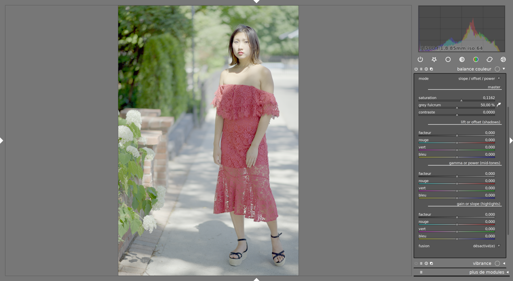

Ensuite, on va rajouter du contraste. D'abord, on va choisir le pivot (fulcrum) qui est la tonalité de gris qui n'est pas affectée par l'addition de contraste. Au dessus de cette tonalité, on ajoute plus de lumière, en dessous, on en retire. Encore une fois, il y a une pipette. On va choisir la tonalité du visage, puisque c'est le sujet de la photo :

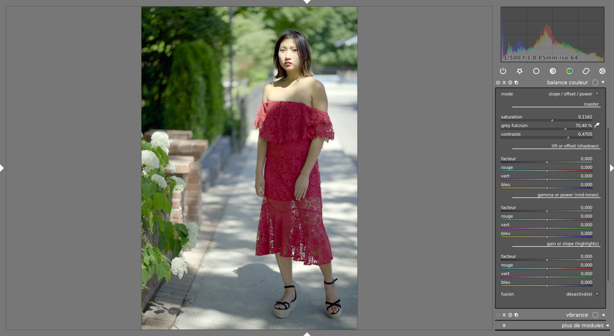

Pas mal, non ? Beaucoup de gens s'arrêteront là. Mais on peut aller plus loin, et se pencher sur la gradation de teinte. La gradation, en anglais _color-grading_, est une opération qui consiste à ajuster les couleurs séparément pour, soit supprimer sélectivement les dominantes, soit en rajouter pour donner une ambiance à la photo (au cinéma, on met le méchant en vert, la pinup en magenta, la maman en orangé, et le psychopathe en bleu). Ici, je trouve qu'on manque de magenta et que le visage est trop vert.

Attention, les niveaux doivent se régler dans un ordre précis pour avoir un bon résultat : on règle d'abord le slope, ensuite l'offset, puis en dernier, le power (qui est l'équivalent du gamma). J'ai été sympa, si vous ne vous souvenez plus de l'ordre, il est rappelé dans le nom du mode (slope / offset / power) :

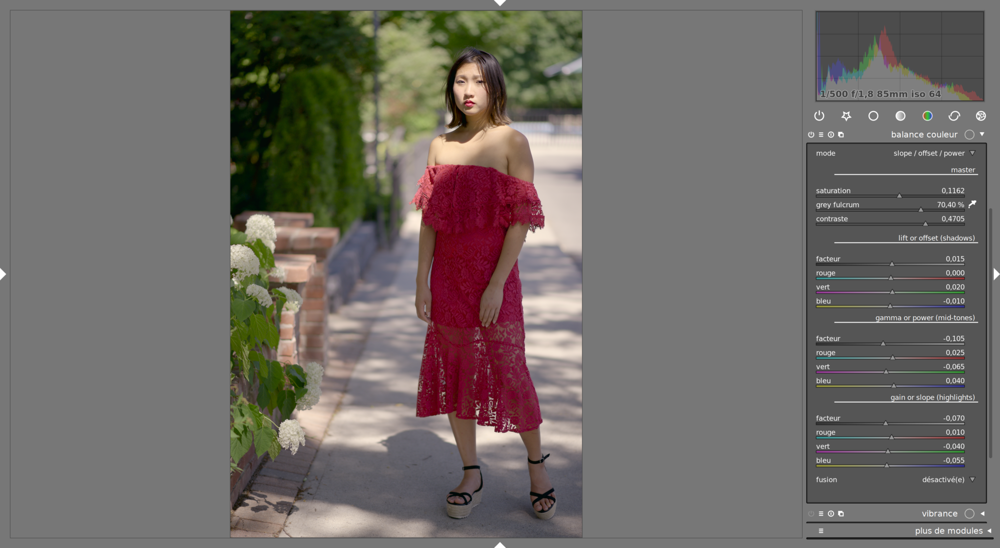

Là dessus, un petit coup de courbes des tonalités, pour remettre un petit boost de contraste dans l'espace Lab, zones de couleurs pour la teinte, contraste local, (similaire à ce que j'ai montré dans mon précédent article), et voilà :

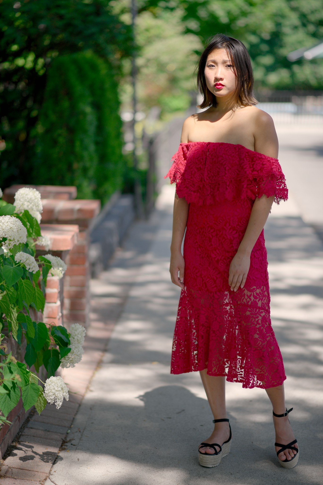

Pour comparaison, la version avec la méthode précédente :

## 3. Bénéfices :

Premièrement, en terme de _workflow_, c'est très rapide, tout est automatisé au maximum avec des pipettes qui mesurent ce que vous avez besoin sans avoir à gratter les curseurs pendant des heures. C'est rapide, à condition de suivre la méthode dans laquelle ça a été pensé. Le module de correction du profil d'entrée se voit ajouter les modes de fusion classiques des autres modules, ce qui permet aussi d'utiliser la fusion paramétrique pour plus de souplesse.

Ensuite, le résultat est largement meilleur, en terme de luminosité, de rendu général, de couleur etc. On a ensuite un contrôle bien plus fin sur la couleur, ce qui rend – enfin ! – la retouche de couleur agréable et professionnelle sous darktable. J'attendais ça depuis longtemps.

Pour finir, j'ai codé des versions OpenCL de ces deux modules pour que ça soit rapide. Le code C de base est optimisé aussi, le tout est assez performant en terme de calcul.

## 4. Limites

La balance des couleurs a toujours ces affreux curseurs RGB, quand la totalité des logiciels qui implémentent cette approche utilisent des roues chromatiques, beaucoup plus simples à contrôler. Le code pour les roues chromatiques est inclus, mais commenté, dans le code source du module, il semble qu'on ne soit pas très loin de le faire marcher, mais je n'ai pas eu de nouvelles du développeur précédent.

## 5. Et maintenant ?

Les fonctionnalités ont été soumises aux développeurs et sont en attente de révision. Un d'entre eux s'est déjà montré hostile au profil logarithmique dans ce module précisément (pas en général). Rien ne garantit que ça soit un jour intégré au code source, mais si vous vouler les tester, [vous pouvez compiler ma branche](https://github.com/aurelienpierre/darktable).

Attention, il se peut que le code change dans un futur proche, et que vos retouches soient alors invalides. Sauvegardez vos bases de données et travaillez sur des copies virtuelles de vos photos.

Mais tous les tests et les retours sont les bienvenus.

## Mise à jour : j'ai commencé à rééditer des photos de cet été avec ces modules

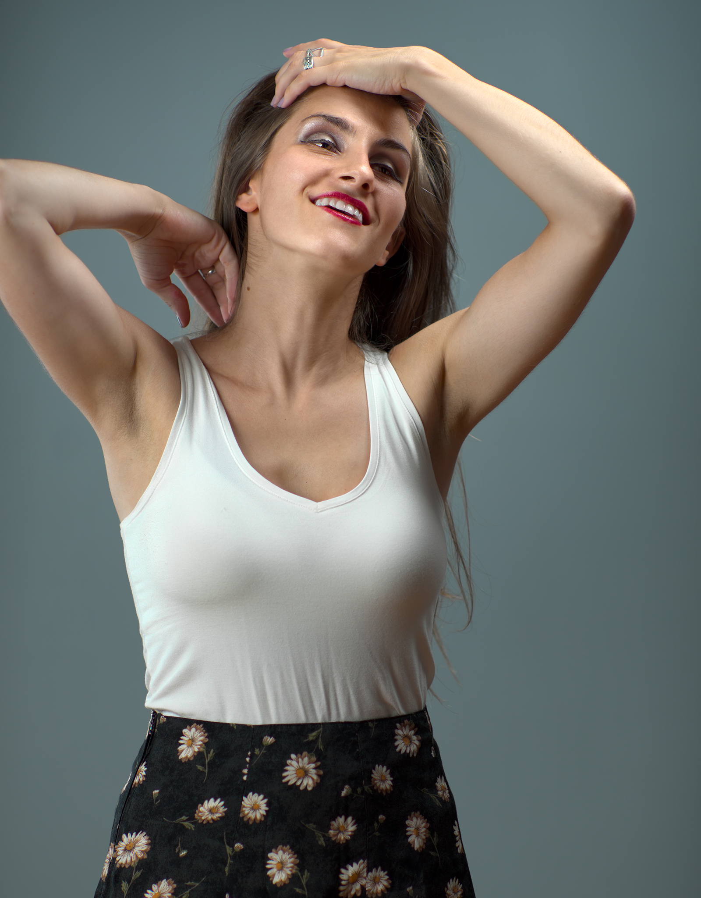

Sortie de darktable (ancienne version ) + retouche Photoshop

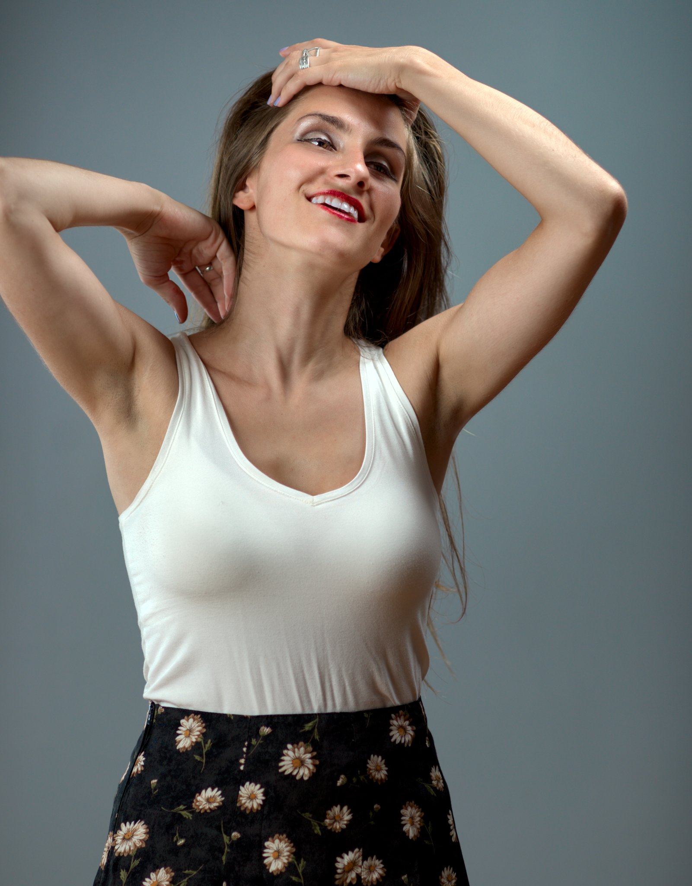

sortie directe de darktable (nouvelle version avec nouveaux modules)

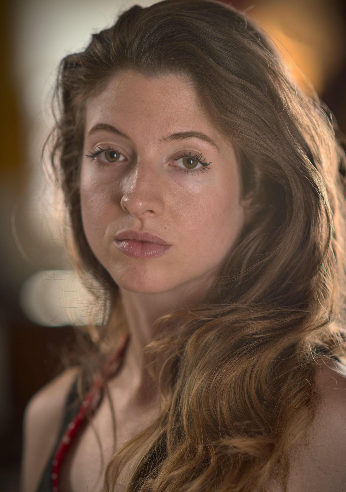 

sortie de darktable (ancienne version)

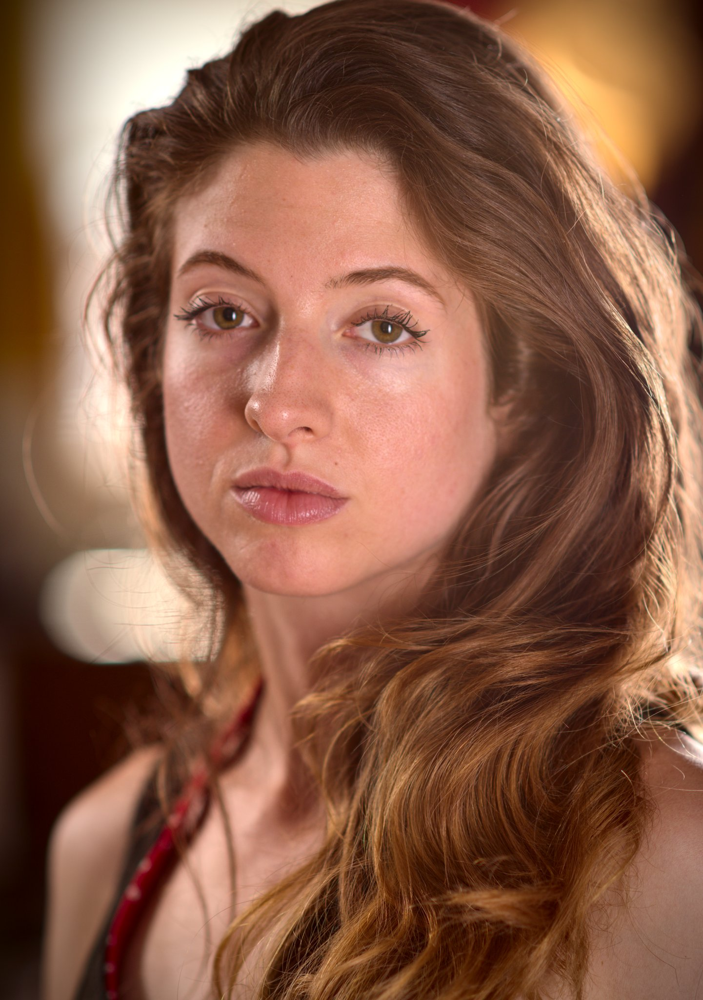

sortie de darktable (nouvelle version avec nouveaux modules)

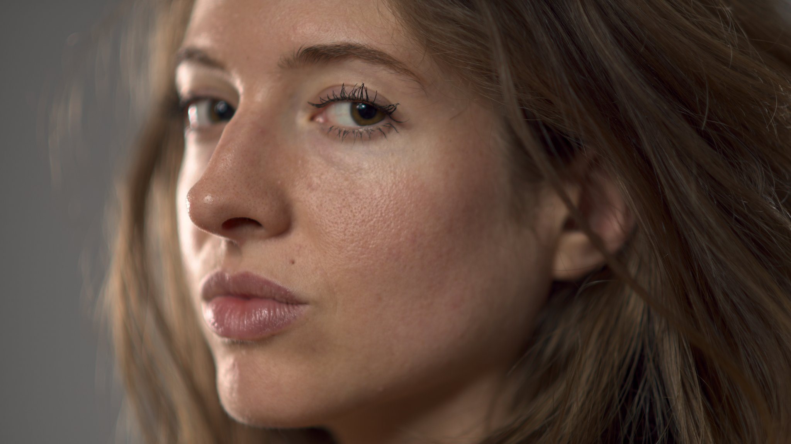

sortie de darktable (version précédente)

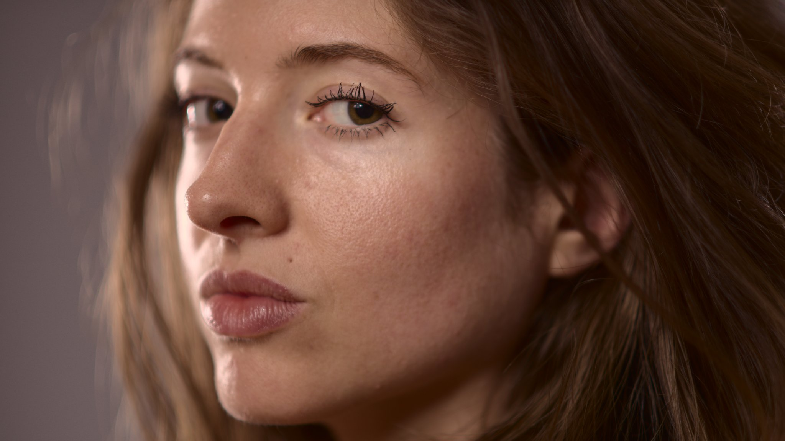

Sortie de darktable (nouvelle version avec nouveaux modules)
