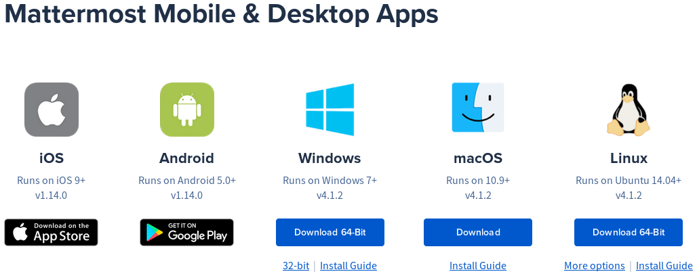

Cela fait plusieurs semaines que nous testons un nouvel outil de communication pour rassembler la communauté francophone des utilisateurs de darktable. Après les salons sur IRC, un canal sur [Matrix/Riot](https://riot.im/app/#/room/#darktablefr:matrix.org), le canal sur Telegram, nous avons ouvert un salon de discussion sur [Framateam](https://framateam.org/).

## Qu'est ce que c'est Framateam?

En fait, Framateam c'est l'application Mattermost qui est hébergé sur les serveurs de [Framasoft](https://framasoft.org/en/). Une sorte de Slack libre et open source pour simplifier les échanges entre les membres d'une équipe, d'une association, d'une organisation.

Comme une vidéo est plus efficace qu'un long discourt...



## Comment nous rejoindre?

1. [Cliquez ici](https://framateam.org/signup_user_complete/?id=133zhsoz8pdid8fzwk4cg6674e) et créé vous un compte si ce n'est déjà fait [gallery size="medium" ids="6124,6120"]
2. Rejoignez les Canaux Publics qui vous intéresse en cliquant sur "Plus..." [gallery size="medium" ids="6121,6127"]
    
    Il existe deux sorte de canaux, les salons de discussion et les flux d'actualités. Ces derniers commencent tous par "RSS ...". Vous y trouverez aussi bien les publications de nouveaux tutoriels vidéo, les réponses aux derniers messages dans notre forum ou les derniers articles publier. Jusqu'aux notifications des derniers travaux dans le code des développeurs de darktable.
3. Chaque canal peut être ajouté en favoris de sorte qu'il apparaisse en haut de votre liste. Les canaux en gras vous signale qu'il y a de nouveaux messages à lire dans ceux-ci [gallery size="medium" ids="6122,6126"]
4. Outre le fait de discuter dans chacun des canaux publics, vous pouvez également communiquer en privé avec chacun des membres. Grâce à la notification des statuts des membres, vous saurez qui est connecté sur la plateforme (gris = déconnecté, jaune = AFK, bleu = connecté) [gallery size="medium" ids="6125,6123"]
5. Mattermost n'est pas qu'une application Web mais c'est aussi un client natif pour votre téléphone mobile ou pour votre système d'exploitation.  [Cliquez ici](https://mattermost.com/download/#mobile) pour télécharger l'application qui vous convient.

## Trucs et astuces

Vous l'aurez remarquez que mes copies d'écrans ont un thème sombre. Mattermost est fournis avec plusieurs thèmes que vous pouvez activer, dans l'interface web, en cliquant sur l'icône "hamburger" et ensuite sur "Paramètres du compte". Ensuite dans le menu "Affichage", cliquez sur "Thèmes" et sélectionnez le thème de votre choix.

[gallery size="medium" ids="6131,6128"]

Autre astuce, lorsque vous rédigez un message, vous pouvez le [formater](https://docs.framasoft.org/fr/mattermost/help/messaging/formatting-text.html). Vous pouvez aussi ajouter des [liens hypertexte](https://docs.framasoft.org/fr/mattermost/help/messaging/formatting-text.html#liens) ou [notifier](https://docs.framasoft.org/fr/mattermost/help/messaging/mentioning-teammates.html) un autre membre. Je vous invite à parcourir la documentation rédigée par les équipes de Framasoft pour en connaître d'avantage sur toutes les possibilités de l'outil : [https://docs.framasoft.org/fr/mattermost/](https://docs.framasoft.org/fr/mattermost/)

## Conclusion

Pour avoir testé Slack en entreprise, qui est son concurrent direct, je ne dirais qu'une seule chose : Il ne lui manque que [les notifications en Push](https://framacolibri.org/t/framateam-activer-les-push-notifications/2690/2) sur les téléphones mobiles et l'outil serait parfait.

Si l'aventure vous intéresse, on vous invite cordialement à nous rejoindre sur [cette nouvelle plateforme](https://framateam.org/signup_user_complete/?id=133zhsoz8pdid8fzwk4cg6674e).
