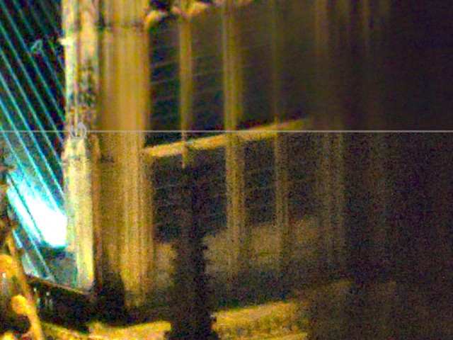
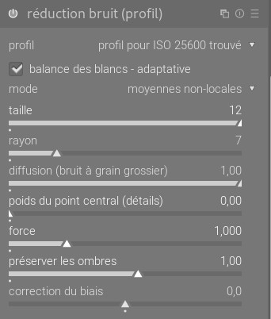
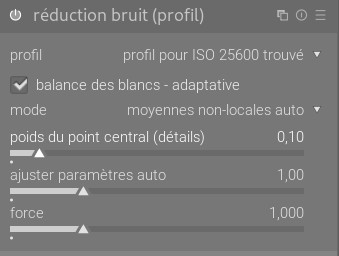
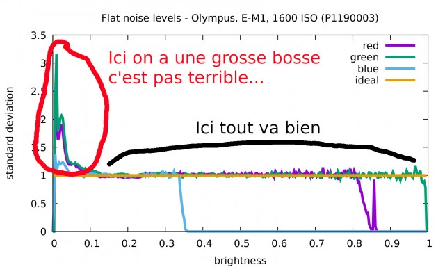
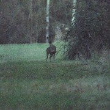

Ce texte a été publié initialement sur le [forum](https://forums.darktable.fr/showthread.php?tid=4017&pid=34962#pid34962) par @rawfiner. Je le reproduit ici avec son autorisation pour lui assurer une plus large audience.

* * *

Bonjour à tous

Ce post vise tout d'abord à expliquer les nouveaux paramètres de la réduction de bruit de profil introduits par mes changements qui ont eu lieu depuis janvier. J'expliquerai en deuxième partie de post mon cheminement au long de ces 9 mois pour ceux que ça intéresserait. Je finirai par détailler qques idées pour la suite   

**Un peu de contexte pour comprendre la suite - la réduction de bruit de profil, comment ça marche ?**

Le profil qu'est ce que c'est ? C'est simplement quelques paramètres (2 par canaux et par valeur ISO en l'occurrence) qui décrivent la manière dont la variance du bruit évolue en fonction de la luminosité. La variance est une mesure de la dispersion des valeurs autour de la moyenne, donc dans notre cas elle donne une information sur à quel point les valeurs des pixels bruités peuvent être éloignés des valeurs qu'ils devraient avoir s'il n'y avait pas de bruit. Le profil permet d'exprimer la variance en fonction de la moyenne.

À quoi ça sert d'avoir ce profil ? Eh bien, les algorithmes de débruitage n'aiment pas gérer des données où la variance du bruit change partout. Du coup, le profil permet de définir une transformation sur l'image, appelée transformation de stabilisation de variance, qui permet d'obtenir une image où la variance du bruit devient constante : le bruit dans les zones sombres et les zones claires a alors les même caractéristiques, et l'algorithme de débruitage peut faire son boulot bien plus facilement.

Voilà donc comment marche la réduction de bruit de profil.

**Nouveautés dans la réduction de bruit de profil**

Nous avons vu que darktable utilise deux paramètres pour chaque canal et valeur ISO pour effectuer sa transformation de stabilisation de variance. Un changement important introduit a été de changer la transformation de stabilisation de variance pour en avoir une plus générique, qui admet un 3ème paramètre permettant de contrôler si on débruite plus les ombres ou les hautes lumières, et permettant donc de trouver un équilibre. Il faudrait idéalement déterminer ce paramètre lors du profilage, mais pour l'instant celui ci est inféré automatiquement avec une heuristique à partir des 2 paramètres connus du profil. Il peut de plus être modifié manuellement dans l'interface. À noter que ce paramètre correspond au paramètre de gamma présent dans la réduction de bruit de Rawtherapee. Ce changement de transformation de stabilisation de variance a aussi été l'occasion d'introduire un paramètre de réduction du biais, qui permet de corriger l'image lorsque les ombres deviennent violettes (ce qui arrive régulièrement à haut ISOs).

J'ai également apporté plusieurs nouveau paramètres dans l'algorithme des moyennes non locales. Je trouvais personnellement cet algorithme inutilisable dès les moyens ISOs, et encore plus dans les hauts ISOs. Il lui manquait simplement un peu de flexibilité ! Le premier paramètre ajouté est celui de diffusion, qui permet de réduire efficacement (à la fois en terme visuel et en terme de temps d'exécution) le bruit gros grain. Un petit exemple sur une photo de jpg54, avec ce qu'on obtenait avant (sur la gauche), et ce qu'on peut obtenir maintenant (sur la droite). On voit que la réduction de bruit à gauche créé un bruit gros grain bien moche.

J'ai ensuite rajouté un paramètre nommé "poids du point central" qui contrôle principalement les détails : il permet de récupérer des détails (et du bruit de grain fin). Lorsqu'on le met à de fortes valeurs, le module réduit principalement le bruit de chrominance. Un exemple, volontairement un peu exagéré, avec en haut pas de récupération des détails, et en bas une récupération des détails forte (l'image a été agrandie pour bien voir l'effet dans le post) :

Bon, c'est bien beau tout ça, mais ça fait plein de paramètres :

Qu'à cela ne tienne, j'ai ajouté un mode "auto", qui vous règle la grande majorité des paramètres tout seul en se basant sur le profil. Et comme les choses automatiques c'est pas parfait, ce mode a un curseur pour ajuster ce qu'il vous propose. Augmentez la valeur de ce curseur si le débruitage est moche, réduisez le si le contraste local est trop lissé. Ce paramètre doit être utilisé notamment si vous avez sous exposé fortement votre image.

Si vous modifiez les valeurs dans ce mode et que vous revenez en mode pas "auto", les curseurs seront à jour, comme si vous les aviez modifiés directement.

De plus, les paramètres par défaut du module sont aussi ajustés automatiquement en fonction du profil, ce qui permet un débruitage en un clic en activant le module.

Voilà pour ce qui est de la description des changements, j'espère que ça vous plaira à l'usage !  

**Cheminement pour les modifications de la transformation de stabilisation de variance**

Problème de départ : la réduction de bruit de profil c'est chouette, mais sur les hauts ISOs le module galère à corriger les pixels qui sont complètement noirs. D'autre part, j'avais constaté (avec votre aide) que sur les courbes des profils de bruit, après stabilisation, la variance avait une "bosse" dans les zones sombres, ce qui pouvait expliquer cela :

J'ai donc regardé le code servant à créer les profils, pour essayer de savoir d'où venait cette bosse et si ça pouvait s'arranger. Je me suis aperçu que ce code se basait sur des hypothèses erronées. La variance obtenue après stabilisation était alors, sur mes photos, proche de 12-15, au lieu d'être proche de 1. Je me suis donc lancé dans la réécriture du code, pour que ça marche mieux. Là, je me suis aperçu que la modélisation avec 2 paramètres pour les profils était mauvaise, à la fois pour les très bas ISOs et les très hauts ISOs. J'ai tâtonné un moment avant de trouver une expression de la variance en fonction de l'espérance qui marche bien. Celle ci impliquait 3 paramètres, et formait une généralisation de l'expression utilisée auparavant.

J'obtenais alors une variance bien stabilisée à 1, je vous passe les détails mais c'était un peu la galère pour que le code de profilage soit suffisamment robuste, et donne les meilleurs paramètres.

Le temps avançait vite, et la date limite pour intégrer de nouvelles fonctionnalités se rapprochait. Comme ce genre de modification forçait à recréer tous les profils, je n'avais pas le droit à l'erreur : il fallait que l'outil de profilage soit le plus robuste possible. Et je constatais que sur mes images, j'obtenais un lissage légèrement excessif des zones les plus sombres, à cause d'un des 3 paramètres du profil qui prenait des valeurs trop grandes.

J'ai donc préféré rajouter le 3ème paramètre de profil dans l'interface graphique du module, et laisser l'utilisateur le choisir. Cela permettait de ne pas avoir à refaire tous les profils. J'ai ensuite regardé si je pouvais trouver une formule empirique pour l'estimer à partir des autres paramètres des profils (faux) actuels, puis fait le même boulot pour les autres paramètres des moyennes non locales, ce qui a fini par la création des modes "auto". Et voilà  

**Idées pour la suite**

Une première idée serait de finir le boulot sur l'outil de profilage. Le problème c'est que c'est vraiment du tâtonnement pour obtenir un outil qui marche bien, donc ça peut être long, et puis la motivation diminue du fait des bons résultats obtenus avec les anciens profils. Pas sûr que je fasse ça donc.

Quelque chose qui m'embête plus, c'est que les moyennes non locales prennent pas mal de temps à s'exécuter sur mon PC. J'aimerais un algorithme de débruitage plus rapide. J'ai donc cherché dans l'état de l'art ce qui se faisait de rapide, et je suis tombé sur le filtre bilatéral récursif : une implémentation très rapide permettant de faire en gros l'équivalent d'un filtre bilatéral. Dans la publication en question, ils disent que pour le débruitage c'est pas très adapté, mais je pense que c'est parce qu'ils n'ont pas essayé correctement   Avec deux trois modifs, j'ai bon espoir que ça donne un bon débruitage qui soit assez rapide. J'aimerais donc intégrer ça, dans un premier temps dans la réduction de bruit de profil.

Ensuite, comme il y a des images sur lesquelles les profils marchent mal, j'aimerais créer un module de débruitage aveugle, c'est à dire un module qui créé son propre profil en fonction de l'image qu'il a à débruiter. J'ai repéré une approche qui permettrait de faire l'estimation de la variance du bruit, qui marche bien sur les raws d'après la publication. Du coup, l'idée serait de combiner ça avec le débruitage par filtre bilatéral récursif et voir ce que ça donne.

Bref, en résumé : "j'ai encore de quoi m'occuper" il y a encore de la marge de progrès pour le débruitage dans darktable, même si je trouve que cette année a été l'occasion d'un joli bond en avant !

Voilà, n'hésitez pas si vous avez des questions ou si vous voulez plus de détails  

***

Une mini démo sur la biche de @mimi85, en une seule instance, sans autre module de débruitage, en ajustant les paramètres en mode auto :

