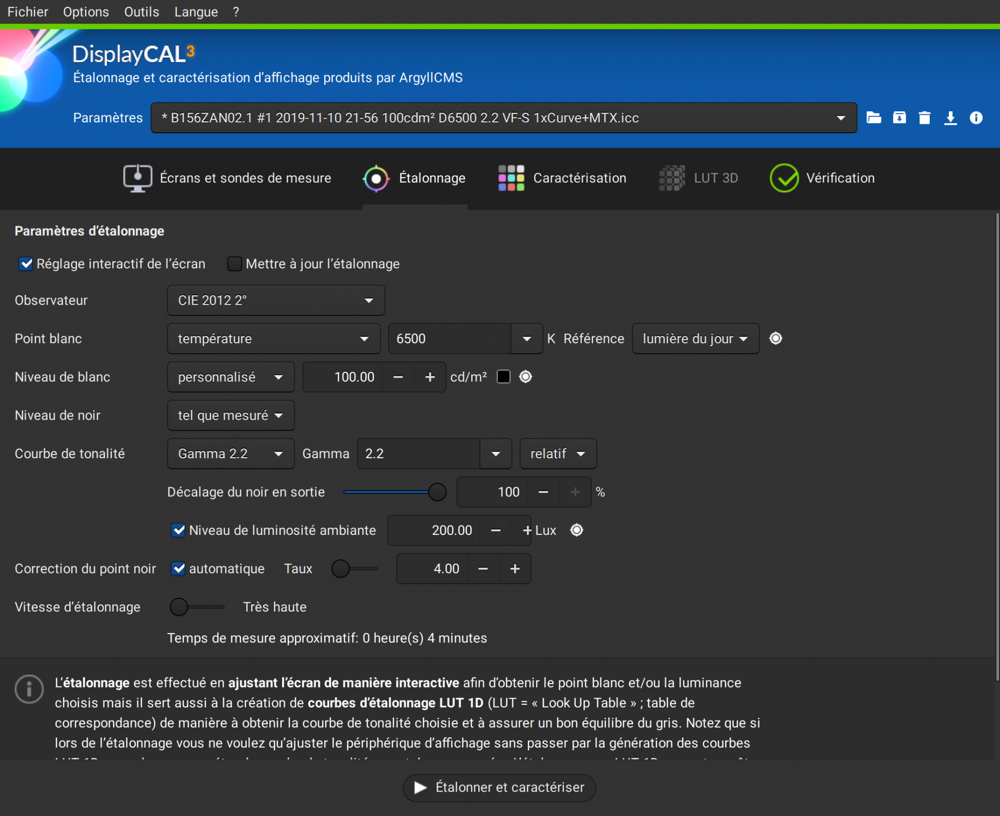
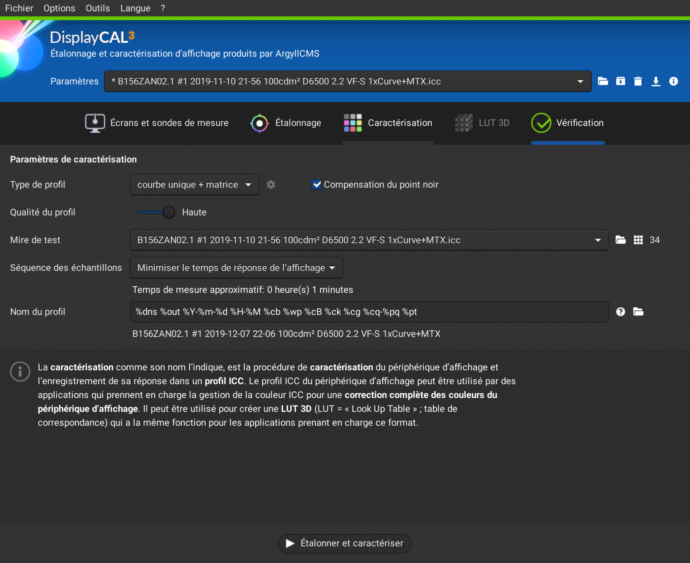

Question habituelle qui perturbe bon nombre de photographes, qui se retrouvent alors promenés de terme technique en concept barbare. Et qui en soulève plein d'autres…

## L'étalonnage, ça sert à quoi ?

Il faut d'abord comprendre que la chaîne de gestion de la couleur, en photo numérique, est construite autour de la photo imprimée sur papier et montrée en galerie, pour des raisons historiques. Et qu'elle a peu évoluée depuis les années 1980, parce que les habitudes, c'est cool.

La photo imprimée sur papier a un contraste qui dépend de la réflexion du blanc du papier et de l'absorption lumineuse des pigments noirs, d'un ordre de grandeur de 200:1 pour le noir et blanc photochimique et de 50:1 pour du jet d'encre couleur, soit une plage dynamique entre 5,6 EV (_jet d'encre couleur_) à 7,6 EV (_N&B photochimique_). Rappelons que le papier ne fait que refléter une partie de la lumière qu'il reçoit, et que les encres ou pigments n'ont pour objectif que de réduire cette réflexion dans une partie du spectre lumineux. Le papier travaille donc en synthèse soustractive (pour produire du bleu, il faut soustraire le vert et le rouge de la lumière blanche).

La photo affichée à l'écran a un contraste qui dépend de sa technologie et de son réglage, d'un ordre de grandeur de 2000:1 à 10000:1 (en poussant le rétro-éclairage à fond)… Mais pour des raisons informatiques (_codage en 8 bits entiers_), sa plage dynamique reste de 8 EV maximum, soit un « contraste » réel de 255:1 (du point de vue de l'encodage des données). L'écran émet de la lumière directement, et travaille donc en synthèse additive (pour produire du bleu… on émet du bleu et c'est tout).  En revanche, l'écran peut aussi se mettre à travailler en réflexion s'il est utilisé dans un environnement très lumineux, auquel cas la luminosité réelle du noir correspond au rétro-éclairage de la dalle à laquelle on ajoute la lumière ambiante, et son contraste réel plonge. C'est là qu'est l'intérêt des écrans à 10000:1 (_valeur constructeur mesurée dans le noir absolu_) : pousser le blanc plus loin (_vu que le noir est imposé par l'éclairage ambiant, pas par l'écran_) pour garder un contraste satisfaisant même dans un environnement très lumineux.

Du coup, on a deux media qui fonctionnent complètement différemment et ne produisent pas du tout les mêmes résultats… L'étalonnage va donc nous servir à avoir un espace commun aux deux pour pouvoir effectuer des adaptations de couleurs qui vont permettre de prévoir sur écran le rendu de l'impression papier.

Sans étalonnage, si j'envoie un triplet rouge-vert-bleu à un écran, à un autre écran, ou à une imprimante, j'obtiens 3 couleurs différentes. Ce qui est un peu gênant… L'étalonnage nous permet, pour un même triplet RGB, d'obtenir la même couleur partout.

## L'étalonnage, c'est la panacée ?

Le problème de l'étalonnage, encore une fois, si l'on respecte la chaîne de couleur ICC, c'est qu'il repose sur l'hypothèse qu'on ne travaille **que** pour le papier. La conséquence de cette hypothèse (_qu'on a un peu oubliée quand on installe un profil ICC_), c'est qu'on s'est permis de la semer à différents endroits de la chaîne graphique où elle n'avait rien à faire (_en toute rigueur_). Par exemple, la valeur standard du gris moyen vient du papier : entre le gris moyen (18,45 %) et le blanc (100 %), on a 2,43 EV, ce qui veut donc dire qu'on suppose une plage dynamique de 4,86 EV (_si l'on veut que le gris moyen se trouve… au milieu_). On est très en dessous d'une plage dynamique d'appareil photo, qui enregistre le gris moyen beaucoup plus bas.

Jusqu'à présent, l'essentiel des logiciels de retouche d'image travaillent donc dans un espace de couleur relatif à l'affichage, c'est à dire après avoir ramené les valeurs RGB entre 0 et 100 % (_100 % de la luminosité maximale de l'écran_) et appliqué une correction gamma. En effet, si l'on applique un gamma 2,44 sur le gris 18,45 % (_ou un gamma 2.2 suivi d'une correction de luminosité de +11 %, ce qui revient algorithmiquement au même_), on obtient la valeur 50 %. Or les [modes de fusion](https://en.wikipedia.org/wiki/Blend_modes#Overlay) éclaircir, assombrir, incrustation, lumière douce, lumière dure, etc. ainsi que les algorithmes classiques de correction de contraste supposent un gris moyen à 50 % (_la valeur est codée en dur dans les logiciels_), et vont traiter les pixels différemment selon qu'ils sont au dessus ou au dessous de cette valeur fixée.

On travaille donc traditionnellement l'image sur des valeurs RGB non-linéaires, pour remapper le gris 18 % autour de 50 %, ce qui peut vite mal tourner quand on fait du HDR (_on va le revoir plus loin_). Dans cet objectif, l'étalonnage sert à brider artificiellement l'écran (_en contraste et en saturation_) pour se ramener au niveau (_médiocre_) du papier et retrouver un résultat visuellement équivalent, de sorte à éviter les mauvaises surprises quand le tirage sort. Dans la chaîne ICC, l'écran n'est qu'un moniteur de prévisualisation de ce que le papier donnera. On retouche l'image comme si on retouchait en réalité le tirage final, ce qui mène à toutes sortes d'incohérences puisque le tirage final est en cyan-magenta-jaune (_en synthèse soustractive_), alors qu'on traite l'image en rouge-vert-bleu (_en synthèse additive_).

Cependant, aujourd'hui, les photos sont consommées principalement sur écran, et l'écran n'est plus un simple moniteur de contrôle du papier, mais un medium de destination à part entière. Ces écrans ont un gamut de plus en plus large (_Apple DCI-P3, Adobe RGB, Rec2020_), et le HDR 10 bits arrive lentement. Non seulement la chaîne ICC (v2 et v4) n'est pas prévue pour le HDR (_sauf la dernière version, ICCmax, bricolée n'importe comment pour ajouter le HDR aux forceps_), mais en plus elle nous empêche de profiter des possibilités offertes par les écrans modernes, puisqu'on retouche toujours avec le papier comme medium de destination.

## L'étalonnage, comment ça se passe ?

D'abord, il faut faire le distinction entre profilage, calibration, étalonnage et caractérisation… Pas simple. On a deux étapes :

1. la calibration (en anglais) ou l'étalonnage (en français rigoureux), qui règle la luminosité du blanc, du noir, la balance des blancs et le gamma. Elle est totalement optionnelle et produit une LUT (_look-up table_) qui sera habituellement chargée ensuite dans la table de gamma de la carte graphique (_VCGT : Video Card Gamma Table_) :

2. le profilage (en anglais), ou la caractérisation (en français rigoureux), qui enregistre le décalage entre la couleur produite par l'écran et la couleur attendue, pour des numéros RGB connus. Cette étape produit le profil ICC :

Quelques précision s'imposent :

1. Il est possible d'enregistrer la calibration dans le profil ICC et d'éviter ainsi l'utilisation de la table de gamma de la carte graphique (VCGT). En effet, suivant le pilote de carte graphique, il est possible que la VCGT soit effacée pendant la mise en veille de l'ordinateur (_et autres bugs sympas du même genre_), ou que plusieurs applications différentes tentent de contrôler la VCGT en même temps. En conséquence, il peut être difficile de savoir quelle table de gamma est effectivement utilisée sur la VCGT, et plus prudent de ne simplement pas l'utiliser (_dans DispCal, allez dans "Options" -> Avancé -> "Ne pas utiliser la table de gamma de la carte vidéo pour appliquer l'étalonnage"_).
2. Le profil ICC est un simple fichier de méta-données, et il ne réalise aucune correction d'image par lui-même. C'est une simple cartographie de la restitution des couleurs pour un medium donné (écran, capteur, imprimante…). C'est le CMS (_colour management system, système de gestion de la couleur, en français_) qui, à partir des profils ICC d'entrée et de sortie, calcule une transformation de couleur et l'applique. Dans darktable, c'est Little CMS 2 qui réalise cette transformation. Il est important de comprendre qu'avoir installé un profil ICC ne garantit absolument pas qu'il soit appliqué, c'est au niveau du CMS qu'il faut contrôler ce qui se passe.
3. Les noms profilage, étalonnage, calibration ou caractérisation sont utilisés n'importe comment et de façon interchangeable sur Internet, et ne signifient pas la même chose en français ou en anglais. ICC étant un organisme anglophone (donc peu précis), ce sont les noms anglais qui font foi dans le contexte de la colorimétrie, mais demandez toujours à vos interlocuteurs de définir de quoi ils parlent avant d'entamer des dialogues colorimétriques de sourds. "Calibration" (_en anglais_) est traduit par "étalonnage" (_en français_), mais "calibration" existe aussi en français et n'a pas le même sens que profilage (_en français, on étalonne un capteur, on calibre des œufs_). Toutes ces définitions sont régies, en français et en anglais, par le Bureau International des Poids et des Mesures (BIPM), mais l'International Colour Constortium (ICC) a choisi de les ignorer allègrement, pour embrouiller au maximum les gens et être sûr de réinventer la roue dans son coin. C'est à savoir, pour comprendre pourquoi… personne ne se comprend.

Personnellement, je suis initialement formé à la métrologie, donc j'utilise la dénomination rigoureuse du BIPM. Pour moi, l'étalonnage c'est l'opération globale qui consiste à corriger la réponse d'un appareil contre un étalon, ce qui englobe donc ce que ICC appelle calibration **et** profilage. Ensuite, concernant les deux étapes du profilage, j'utilise la dénomination anglaise des tordus de chez ICC : calibration et profilage.

## Étalonnage ou adaptation de couleur ?

Répétons le : l'étalonnage ne sert qu'à dresser une carte de la restitution de couleur d'un medium d'entrée ou de sortie (capteur, imprimante, écran), et à l'enregistrer dans un fichier purement informatif qui sera utilisé (ou pas) par un logiciel de gestion de la couleur (CMS). Votre profil ICC n'est qu'un fichier de méta-données, c'est le CMS qui a le dernier mot.

Pour simuler à l'écran le résultat d'une impression, il faut plus que ça : il faut une adaptation de couleur, qui permet de tenir compte du fait que le papier n'est pas rétro-éclairé. Pour réaliser cette adaptation de couleur, il faut un modèle de représentation des couleurs (Lab, JzAzBz, IPT, …) qui permet de tenir compte de la perception humaine pour corriger l'image à l'écran de façon à reproduire un tirage de façon réaliste. Le modèle d'adaptation est construit sur la base de mesure psychophysiques, il en existe un paquet :

- le modèle Hunt, développé chez Kodak par Robert Hunt entre 1952 et 1995 (oui, il a travaillé plus de 40 ans dessus)
- le modèle CIECAM97 et sa version corrigée, CIECAM02, utilisée dans Windows 10 et RawTherapee,
- le modèle Retinex, dont la complexité garantit sa non-utilisabilité pratique,
- les modèles RLab, Nayatani, LLab, ATD, etc.

Leur objectif est de prévoir l'apparence d'une image sous différentes conditions d'éclairage du tirage ou de l'écran. Il est alors possible de compenser la saturation, la teinte et le contraste d'une image pour différents éclairages ambiants, ou de réduire le gamut de l'image en utilisant la plus proche couleur. Ce qui permettrait donc, entre autres, de simuler une impression papier à l'écran, ou de corriger l'impact de l'éclairage ambiant sur votre écran (pour faire comme si vous étiez dans le noir).

La clé de la gestion de couleur n'est donc pas seulement l'étalonnage, elle réside aussi dans des modèles d'adaptation de couleur performants. Et, ici, j'ai une mauvaise nouvelle : l'épreuvage écran que fournit darktable est archaïque et pratiquement inutilisable. Essayez d'imprimer une photo, puis comparez la à l'épreuvage écran de darktable, et jugez vous-même.

La fonction de la calibration, en fixant le point blanc et le point noir, est d'éviter le recourt aux modèles d'adaptation des couleurs en limitant directement le contraste écran à celui du papier (plus ou moins). Mais, même là, la reproduction n'est toujours pas un vrai épreuvage sans corrections additionnelles.

## À la croisée des chemins

La chaîne de couleur ICC suppose que le medium de sortie est un tirage papier. C'est sa raison d'être et, dans ce contexte, ICC est particulièrement performant. Cependant, aujourd'hui, le medium de sortie peut être n'importe quoi : de l'écran HDR 10 EV Rec2020 au tirage jet d'encre 5,6 EV sRGB. Et la chaîne ICC n'est pas prête pour ça, de même que le pipeline couleur classique utilisé dans la plupart des logiciels photo, puisque tout le monde s'est laissé allé en mélangeant la sortie et l'entrée sans trop se poser de question.

Le cinéma possède, depuis très longtemps, un pipeline indépendant du medium de sortie. En effet, le cinéma travaille avec différentes générations de TV, des projecteurs de salle de cinéma (numériques et analogiques), etc. et doit s'adapter en même temps à tout le monde, sans avoir le budget pour recommencer le travail depuis le début. Pour régler ce problème, les productions séparent le master du support : les transformations relatives au support sont déplacées à la toute fin du pipeline (gamma et espace de couleur), et le master est édité dans un espace linéaire totalement isolé du medium de sortie.

Le master est le fichier raw sorti de la caméra, retouché en considérant un medium de sortie parfait dont le gamut est le spectre lumineux visible. À la toute fin, le master est converti et exporté pour un médium précis, et la plage dynamique ainsi que le gamut du master sont ajustés pour le support en utilisant des profils de couleur ou des LUTs. Les artistes qui retouchent n'ont donc pas besoin de se soucier du medium de sortie, qui est pris en charge entièrement par le logiciel et ajusté avec le profil de sortie. De même, si, un jour, une super TV à très large plage dynamique et très large gamut sort, il suffira de "remasteriser", c'est à dire de ré-exporter le master avec de nouveaux paramètres, et de remettre sous presse un nouveau Blue-Ray encodé pour.

Pour ce faire, il est cependant nécessaire d'effectuer toute la retouche dans un espace relatif à la scène, et non relatif à l'affichage, donc de laisser toutes les transformation non linéaires pour l'exportation. Le problème, actuellement, en photo, c'est que ces transformations arrivent au début du pipeline parce que bon nombre d'algorithmes attendent leur point gris à 50 %.

C'est exactement cette chaîne de travail cinématographique que j'incorpore petit à petit dans darktable depuis la version 2.6, et qui commence à rentrer aussi dans RawTherapee et Photoflow (je suis en contact avec leurs développeurs). Le master, c'est le fichier avant de traverser filmique. Tout ce qui se passe avant filmique n'a rien à voir avec le medium de sortie et se trouve appliqué dans un espace linéaire, proportionnel à l'énergie lumineuse. Filmique remappe la plage dynamique, puis le profil de couleur de sortie remappe le gamut, et vous n'avez plus besoin de vous en soucier. Dans darktable 3.0, les modules ont été réarrangés dans le pipe de sorte que rien de ce qui se passe avant filmique RGB n'attende le blanc à 100% et le gris à 50 % : avant filmique, les modules peuvent (plus ou moins) gérer des valeurs entre 0 et l'infini sans rien écrêter. À la fin, filmique s'arrange pour remapper tout le monde entre 0 et 100 %, peu importent les valeurs des pixels en entrée (il suffit d'ajuster les paramètres).

Malheureusement, dans darktable 3.0, pour des raisons de compatibilité, vous trouverez entre filmique RGB et le profil de sortie tous les modules qui ne savent pas fonctionner dans un espace linéaire parce qu'ils attendent le gris moyen à 50 % : les modules qui travaillent la couleur en Lab. Dans un monde idéal, ces modules n'existeraient pas parce qu'ils nécessitent un encodage non-linéaire et une plage dynamique réduite.

## Conclusion

1. L'étalonnage est la combinaison de la calibration et du profilage. Si le profilage est essentiel pour s'assurer de l'homogénéité d'un écran, la calibration (ajustement du contraste et de la température couleur) n'est justifiée que dans le cas d'un travail dédié 100 % à l'impression papier, mais revient à brider artificiellement l'écran et n'est absolument pas nécessaire si un modèle d'ajustement de couleur (comme CIECAM02) est utilisé. De plus, étant donné que le CMS gère la conversion vers le profil de couleur de sortie et que l'œil s'adapte rapidement à la température couleur et au contraste, il est inutile de chercher à forcer le point blanc de l'écran à D50 et son contraste à 245:1, à moins de faire des comparaisons visuelles directes (_côte à côte_) entre un tirage papier et l'écran. Et même dans ce cas, ça n'est pertinent que si vous visualisez votre tirage papier dans une [cabine de lumière](https://www.xrite.com/categories/light-booths/spectralight-qc) à éclairage contrôlé D50.

2. Les écrans LED modernes sont prévus pour un point blanc à une température couleur de 6500 K (D65). Si vous les forcez à D50 ou D55, vous allez réduire leur gamut et augmenter les risques de cassures de tons. Encore une fois, vous avez un CMS qui se charge de faire les conversions requises pour vous (espaces de couleur, point noir et point blanc), au niveau des pixels, inutile de serrer la bride à votre écran. De toute façon, l'épreuvage écran ne marche pas en pratique, et ne sert à peu près à rien si votre master est réellement indépendant du medium de sortie.

3. Dans darktable 3.0 (et déjà dans 2.6), il est inutile de se casser la tête à éviter les dépassement de gamut au niveau de la retouche artistique du master (_avant filmique RGB_) : filmique et Little CMS 2 s'en chargent pour vous. Retouchez votre master comme au cinéma : en supposant un medium de sortie parfait. En principe, Little CMS 2 va remapper les couleurs hors-gamut vers les couleurs les plus proches disponibles dans le gamut de sortie. Si Little CMS 2 n'est pas activé, darktable écrête les couleurs hors-gamut (_à ce moment là, vérifiez quant même le résultat pour éviter les mauvaises surprises… ou activez Little CMS 2_). Mais vous n'avez pas à désaturer les couleurs à la main dans votre retouche artistique pour compenser le gamut réduit de la sortie : c'est le boulot du logiciel, qui dispose d'un profil pour faire ça intelligemment.

4. Gardez toutes les transformations liées à l'affichage (gamma, profil de sortie, tone mapping) pour la toute fin du pipe. Ainsi, votre pipeline devient adaptable à n'importe quel medium de sortie, sans changer la retouche. C'est au niveau de l'export que tout s'ajuste (_dans un monde idéal ; on n'y est pas encore dans darktable 3.0 mais ça vient_).

5. Dans la chaîne ICC traditionnelle, on retouche l'image comme si on retouchait en réalité le tirage final, en utilisant les valeurs RGB encodées pour l'affichage (avec un gamma). Dans la chaîne cinéma moderne, on retouche l'image comme si on retouchait directement les émissions lumineuses de départ, en utilisant les valeurs RGB encodées proportionnellement à l'énergie de la lumière (sans gamma). Ceci nous permet d'avoir à la fois une retouche indépendante du medium de sortie, mais aussi d'utiliser des algorithmes physiquement réalistes, avec un résultat plus naturel.

6. darktable 3.0 est en transition entre la chaîne de travail traditionnelle, liée à l'affichage, et la chaîne de travail moderne, liée à la scène. Les modules positionnés avant filmique RGB dans le pipe sont purement liés à la scène, et ceux après sont purement liés à l'affichage. La transition est en cours, et il va falloir un peu de souplesse intellectuelle pour joindre les deux bouts. La retouche liée à la scène ne pose aucune hypothèse sur la valeur du gris ou du blanc, et s'adapte à n'importe quelle plage dynamique. La retouche liée à l'affichage encode les valeurs RGB de sorte à obtenir le gris moyen à environ 50 % et requiert une plage dynamique modérée (maximum 8 EV). En conséquence les modes de fusion assombrir, éclaircir, incrustation, lumière douce, lumière dure ou lumière linéaire n'ont pas de sens avant filmique RGB. À l'inverse, les modes de fusion addition, soustraction, division et multiplication n'ont pas de sens après filmique.

7. Bien plus que le calibrage de l'écran, c'est la couleur de l'interface du logiciel qui va faire une différence. En effet, la perception des couleurs varie en fonction de l'éclairage ambiant et de la couleur du fond : le thème sombre de darktable peut vous conduire à sur-estimer l'exposition de l'image, et à sous-estimer son contraste (effet Bartleson–Breneman) et sa saturation (effet Hunt). Le thème gris, dans darktable 3.0, a été créé spécialement pour limiter les illusions d'optiques.
