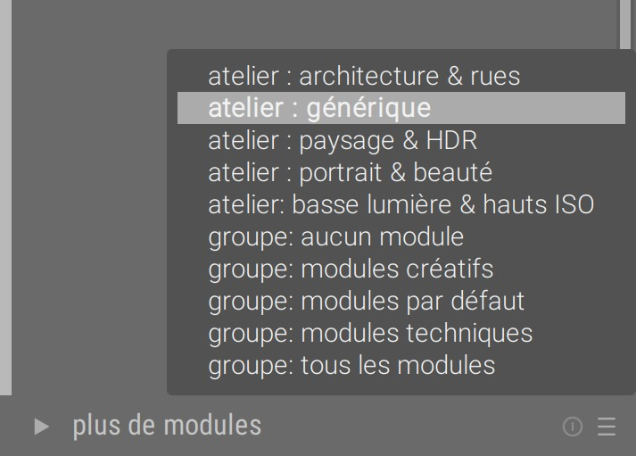

darktable est lentement en train de converger vers un workflow RGB relatif à la scène. Pourquoi ? Qu'est ce que ça implique ? Comment cela change-t-il l'utilisation ? Réponses ici…

_Cet article commence par 3 sections d'introduction théorique sur l'espace Lab que vous n'avez pas besoin de comprendre en détail pour comprendre la suite._

## Lab, c'est quoi ?

L'espace de couleur [CIE Lab](https://fr.wikipedia.org/wiki/L*a*b*_CIE_1976) a été publié en 1976 par la Commission Internationale de l'Éclairage (CIE), dans une démarche, initiée en 1931 avec l'espace XYZ, de représentation mathématique de la perception des couleurs par un être humain moyen. Il vise à découpler l'information lumineuse (canal L) de l'information chromatique (canaux a et b) et tient compte des corrections non-linéaires effectuées par le cerveau humain par dessus le signal linéaire reçu de la rétine. L'espace Lab dérive de l'espace [CIE XYZ](https://fr.wikipedia.org/wiki/CIE_XYZ) qui représente, lui, la réponse physiologique de 3 des 4 types de cellules photo-sensible dans la rétine (les cônes).

Donc XYZ représente ce qui se passe dans la rétine, et Lab représente ce qui se passe au niveau du cerveau, à l'étape suivante. Mais tous deux sont des [modèles](https://fr.wikipedia.org/wiki/Mod%C3%A8le_scientifique), c'est à dire des tentatives de description de la réalité, et pas la réalité elle-même. Entre un modèle et la réalité, il existe toujours une erreur plus ou moins importante, qui diminue à mesure que les chercheurs font leur boulot et raffinent les modèles. De plus, un modèle ne représente souvent la réalité que sous certaines conditions seulement, qui définissent le domaine de validité du modèle.

Et concernant le domaine de validité, si XYZ fonctionne plutôt pas mal à peu près tout le temps, Lab ne fonctionne que tant que l'image a un contraste inférieur à 100:1, soit une plage dynamique de 6.5 EV. Dans le contexte de création du Lab, en 1976 on travaillait avec des négatifs numérisés, et des négatifs couleur tournent autour 6-7 EV de plage dynamique. 6.5 EV, c'est aussi le contraste statique de la rétine, et c'est un peu après 1976 qu'on s'est rendu compte que le cerveau faisait de la fusion HDR en permanence, à partir de plusieurs images chaque seconde, donc le contraste statique n'a pas tellement de sens.

À quoi sert CIE Lab ? À prévoir la différence perceptuelle entre 2 couleurs (le delta E) et donc éventuellement à faire des adaptations de gamut lorsqu'on convertit une image d'un espace de couleur à l'autre. On peut alors essayer de remapper le gamut vers la couleur la plus proche dans l'espace cible via des stratégies qui minimisent le delta E numériquement.

Les gros inconvénients du Lab sont :

- il ne fonctionne pas bien pour les très forts contrastes (> 7 EV), et particulièrement en dehors de la plage \[1 ; 100\] Cd/m²
- il n'est pas linéaire en teinte, c'est à dire que si je fixe les composantes de chromaticité a et b d'un pixel en changeant sa composante de luminosité L, on attendrait la même teinte à une luminosité différente (c'est dans le cahier des charges de l'espace), or on observe un léger virage de teinte parasite, plus ou moins marqué suivant la couleur d'origine du pixel,
- une partie de l'espace Lab sont des couleurs imaginaires, qui sortent du domaine visible.

## Que fait Lab dans darktable ?

L'idée initiale était de permettre de manipuler séparément la luminosité et la chromaticité. En 2009, année de création du projet, les appareils photo avaient des plages dynamiques assez proches du domaine de validité du Lab, l'idée était alors loin d'être stupide, d'autant plus que darktable n'avait alors pas d'option de masquage.

Avantages :

1. Lab étant un espace de référence, donc indépendant de l'espace de couleur de l'affichage, les pré-réglages sont très faciles à transférer.
2. Lab place le gris moyen (18 %) à 50 %, donc l'interface est plus intuitive (le gris moyen est au milieu du graphe de la courbe des tonalités, par exemple).

Problèmes :

1. aujourd'hui, les appareils photos sont largement hors des conditions de validité du Lab, et les défauts de cet espace ressortent d'autant plus. Avec des plages dynamiques variant de 10 à 14 EV, n'importe quel appareil photo récent fait du HDR par défaut, et Lab n'est pas fait pour ça.
2. pousser des pixels dans l'espace Lab est très risqué, notamment lorsqu'on s'attaque au compositing et à la fusion d'image avec des masques adoucis. On va y revenir, mais c'est lié au problème suivant.
3. Lab n'est pas adapté aux corrections physiquement réalistes, comme le floutage, défloutage, débruitage, et n'importe quel filtre qui simule ou corrige un effet optique.

Bref, Lab, c'était une erreur de jeunesse. Ceci dit, tous les autres logiciels de traitement photo semblent travailler par défaut dans des espaces RGB non-linéaires (avec un gamma appliqué au début du pipe), ce qui revient au même, dans les grandes lignes.

## Lab, comment ça marche ?

Tout part d'un espace RGB linéaire classique, par exemple celui du capteur. On convertit le RGB linéaire vers XYZ. Pour les besoins de la démonstration, ici, on peut considérer l'espace XYZ comme un espace de type RGB dont les couleurs primaires ont été un peu manipulées (mais ça se comporte pareil). XYZ est un espace linéaire.

On passe alors du XYZ au Lab en appliquant un « genre de correction gamma » sur le canal de luminance (de Y vers L), et une rotation sur les canaux a et b. Bref, sans rentrer dans les détails, mathématiquement Lab c'est « un peu comme » appliquer un gamma 2.44 sur du RGB linéaire. Disons que ça pose les mêmes problèmes pratiques : c'est fortement non-linéaire.

* * *

**Récapitulatif pour ceux qui n'ont pas tout suivi :** _Lab ne marche pas pour des images à fort contraste, ne marche pas si bien pour des images à contraste modéré, et encode les valeurs des pixels de façon perceptuelle et non physique, ce qui va nous poser problème pour la suite. Lab n'a jamais été construit pour faire de la retouche mais seulement pour étudier la vision humaine._

* * *

## Les limites des espaces non-linéaires en traitement d'image

**D'abord, linéaire, ça veut dire quoi ?** Si _y_ est linéaire par rapport à _x_, ça veut dire qu'il existe une relation entre _x_ et _y_ de la forme _y_ = **a** \* _x_ + **b**, avec **a** et **b** des constantes réelles. **Linéaire, ça veut dire proportionnel à une constante près**.

Quand on parle d'espace RGB linéaire, on entend que les valeurs RGB sont proportionnelles à quelque chose. **Mais proportionnelles à quoi ?**

Pour faire simple, le capteur compte les [photons](https://fr.wikipedia.org/wiki/Photon) qu'il reçoit. Chaque pixel contient donc une information sur le spectre lumineux capté à cet endroit là, sous forme de 3 intensités (rouge, vert, bleu). Le coefficient de proportionnalité **a** entre le nombre de photons et la valeur RGB finale, c'est la sensibilité ISO du capteur. La constante **b**, c'est le seuil de bruit du capteur. Le signal RGB est donc proportionnel à l'énergie de l'émission lumineuse captée par le capteur de l'appareil photo.

Du point de vue de la perception humaine, ces intensités proportionnelles au niveau d'énergie physique de l'émission lumineuse n'ont pas de sens. En effet, le cerveau applique une correction non-linéaire de type logarithmique, que l'espace Lab approxime par une racine cubique pour faire simple, ce qui signifie que nous avons une sensibilité accrue aux basses lumières, et une sensibilité réduite aux hautes lumières.

Cependant, toutes les opérations optiques qui sont réalisées lors de la prise d'image, comme le flou d'objectif, la création de bruit, ou l'effet d'un filtre coloré ajouté sur l'objectif, sont appliquées directement sur les photons. Par conséquent, pour retirer le flou d'objectif, ou pour le simuler, nous avons besoin de travailler sur les informations RGB linéaires qui sont l'information la plus proche du photon dont on dispose. Voyez vous-même, lequel de ces deux bokeh générés par ordinateur (original en bas) vous semble le plus naturel ? (Voir aussi un [exemple plus spectaculaire chez Chris Bejon](https://chrisbrejon.com/cg-cinematography/chapter-9-compositing/#exposure-control-by-dof))

\[gallery columns="2" link="file" size="medium" ids="6858,6859"\]

 Photo d'origine : [Hanny Naibaho](https://unsplash.com/@hannynaibaho?utm_medium=referral&utm_campaign=photographer-credit&utm_content=creditBadge "Download free do whatever you want high-resolution photos from Hanny Naibaho")

Observez notamment comment les personnages sombres (en bas à gauche) fusionnent dans l'arrière-plan clair, ou le contraste des pentagones du diaphragme formés sur les points lumineux. Un autre exemple, avec un simple flou sur des surfaces lisses : lequel de ces dégradés vous semble le plus progressif ?

 Gauche : floutage en RGB linéaire puis encodage en sRGB | Droite : encodage en sRGB puis floutage

Ces deux exemples ont été générés avec Krita, qui permet de travailler aussi bien en RGB linéaire et non-linéaire, et possède des calques de réglages dont un flou d'objectif physiquement réaliste.

Mais ce type de problème va se poser de la même manière dans darktable, dès que vous allez utiliser des modules d'**accentuation de la netteté,** **passe-haut,** **passe-bas**, et des **fusions/adoucissement de masques** dessinés et/ou paramétriques (qui sont des flous).

> Un floutage, un défloutage, ou n'importe quoi de connecté à l'optique doit travailler en RGB linéaire. Il n'y a aucun modèle mathématique\* qui permette d'avoir des dégradés corrects en RGB encodé pour l'affichage (avec un « gamma ») ou en Lab, du fait de la non-proportionnalité à l'énergie lumineuse.

C'est aussi le problème qui survient avec le module **zones de couleurs** au niveau de la fusion des zones (même si un bricolage, introduit sous le mode « flou » permet de cacher un peu mieux la misère), et qui produit des transitions granuleuses et nettes.

Le seul module de darktable qui travaille en Lab pour faire un flou, et où ça marche quand même, c'est le mode **laplacien local** du **contraste local.** La raison est qu'on passe par des courbes de tonalités appliquées sur une séparation de fréquence multi-échelle, _blabla, mots compliqués, blabla_… en bref le prix à payer pour que ça marche, c'est que c'est hyper lourd en calculs et la théorie est rock'n roll. Et… même si le flou est stable, il s'accompagne d'une désaturation peu gracieuse avec virage vers le gris-bleu boueux quand on pousse les curseurs un peu fort.

\* : et ce n'est pas parce que les problèmes ne sont pas visibles tout le temps qu'ils n'existent pas tout le temps. On peut, jusqu'à un certain point, réussir les cacher avec des artifices mathématiques (seuils, opacité, etc.), mais ils finiront toujours par ressortir au plus mauvais moment. Faites moi confiance, je sais exactement où appuyer pour que ça casse.

## Les bénéfices du traitement RGB linéaire

Vous allez me dire « tant que je ne floute pas ou que je travaille uniquement sur la couleur, je peux quand même utiliser Lab ».

C'est partiellement vrai, mais en fait, même dans ces cas là, le travail en RGB linéaire donne des algorithmes plus simples, plus rapides, et qui tolèrent des ajustements bien plus extrêmes sans présenter des effets secondaires aussi gênants. De plus, encore une fois, Lab ne supporte pas les hautes plages dynamiques, donc il faut veiller à utiliser les modules Lab après un mappage de tonalité HDR.

En toute rigueur, la seule application où Lab est nécessaire, c'est le mappage de gamut, lorsqu'on change d'espace de couleur avant d'envoyer l'image vers un fichier ou vers l'écran. Et même là, depuis 1976, on a trouvé de bien meilleurs espaces (IPT-HDR, JzAzBz) pour faire ça en HDR et avec une linéarité des teintes presque parfaite.

## L'état de darktable

À la sortie de darktable 3.0, le pipeline par défaut (c'est à dire l'ordre de base des modules) a été repensé autour de filmique. Il y a donc 4 étapes incontournables dans ce pipe :

1. le **dématriçage**, par lequel on passe du fichier raw (à trous) à une image (complète),
2. le **profil de couleur d'entrée**, par lequel on convertit l'espace RGB du capteur vers un espace standard de travail,
3. **filmique** (ou la **courbe de base**), qui font la bascule entre l'espace linéaire (proportionnel à l'énergie lumineuse) et l'espace non-linéaire (compressé de façon perceptuelle),
4. le **profil de couleur de sortie**, par lequel on convertit de l'espace standard de travail vers l'espace RGB de l'écran ou du fichier image.

Notez que l'approche reposant sur **courbe de base** reste l'approche par défaut car elle permet de retomber plus ou moins sur le rendu des JPEG du boîtier dès l'ouverture du logiciel, ce qui semble être la préférence de beaucoup d'utilisateurs. Néanmoins, la **courbe de base** a été repoussée dans le pipe juste avant filmique, donc elle est désormais sécuritaire pour les couleurs des modules qui arrivent avant et s'est vue ajouter un mode de préservation des couleurs similaire à **filmique**. Donc, entre **courbe de base** et **filmique, pour darktable 3.0,** la différence se fait désormais seulement sur l'ergonomie et sur la capacité à récupérer les très basses lumières. **Filmique** est un peu plus complexe à comprendre mais plus rapide à régler (une fois qu'on a compris), et reste meilleur pour aller rechercher les basses lumières.

Les modules qui travaillent en RGB linéaire et réalisent des opérations linéaires (donc laissent le pipeline linéaire après eux) sont :

1. **exposition,**
2. **balance des blancs**,
3. **mixeur de canaux,**
4. **égaliseur de tons** (qui est linéaire par parties).

L'avantage de réaliser des opérations linéaires est qu'elles n'affectent en rien la chrominance de l'image (changer la luminosité laisse la chrominance intacte) et préservent la proportionnalité à l'énergie du signal. Ces modules doivent être positionnés avant filmique ou la courbe de base, et exposition et **égaliseur de tons** sont recommandés avant le **profil d'entrée**. Ils peuvent être utilisés sans danger et sans modération. Notez qu'il y a un bémol ici sur l'**égaliseur de tons**, qui préserve la linéarité locale (à l'intérieur des zones de l'image), mais pas la linéarité globale (entre les zones). Ça correspond à ce qui se passerait si on arrivait sur la scène avec une lampe torche, et qu'on ré-éclairait à la main les objets de la scène, donc on garde quand même la cohérence physique du signal.

Les modules qui travaillent en RGB linéaire et réalisent des opérations non-linéaires mais respectueuses de la chrominance (à condition d'activer le mode _ad-hoc_) sont :

1. **courbes RGB**,
2. **niveaux RGB**.

Le respect de la chrominance passe par les modes de préservation qui contraignent les ratios RGB en entrée et en sortie du module, de sorte à les garder identiques. Notez que **courbes RGB** et **niveaux RGB** peuvent être déplacés avant ou après **filmique** suivant l'intention, de toute façon ils réalisent des opérations non-linéaires. Par contre, veillez à ne pas utiliser d'adoucissement de masque sur des modules qui viendraient après, car la linéarité n'est plus assurée.

Les modules qui travaillent en RGB linéaire et réalisent des opérations non-linéaires et non respectueuses de la chrominance sont :

1. **mappage des tonalités**, (on va y revenir)
2. **balance couleur**,
3. **LUT 3D**.

**Balance couleur** est conçue pour être appliquée sur des données RGB linéaires non corrigées en contraste, donc avant **filmique, courbes de tonalités, etc.**. Elle ne préserve pas la chrominance puisque son but est explicitement de l'ajuster créativement. Idem pour **LUT 3D**, dont le principal but est d'émuler des émulsions de film argentique.

Je rappelle ici que **filmique** est une conversion de plage dynamique, depuis la haute plage dynamique de l'appareil photo, vers la faible plage dynamique de l'écran. Il ne s'agit pas d'une courbe de tonalités destinée à appliquer une correction artistique, mais d'un mappage de tonalités pour faire rentrer au chausse-pied les données capteur dans l'espace disponible de l'écran, en essayant de protéger autant que possible les détails (qu'on suppose _a priori_ dans les tons moyens) et de garder une certaine lisibilité optique dans l'image.

Avant **filmique**, dans le pipe linéaire, on trouve quand même des modules qui travaillent en Lab mais réalisent des opérations linéaires qui devraient (en toute rigueur) être réalisés en RGB linéaire :

1. **égaliseur de contraste,**
2. **passe-haut,**
3. **passe-bas,**
4. **renforcer la netteté,**
5. **reduction du bruit (moyenne non locales)**

Ces modules doivent être adaptés dans le futur pour pouvoir travailler dans un espace Yxy (dérivé de CIE XYZ) linéaire car **c'est une erreur de les faire travailler en Lab**. C'est un travail relativement facile à effectuer car Yxy décompose la luminance (canal Y) et la chrominance (canaux x et y) avec un logique similaire au Lab, moins la transformation non-linéaire. Dans l'intervalle, vous pouvez continuer à les utiliser, mais avec modération. Pour l'**égaliseur de contraste**, notez qu'il utilise une séparation en ondelettes sensibles aux bords, ce qui le rend assez lourd à l'exécution, mais très efficace pour éviter les halos, même en considérant qu'il travaille en Lab.

Après **filmique**, dans le pipe non-linéaire, se trouvent tous les autres modules Lab puisqu'ils ont besoin d'un espace à faible plage dynamique. Certains de ces modules pourront être également convertis vers xyY et migrés avant filmique dans le futur (notamment l'**effet Orton,** le **grain** et **lumière d'appoint**). Notez en outre que le module **vignettage** a été laissé en fin de pipe, comme avant, bien qu'il travaille en RGB. Il est probable qu'il soit mieux avant **filmique**, voire avant le **profil d'entrée**, mais son code est surprenamment complexe pour ce qu'il réalise et je n'ai pas eu le temps de détricoter l'imbroglio pour comprendre quelles sont ses hypothèses de travail.

## Modules déconseillés

Les modules déconseillés le sont en raison d'erreurs fondamentales de conception, sur la base de mon opinion personnelle, qui repose sur mon expérience pratique et théorique de la retouche d'image, et dans un esprit de rationalisation du workflow à un nombre minimal d'étapes. Rien ne vous empêche de continuer à les utiliser, d'autant plus que les utilisateurs me font régulièrement découvrir des usages (souvent détournés) auxquels je n'avais pas pensé. Mais l'idée ici est bien de vous donner les clés pour le meilleur résultat possible le plus vite possible avec le minimum de tracas possible.

### Mappage local des tonalités

Le mappage local des tonalités encode les valeurs RGB logarithmiquement en interne (elles sont ensuite décodées à la sortie, pas de problème à ce niveau là), puis applique un flou bilatéral sur ces valeurs logarithmiques. Comme on l'a vu plus haut, la théorie est claire : un flou, sur n'importe quoi de non linéaire, produit des halos et des franges. Et comme promis, la plage de réglages utiles de ce module est très réduite, si bien que les utilisateurs ont pris l'habitude de fusionner la sortie du module avec de faibles opacités. Qu'on soit clair : ça revient seulement à cacher la misère.

_Préférez l'égaliseur de tons._

### Mappage des tonalités (global)

Ce module travaille en Lab pour effectuer une compression HDR, et si vous avez suivi mes explications, vous avez compris que c'est une contradiction dans les termes. De plus – et c'est important – la valeur du blanc est ajustée automatiquement depuis le maximum dans l'image, donc la luminosité globale de l'image peut donc changer suivant la taille de l'exportation, à cause du lissage opéré par la mise à l'échelle (interpolation). À prévoir : un JPEG plus clair ou plus sombre que la prévisualisation en chambre noire.

_Préférez filmique._

### Ombres et hautes lumières

Idem, ce module travaille en Lab pour effectuer une compression HDR et utilise un flou gaussien ou bilatéral pour isoler les hautes et les basses lumières. En pratique, ça donne des halos assez vite dès qu'on pousse les paramètres (même si le flou bilatéral allège un peu les problèmes), et il tend même à rajouter du contraste local (par effet secondaire) dans les hautes lumières, pour des nuages au look très HDR. Dans les basses lumières, utilisé un peu fort, ce sont les couleurs qui virent vers le bleu-gris. Dans tous les cas, c'est quand vous avez le plus besoin de ce module qu'il vous lâche, en pratique il ne fonctionne bien que pour des corrections mineures.

_Préférez l'égaliseur de tons._

### Filtre passe-bas

Le filtre passe-bas est en fait un simple flou. Beaucoup de gens l'utilisent pour inverser le contraste, et le fusionnent ensuite en incrustration ou en lumière douce/dure/linéaire, pour comprimer la plage dynamique. C'est en fait exactement ce que fait déjà le module **ombres et hautes lumières** en moins d'étapes pour l'utilisateur. Comme mentionné plus haut, le **passe-bas** travaille en Lab, donc pour le flou… Attendez vous au pire.

_Préférez l'égaliseur de contraste pour le flou, ou l'égaliseur de tons pour la compression locale de plage dynamique_

### Filtre passe-haut

Beaucoup de gens utilisent le passe-haut en le fusionnant en incrustation ou en lumière douce/dure/linéaire, pour rajouter de la netteté. C'est en fait exactement ce que fait déjà le module **renforcer la netteté**. Le passe-haut est réalisé par soustraction entre un flou (passe-bas) et l'image d'origine, donc on a le même problème que pour le **passe-bas** car il travaille encore en Lab.

_Préférez l'égaliseur de contraste pour la netteté fine, ou le contraste local pour l'acutance générale._

### Renforcer la netteté

Le module de renforcement de la netteté était initialement prévu pour corriger les capteurs munis d'un filtre passe-bas optique ainsi que le lissage dû au dématriçage dans certains cas. Premièrement, comme ce module travaille en Lab, il n'y a pas besoin de le pousser beaucoup pour qu'il produise des halos. Deuxièmement, la méthode interne d'accentuation de la netteté (par [masque flou](https://fr.wikipedia.org/wiki/Masque_flou)) est assez archaïque et rapidement artificielle, même en mode RGB. Troisièmement, compte tenu de la netteté des optiques modernes, du fait que beaucoup de capteurs n'ont plus de filtre passe-bas, et que la plupart des photos seront exportées à un rapport de réduction d'au moins 8:1 (24 Mpx capteurs vers 3 Mpx écran), le renforcement de netteté au niveau du pixel est devenu pratiquement inutile. De façon générale, le photographe numérique du 21e siècle gagnerait à se calmer le pompon avec la netteté qui croustille, ça ferait du bien à tout le monde.

_Préférez l'égaliseur de contraste pour déflouter l'optique via les pré-réglages fournis, ou le contraste local pour l'acutance générale._

### Monochrome

Le module **monochrome** travaille en Lab, qu'il utilise pour définir un bonus ou un malus de contribution de certaines couleurs à la densité du noir, en vue de convertir la couleur en nuances de gris. Le problème est que l'interface est assez chatouilleuse dans les réglages, et une petite correction peut produire de gros changements et casser le contraste global de façon assez disgrâcieuse. En pratique, obtenir un résultat prévisible est assez difficile et ce module se solde souvent par des séances fastidieuses de micro-ajustements.

L'idée d'une contribution pondérée des couleurs à la densité du noir vient de la pellicule argentique, qui se comporte exactement de cette manière. Mais, vous l'avez vu venir, la pellicule ne travaille pas en Lab. Cette idée est reprise de façon physiquement réaliste dans le module **mixeur de canaux**, où plusieurs pré-réglages d'émulsions argentiques commerciales sont proposés pour créer un canal gris. Notez que, pour que les coefficients soient exacts, l'espace de couleur de travail (dans le module **profil d'entrée**) doit être réglé sur REC 709 linéaire, autrement les réglages devront être ajustés.

Pour un noir et blanc basé sur la luminance perceptuelle humaine (linéaire), il suffit de baisser la saturation d'entrée ou de sortie à 0 % dans la **balance couleur** (clic droit sur le curseur, puis entrez 0 au clavier — le réglage ne va que jusqu'à 50 % par défaut dans l'interface).

_Préférez le mixeur de canaux pour une approche argentique ou la balance couleur pour une approche perceptuelle._

### Lumière d'appoint / Lumière d'arrière plan / Zones

Ces trois modules visent à ré-éclairer une partie de l'image, et tentent de diluer la correction en intensité et dans l'espace en faisant un flou dans l'image. Mais comme ils travaillent en Lab… bref, je ne vous la refais pas. Les résultats sont juste mauvais tout le temps, exceptés avec des réglages très doux, qui signifient que vous n'aviez pas vraiment besoin de ces modules.

_Préférer le module d'exposition avec des masques, ou l'égaliseur de tons._

### Correction des couleurs

Toute photographie comporte au moins deux sources de lumière : une source directe (lampe, soleil, bougie) et une source réfléchie (murs, nuages, sols, plafond). Il arrive souvent que la balance des blancs de ces deux sources ne coïncide pas. En pratique, la vision humaine a ce qu'il faut pour corriger ça, mais pas l'appareil photo. Il faut donc effectuer une correction séparée de la balance des blancs pour les hautes lumières (qui reçoivent, en général, la lumière directe) et les basses lumières (qui reçoivent, en général, la lumière réfléchie).

C'est ce que vous propose le module **correction des couleurs**, encore une fois en Lab, encore une fois avec une interface discutable, encore une fois avec des résultats mitigés et peu naturels dès qu'on pousse le réglage. Pourtant, en y réfléchissant bien, les soucis de balance des blancs se ramènent à des histoires de spectre lumineux, et leur correction est plus simple en RGB, notamment pour gérer la progressivité de la correction.

Le module **balance couleur** vous permet de régler ça beaucoup plus vite, et pas seulement pour les ombres et pour les hautes lumières, mais aussi pour les tons moyens. En utilisant les pipettes, à droite des curseurs de teintes, il vous permet aussi d'aller directement prélever des tons neutres dans l'image (pour le noir, gris et blanc) et de laisser le logiciel calculer la couleur complémentaire. Voir le manuel pour plus de précisions.

_Préférez la balance couleur._

### Velvia

Velvia travaille en RGB en fonctionne sur une logique assez similaire à la saturation de la balance couleur. En apparence, ça sent bon. Sauf qu'en fait, son équation colorimétrique n'est pas perceptuellement correcte, ce qu'il fait qu'il va changer tout à la fois la saturation (ce qu'on lui demande), mais aussi la teinte et la luminosité (ce qui devient gênant). On fait passer la pillule en appelant ça un effet créatif Velvia, censé reproduire le film éponyme de chez Fuji. Le problème est qu'il semble avoir été optimisé pour le RGB non-linéaire. Du coup, c'est le genre de module typiquement imprévisible.

_Préférez la balance couleur._

### Niveaux / Niveaux RGB

Ces deux là marchent comme ils devraient, aucun problème là dessus. Mais quand on regarde le code, on s'aperçoit qu'il duplique exactement le mode **slope/offset/power** de la **balance couleur.** Le point blanc est mis à l'échelle par une simple correction d'exposition, comme le facteur du slope ou même… l'exposition du module **exposition**. Le point noir est ajusté par addition d'une constante, comme le facteur de l'offset, ou la correction du point noir du module **exposition**. Le point gris est ajusté par une fonction puissance (improprement appelée gamma), exactement comme le facteur du power de la **balance couleur**. Ce ne sont pas juste les mêmes fonctionnalités, ce sont exactement les mêmes maths. La différence réside donc seulement dans l'ergonomie, mais aussi dans le fait que la balance couleur vous donne la valeur numérique des réglages, ce qui les rend plus facilement transférables d'une image à une autre ou d'un logiciel à l'autre.

_Si vous utilisez déjà la balance couleur, inutile d'ajouter en plus un module niveau. Finissez votre retouche dans le même module._

### Courbes / Courbes RGB

Ceux là aussi marchent bien mais considérant leur usage classique… sont-ils bien utiles ? Habituellement, on les utilise pour ajouter/retirer de la luminosité, ce qui tombe exactement dans le cas d'utilisation du gris des **niveaux** ou du power de la **balance couleur,** ou pour ajouter/retirer du contraste, ce qui peut s'ajuster soit en diminuant/augmentant l'intervalle entre le blanc et le noir (de façon linéaire), soit en appliquant une compression de luminosité non linéaire, encore une fois disponibles depuis la **balance couleur**.

L'ergonomie des courbes pose un vrai problème dans un workflow RGB linéaire, car le gris moyen est supposé au centre du graphe, ce qui suppose en conséquence qu'on travaille en RGB non-linéaire où le gris à été relevé à 50 %. Dans un encodage linéaire, le gris moyen standard est attendu à 18 % (mais la pratique est souvent non standard), et le contrôle du contraste autour de cette valeur non centrée sur le graphe devient complexe dans l'interface. De plus, le graphe des courbes suppose un signal RGB limité entre les valeurs 0 et 100 %… 100 % de quoi ? De la luminance du blanc écran. Dans un workflow linéaire, le signal HDR peut aller de 0 à l'infini, et c'est au niveau de filmique qu'on se charge de remettre tout le monde entre 0 et 100 % du blanc écran.

Le contraste de la balance couleur est compatible avec cette approche non-limitée, via son paramètre **pivot**, qui permet de sélectionner la référence de contraste. Ainsi, au dessus du pivot, on augmente la luminosité, en dessous, on la diminue, mais le pivot reste inchangé. Le workflow relatif à l'affichage (en Lab ou en RGB non-linéaire) pose toujours l'hypothèse implicite que le gris est à 50 %, et ne vous permet me pas de changer cette valeur.

_Préférez la balance couleur._

### Contraste / Luminosité / Saturation

Module travaillant en Lab, qui duplique encore une fois les module niveaux, les courbes, et la balance couleur tout en ajoutant un paquet d'effets indésirables sur les couleurs.

## Modules à utiliser avec précaution

Ces modules ne peuvent être déconseillés car on n'a pas de remplaçant exact pour l'instant, mais ils doivent être utilisés avec prudence car ils peuvent se montrer imprévisibles et vous faire perdre beaucoup de temps.

### Vibrance

Vibrance travaille en Lab en applique une correction de saturation qui pénalise les pixels déjà saturés pour éviter les sur-saturations, mais tend aussi à assombrir les couleurs. Le résultat est loin d'être laid, le problème est qu'on ne peut pas contrôler de combien on assombrit pour la quantité qu'on resature.

_Préférez les zones de couleurs avec une sélection par saturation._

### Zones de couleur

Ce module serait génial si la fusion entre zones de teintes étaient plus progressive. Il dispose aujourd'hui de deux modes (**prononcé**, l'ancien, et **flou**, le nouveau) qui tentent de relever ce défi de deux façon différentes, avec des résultats trop discrets pour le nouveau, et des transitions trop abruptes pour l'ancien. Encore une fois, il travaille en Lab, quand les fonctionnalités similaires chez Capture One semblent utiliser HSL ou HSV, et c'est peut-être un début de piste pour expliquer pourquoi il est loin derrière.

Dans certains cas, **zones de couleurs** gagnera a être remplacé par la **balance couleur** où l'on utilisera le masquage paramétrique pour isoler les teintes sur lesquelles on veut agir. Ensuite, le rafinement du masque paramétrique par filtre guidé devrait aider pour les cas difficiles. Pour le reste, balance couleur permet de virer la teinte, de pousser la saturation et la luminosité exactement pareil.

Notez cependant que la **balance couleur,** bien que travaillant en RGB à l'interne, fusionne les masque en Lab car ce module date d'avant la possibilité d'avoir des modules 100 % RGB, et convertit de Lab vers RGB en interne. On y travaille encore…

_Préférez la balance couleur._

### Vignettage

Ajouter une vignette autour de l'image n'est pas compliqué : il suffit d'abaisser graduellement l'exposition, et éventuellement la saturation. Pour autant, le module **vignettage** réalise une magie noire incompréhensible, qui est largement plus compliquée que cela, avec une homogénéisation interne qui devrait être superflue si les choses étaient bien faites. Le résultat est rarement naturel, la transition de luminosite étant trop violente par rapport à une vraie vignette.

Vous obtiendrez de meilleurs résultats avec un module **exposition** réglé à -0.5 EV, un masque circulaire avec une large zone de transition dont vous aurez inversé la polarité, doublé éventuellement d'un module de désaturation des couleurs auquel vous passerez le masque d'**exposition** via un masque rasterisé.

_Préférez le module exposition._

## Modes de fusion des masques déconseillés

Peu de gens le savent, mais les [modes de fusion](https://en.wikipedia.org/wiki/Blend_modes) éclaircir, assombrir, incrustation, lumière douce, lumière vive, lumière linéaire, lumière ponctuelle, attendent implicitement le point gris à 50 % et sont donc totalement héritiers du worflow relatif à l'affichage. Il suffit de regarder les équations pour s'en rendre compte. Ils vont ainsi traiter les pixels différemment suivant qu'ils sont au dessus ou au dessous de 50 %. On rappelle que le workflow RGB linéaire garde le point gris à 18 % (voire moins). Ces modes de fusion vont donc se comporter de façon imprévisible dans les parties linéaires du pipeline.

En RGB linéaire, vous disposez seulement des modes de fusion basés sur des opérations arithmétiques (addition, multiplication, division, soustraction, moyenne), basés sur des comparaison maximum/minimum (écran) ou sur des séparation de canaux (teinte, couleur, chroma, etc.).

À noter, le mode multiplier est un des plus puissants en RBG linéaire. Par exemple, pour accentuer le contraste d'une image de façon naturelle, il suffit d'utiliser un module **exposition** fusionné en multiplication, de régler l'exposition entre 2 et 3 EV et l'opacité entre 10 % et 50 %. L'exposition sert alors à contrôler le point de pivot du contraste, et l'opacité l'intensité de l'effet. C'est rapide, simple et efficace.

## Un workflow minimal pour un débutant

Dans darktable, vous avez le choix entre 77 modules qui vont vous permettre de faire la même chose de plein de façons différentes. Mais c'est souvent une illusion de choix, car beaucoup d'entre eux ont autant d'inconvénients que d'avantages. Si vous ouvrez le code source des modules déconseillés ci-dessus, vous vous rendrez compte qu'ils sont quasiment tous datés de 2010-2011 et qu'on a dû les garder pour tenir la promesse de rester compatible avec les anciennes retouches.

Vous pouvez pratiquement réduire au moins 80 % de votre retouche à 4 modules :

1. **exposition**,
2. **balance des blancs**,
3. **balance couleur**
4. **filmique**.

S'ils sont si puissants, c'est qu'ils sont en réalité extrêmement simples, quand vous regardez leurs équations :

- **Exposition** : RGB\_sortie = exposition × RGB\_entrée + niveau de noir
- **Balance couleur** :
    - CDL : RGB\_sortie = (slope × RGB\_entrée + offset)^power
    - contraste : RGB\_sortie = (RGB\_entrée / pivot)^contraste × pivot
- **Balance des blancs** : RGB\_sortie = coefficients × RGB\_entrée
- **Filmique** est un poil plus complexe, mais ça reste des maths de niveau lycée.

Avec ces 4 modules, vous avez tout ce qu'il faut pour produire une image regardable, corriger les soucis de colorimétrie, le contraste et ajouter une intention artistique. Pensez à désactiver la courbe de base si vous passez par filmique. Ensuite, suivant les besoins, complétez avec les modules suivants :

- Pour améliorer l'acutance, la meilleure option est le module **contraste local,** en mode **laplacien local.**
- Pour déflouter l'objectif, vous avez des pré-réglages de défloutage plus ou moins prononcé dans l'**égaliseur de contraste**.
- Pour débruiter, le meilleur algorithme est dans le module **réduction du bruit (profil)**, en mode **moyennes non-locales auto** si vous ne voulez pas vous casser la tête.
- Pour supprimer la brume, vous avez un module de **suppression de la brume,**
- Pour faire un noir et blanc, le plus simple est d'utiliser les pré-réglages de films dans le **mixeur de canaux**,
- Pour un contrôle créatif du contraste global et rééclairer la scène a posteriori, utilisez le module **égaliseur de tons**.

Certains de ces modules sont d'une puissance méconnue, et largement sous-exploitée :

1. Le module **exposition**, avec ses masques, peut remplacer toutes les options de **mappages** HDR, **ombres et hautes lumières**, l'**égaliseur de tons**, les **courbes de tonalités**, et même le **contraste local** (dans une certaine mesure), utilisé en fusion multipliée.
2. Le module **mixeur de canaux** peut venir à bout de tous vos problèmes de gamut, y compris les problèmes de lumières de scène bleues, sans avoir à utiliser un faux profil d'entrée, mais également transformer l'herbe en neige ou des arbres d'été en arbres d'automne.
3. La **balance couleur** peut vous permettre d'émuler les couleurs d'une pellicule, de compenser une balance des blancs inégale, de supprimer des rougeurs sur la peau, d'accentuer le relief, de créer un split-toning, ou de donner une ambiance apocalyptique à vos images.

Enfin, pour n'afficher dans l'interface qu'une sélection minimale et raisonnable de modules, à droite de « **Plus de modules** », ouvrez la liste des presets et choisissez « **Atelier - générique** ».

darktable est quand même franchement plus simple quand vous avez compris que vous n'aviez pas à utiliser tous ses 77 modules en même temps…

Si vous avez un doute sur l'ordre des modules, sachez que l'ordre par défaut pour la version 3.0 a été pensé de façon globale, et à part quelques incertitudes sur la meilleure position des modules vignettage ou monochrome, le reste se tient de façon plutôt solide, en théorie et en pratique.

## Conclusion

Pousser des valeurs de pixels dans un sens ou dans l'autre, c'est une chose. Fusionner les corrections pour qu'elles se fondent discrêtement dans l'ensemble en est une autre. Nous avons vu que le Lab ou le RGB non-linéaire permettent de pousser les pixels plus ou moins correctement, mais que c'est toujours au niveau de la fusion et des flous qu'on paie la facture. Or il se trouve qu'ils y a beaucoup de flous, sous le capot de darktable, parfois où on ne les attend pas. C'est particulièrement problématique quand on fait du _compositing,_ c'est à dire de l'incrustation d'une image dans une autre, pour échanger leur arrière-plan sans toucher au premier plan par exemple. Et c'est précisément ce type de manipulation qui a conduit l'industrie du cinéma à migrer vers le linéaire relatif à la scène depuis déjà une vingtaine d'années.

darktable paie 10 ans de design opensource. Design opensource, ça veut dire que tout le monde et n'importe qui peut sauter sur son éditeur de texte pour coder des trucs avant d'avoir couché les maths sur une feuille et vérifié que la théorie se tenait ou que le problème à résoudre était clairement posé. Ça donne de bonnes surprises, parfois, mais souvent des erreurs fondamentales, commises notamment sur les espaces de couleurs, avec des fonctions de transfert linéaires appliquées dans des espaces non-linéaires, ou des ajustements HDR appliqués dans espaces SDR. Ce type d'erreurs arrivent aussi dans Gimp, Krita, Blender, etc. Comme le traitement d'image ne risque de tuer personne, on se permet un laxisme qui serait intolérable en médecine ou en génie civil.

La théorie donne des boutons aux utilisateurs comme aux développeurs, et il va falloir que ça cesse assez vite si on ne veut pas continuer à tourner en rond ces 10 prochaines années. Tout ce qui marche sur le papier ne marche pas toujours en pratique, mais tout ce qui ne marche pas sur le papier est garanti d'échouer en pratique. Le fait est que l'abstraction et les mathématiques font peur aux gens, alors qu'ils simplifient considérablement le résolution des problèmes complexes. Ce qui devrait effrayer, c'est plutôt l'absence de modèle mathématique clair pour décrire la réalité qu'on manipule dans le logiciel, parce que celui-ci ne sait rien faire d'autre que des calculs, donc autant qu'ils soient propres.

La leçon à tirer de tout ça, c'est de passer plus de temps à faire des recherches et de mettre à plat la théorie disponible sur le papier, avant de s'embarquer dans le code. C'est de définir les contours des problèmes plus précisément, et le cadre de la solution plus clairement, avant de se jeter sur la première solution trouvée et de coder n'importe quoi. Et c'est aussi de s'inspirer de ce que fait le cinéma, parce qu'ils travaillent avec d'avantage de contraintes que la photo, ce qui les oblige à être plus rigoureux et finalement plus intelligents.

darktable est donc en transition. C'est long, c'est parfois pénible, il y a plein de petits bouts à changer à différents endroits et ça fait râler les utilisateurs avides de cohérence. Au moins, maintenant vous savez le pourquoi et le comment. Vous savez aussi ce que vous avez à y gagner. J'espère que ça vous aidera à progresser.

Pour les nouveaux utilisateurs, limitez vous aux modules recommandés ci-dessus, et aventurez-vous plus loin quand vous commencerez à être à l'aise. Pour les anciens utilisateurs, les nouveaux modules ont beaucoup à vous apporter, mais les anciens en Lab restent pertinents pour des effets créatifs modérés et utilisés en connaissance de leurs dangers.

La boîte à outils linéaires est en train de s'étoffer. Au programme :

- la ré-écriture de la balance couleur 100 % RGB (y compris la fusion), avec ajout de la vibrance (et une équation de vibrance développée maison pour préserver la teinte),
- la conversion de l'égaliseur de contraste et de l'effet Orton vers l'espace xyY linéaire (parce qu'en fait, l'effet Orton, lorsqu'il marche comme il devrait, est très utile),
- un égaliseur de couleur, similaire à l'égaliseur de tons, qui permettra d'ajuster saturation, vibrance et effet Abney en fonction de la luminance des pixels, pour redonner du peps à la courbe filmique,
- un [tout nouveau module de déconvolution](https://discuss.pixls.us/t/got-an-image-problem-go-see-the-image-doctor/14518) des objectifs, respectueux de la profondeur de champ (mais pour ça, il faut que je développe encore une ondelette spéciale basée sur le filtre guidé), qui devrait transformer vos 18-55 mm tout mous en Zeiss pour vraiment moins cher,
- et bien sûr la version OpenCL de l'égaliseur de tons.

Voilà, il y a plus de boulot que de gens pour le faire, donc souhaitez-nous bonne chance, n'oubliez pas de [nous soutenir](https://liberapay.com/darktable.fr/), et bonne année 2020 à vous tous !
