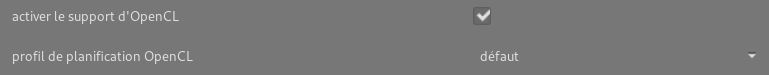

_Cet article est une réédition mise à jour d'un précédent article publié sur mon [blog personnel](https://blog.nicolastissot.fr/travailler-sur-une-version-compilee-de-darktable/) il y a maintenant presque un an. Suite à de récentes demandes de plusieurs utilisateurs sur la communauté Framateam à ce sujet, j'ai proposé aux administrateurs du blog de le republier ici afin d'améliorer la visibilité de celui-ci et de permettre d'accompagner le plus grand nombre d'utilisateurs de darktable souhaitant compiler le logiciel. Merci à eux pour me permettre de l'écrire ici et j'espère que cet article vous sera utile._

# Introduction

Vu que cet article est mon premier sur ce blog, je suppose que peu de lecteurs me connaissent. Pour me présenter en quelques mots, je pratique la photographe en amateur depuis environ 10 ans, et étant fervent défenseurs du logiciel libre, le traitement de mes photos _via_ un logiciel libre est vite devenu une évidence. J'ai longtemps travaillé sur Rawtherapee pour passer sur darktable à partir de la version 2.0. Bien que je ne maîtrise pas encore totalement le logiciel, loin de là même, je l'utilise tout de même sérieusement depuis environ la version 2.4 au moment où j'ai décidé de repartir sur une [base saine](https://blog.nicolastissot.fr/bien-demarrer-sur-darktable-catalogage-des-photos/). Je n'ai au final que quelques années de recul de son utilisation. Depuis la version 2.6, l'arrivée d'Aurélien dans l'équipe de développement et la création de la communauté sur Framateam, j'ai été amené à discuter beaucoup plus régulièrement avec l'équipe de dev francophone et même à en rencontrer certains en dehors d'Internet. Petit à petit, la tentation d'utiliser une version compilée du logiciel et de commencer à donner un coup de main à mon humble échelle a été de plus en plus forte. Finalement, c'est à partir de la sortie de la version 2.6 que j'ai franchis le pas en compilant pour la première fois ma propre version.

À l'heure actuelle, j'utilise exclusivement la version master de darktable (3.1.0) pour traiter mes photos afin de profiter des dernières évolutions et améliorations du logiciel, les bénéfices liés aux améliorations techniques du logiciel étant bien supérieurs aux risques liés à l'utilisation d'une version en cours de développement. Il m'arrive aussi de compiler d'autres versions plus spécifiques du logiciel pour faire un retour des bugs ou problèmes sur les toutes dernières nouveautés.

Faute d'avoir de bonnes connaissances techniques sur le fonctionnement de Github et plus généralement sur la façon dont on compile un logiciel sur Linux, je me suis fait aidé par les développeurs du logiciel pour mes premiers pas. Pour en faire profiter la communauté, j'ai décidé de rapporter et d'expliquer précisément la méthode sur mon blog personnel.

Ce présent article est donc une synthèse sur la façon dont on compile et installe ses propres versions de darktable sur sa machine Linux (désolé, n'utilisant pas Windows, je ne peux pas expliquer la méthodologie sur ce système d'exploitation), ainsi que les différentes mesures de sécurité que j'ai mises en place afin d'éviter de mélanger les versions et perdre des traitements de photos ou casser ma version de production.

**/!\\ Attention /!\\**

**Installer plusieurs versions de darktable sur un même ordinateur et travailler sur des versions en cours de développement peut comporter certains risques. Même si je présente ici une méthode permettant de travailler en toute sécurité, faites bien attention à ce que vous faite au risque de perdre des données.**

# Pourquoi utiliser des versions compilées ?

Avant même de commencer à compiler darktable sur son ordinateur, il est intéressant de se demander pourquoi. Avec du recul, j'y vois plusieurs avantages.

Tout d'abord, comme je l'ai dit plus haut, il est possible d'installer la version en cours de développement (qu'on appelle la version master) afin de pouvoir la tester et rapporter aux développeurs les éventuels bugs pour aider leur travail. Très souvent, ces retours leur sont d'une très grande aide pour améliorer le logiciel et éviter des bugs inattendus à la sortie d'une version stable.

Ensuite, il est courant que les versions de darktable dans les dépôts des distributions Linux arrivent bien après la sortie officielle d'une nouvelle version, utiliser une version compilée chez soi permet par conséquent de profiter immédiatement des dernières versions stables. Par exemple, la version 3.0.0 de darktable est sortie le 25 décembre 2019 et beaucoup de distributions basées sur Debian (Ubuntu, Mint, etc.) sont encore sur la version 2.6.x à ce jour, voire 2.4.x sur les versions LTS… Sur Fedora, bien qu'elles arrivent assez rapidement, il faut tout de même attendre quelques semaines avant d'avoir la nouvelle version proposée dans les dépôts officiels.

Un autre aspect qui est intéressant quand on compile sa propre version d'un logiciel, c'est que celle-ci est optimisée pour la machine et donc plus rapide. Je n'ai cependant pas senti une très grosse différence à ce sujet.

Enfin, simplement par curiosité si vous voulez « jouer » sur les derniers modules en cours de développement avant tout le monde. :-)

# Prérequis de sécurité

Afin de pouvoir travailler sur différentes versions de darktable sur une même machine, il est nécessaire de respecter quelques points très importants :

- **n'utilisez pas les mêmes dossiers de photos pour plusieurs versions**, en effet, les fichiers `.xmp` liés aux traitements des photos ne sont pas toujours compatibles entre les versions de développement (3.1.x) et stables (3.0.x actuellement), vous risquerez donc de perdre définitivement vos traitements.

> _**solution :** lorsque je travaille sur différentes versions de darktable, chaque version a son propre dossier de photos afin d'éviter de mélanger les fichiers_ `xmp`_. Ma version de production utilise mon dossier principal de photos et les versions parallèles (pour tester les nouvelles fonctionnalités) utilisent un dossier où est présent un échantillon un peu représentatif de photos pour pouvoir tester différents modules dessus : forte plage dynamique, haut ISO, paysage, portrait, etc._

- **utilisez des dossiers de configuration du logiciel différents pour chaque version**, cela vous évitera de bousiller votre version de production (stable ou non) en utilisant le même dossier de configuration avec celle d'une version instable.

> _**solution :** sur mon ordinateur, j'ai un dossier_ `~/.config/darktable_master/` _pour ma version de production (où sont toutes mes photos) et des dossiers_ `~/.config/darktable_<nom>/` _pour les versions de développement : par exemple_ `~/.config/darktable_pascal/` _pour une version du code de Pascal Aubry,_ `~/.config/darktable_aurelien/` _pour une version d'Aurélien Pierre, etc. Cela permet de m'y retrouver plus facilement dans mes dossiers si un jour je devais avoir plusieurs versions installées. Nous verrons plus loin comment spécifier à darktable quel dossier de configuration utiliser lors de son lancement._

- **faites des sauvegardes**, toujours, tout le temps, partout, plein de fois… On ne le dira jamais assez, mais faites des sauvegardes. :-)

> _**solution :** lorsque je compile une version instable ou des gros ajouts de code dans la version master, je fais des sauvegardes de mon dossier_ `~/.config/darktable_master/` _qui contient les base de données de ma table lumineuse_. Cela me permet de faire machine arrière en cas de gros problème.__

# Installation des dépendances

Avant de télécharger et compiler darktable, il faut tout d'abord s'assurer à avoir toutes les dépendances nécessaires à la compilation du logiciel.

- Sur Fedora (et CentOS) la liste des packages à installer est la suivante :

\# dnf install git make cmake gcc-c++ intltool gtk3-devel libxml2-devel lensfun-devel librsvg2-devel sqlite-devel libcurl-devel libjpeg-turbo-devel libtiff-devel lcms2-devel json-glib-devel exiv2-devel pugixml-devel libxslt osm-gps-map-devel libsoup-devel libgphoto2-devel OpenEXR-devel libwebp-devel flickcurl-devel openjpeg-devel libsecret-devel GraphicsMagick-devel osm-gps-map-devel colord-devel colord-gtk-devel cups-devel SDL-devel lua-devel

- Sur Debian (et Linux Mint et Ubuntu), la liste est la suivante :

\# apt-get install gcc g++ git cmake intltool xsltproc libgtk-3-dev libxml2-utils libxml2-dev liblensfun-dev librsvg2-dev libsqlite3-dev libcurl4-gnutls-dev libjpeg-dev libtiff5-dev liblcms2-dev libjson-glib-dev libexiv2-dev libpugixml-dev libcolord-dev libcolord-gtk-dev libcups2-dev libgphoto2-dev libsoup2.4-dev libopenexr-dev libwebp-dev libosmgpsmap-1.0-dev libflickcurl-dev libsecret-1-dev libgraphicsmagick1-dev llvm clang liblua5.3-dev

# Installation de la version master (version 3.1.0 de développement)

La version master de darktable correspond à la version en cours de développement où les développeurs ajoutent les dernières évolutions du logiciel au fur et à mesure. En moyenne, il y a une nouvelle version disponible tous les jours.

## Téléchargement du dépôt git de darktable

Maintenant que tout est bien installé, il faut aller chercher le code source de darktable sur [Github](https://github.com/darktable-org/darktable). Dans mon cas, j'ai opté de télécharger le code dans `~/.darktable_master/`. Vous pouvez choisir de les placer ailleurs ceci dit.

$ cd /home/nicolas/
$ git clone https://github.com/darktable-org/darktable.git .darktable\_master/
$ cd .darktable\_master/

## Compilation de la version master

Pour initier la compilation voilà les commandes à faire :

$ git submodule init
$ git submodule update

En ouvrant le fichier `build.sh` présent dans le dossier téléchargé, on voit que la compilation va placer les fichiers du logiciel dans `/opt/darktable/` par défaut. Ayant plusieurs versions dans `/opt/` sur ma machine, j'ai décidé de reprendre la même notation que pour le code source pour éviter de me mélanger les pinceaux. L'option `--prefix` permet de personnaliser la destination de la compilation.

La compilation se fait donc par cette commande :

$ ./build.sh --prefix /opt/darktable\_master/ --build-type Release

Selon votre machine, la compilation devrait durer plus ou moins longtemps, environ une minute. Une fois terminée, elle devrait vous proposer la commande suivante à taper :

\# cmake --build "/home/nicolas/.darktable\_master/build" --target install -- -j12

Notez que celle-ci se fait _via_ le compte root (sauf si le préfixe d'installation passé en paramètre de build.sh est un préfixe correspondant à un dossier qui ne nécessite pas d'accès root).

## Lancement de la version compilée

Désormais, vous avez la version compilée de darktable 3.1 (développement), pour la lancer il faut taper la commande suivante :

$ /opt/darktable\_master/bin/darktable --configdir /home/nicolas/.config/darktable\_master/

**Attention** Ici il est très important de bien définir un `--configdir` ici, et ce **à chaque démarrage**, sinon le logiciel utilisera par défaut le dossier `~/.config/darktable/` et possiblement remplacer la base de données d'une autre version déjà installée et tout casser, ce qui pourrait être problématique.

Pour plus de sécurité sur mon ordinateur et éviter tout problème, j'ai créé un lanceur spécifique dans KDE avec un logo différent qui lance automatiquement cette commande.

# Installation d'une version stable (3.0.0 ici)

Il vous est parfaitement possible de compiler la dernière version stable de darktable et donc profiter des dernières évolutions immédiatement après publication sans risque.

La démarche est quasiment la même que pour la version de développement, à quelques différences près que je vais présenter ici.

Avant de compiler la version, choisissez des dossiers correspondant comme ce qui a été fait pour la version master, par exemple :

/home/nicolas/.darktable\_stable/
/home/nicolas/.config/darktable\_stable/
/opt/darktable\_stable/

Évitez de donner des numéros de versions dans ces dossiers, ceux-ci conservant le même nom tout le temps ils ne correspondront rapidement plus aux versions qu'ils contiennent vraiment.

## Compilation de la version

Le téléchargement se fait de la même façon que précédemment :

$ cd /home/nicolas/
$ git clone https://github.com/darktable-org/darktable.git .darktable\_stable/ $ cd .darktable\_stable/

Une fois dans le dossier du code source, il est possible de voir toutes les versions stables disponibles par la commande suivante :

$ git tag

release-2.0.0
release-2.0.1
release-2.0.2
release-2.0.3
release-2.0.4
release-2.0.5
release-2.0.6
release-2.0.7
release-2.0rc1
release-2.0rc2
release-2.0rc3
release-2.0rc4
release-2.1.0
release-2.2.0
release-2.2.0rc0
release-2.2.0rc1
release-2.2.0rc2
release-2.2.0rc3
release-2.2.1
release-2.2.2
release-2.2.3
release-2.2.4
release-2.2.5
release-2.3.0
release-2.4.0
release-2.4.0rc0
release-2.4.0rc1
release-2.4.0rc2
release-2.4.1
release-2.4.2
release-2.4.3
release-2.4.4
release-2.5.0
release-2.6.0
release-2.6.0rc0
release-2.6.0rc1
release-2.6.0rc2
release-2.6.1
release-2.6.2
release-2.6.3
release-2.7.0
release-3.0.0
release-3.0.0rc0
release-3.0.0rc1
release-3.0.0rc2
release-3.1.0
release0.4

> _Note : la liste étant très longue, j'ai retiré volontairement toutes les versions inférieures à la 2.0.0, celles-ci n'étant pas particulièrement utiles pour la quasi-totalité des gens._

Le choix de la dernière version stable à compiler se fait alors par la commande suivante :

$ git checkout release-3.0.0

La suite est la même que pour la version master, en veillant bien à vérifier les noms de dossiers :

$ git submodule init
$ git submodule update
$ ./build.sh --prefix /opt/darktable\_stable/ --build-type Release
# cmake --build "/home/nicolas/.darktable\_stable/build" --target install -- -j12

# Mises à jour des versions compilées

Dans les deux cas de figure, la méthode à suivre pour mettre à jour une version compilée est la même, voilà les commandes pour la version master :

$ cd /home/nicolas/.darktable\_master/
$ git pull
$ git submodule update
$ ./build.sh --prefix /opt/darktable\_master/ --build-type Release
# cmake --build "/home/nicolas/.darktable\_master/build" --target install -- -j12

Avant la compilation il peut être fortement recommandé de supprimer le dossier `build/` et le dossier correspondant dans `/opt/` (ici `/opt/darktable_master/`) pour être certain de partir sur une compilation fraiche.

Il suffit alors de relancer votre logiciel pour tourner sur la dernière version. :-)

Il est possible qu'au lancement, darktable vous prévienne que la base de données a été mise à jour et vous propose de faire une sauvegarde de celle-ci avant de l'ouvrir. À vous de choisir, depuis que j'utilise la version master en production je sauvegarde mon dossier dans `~/.config/` au cas où, même si la plupart du temps cela se passe bien.

## Activation de OpenCL pour darktable

Si votre ordinateur a une carte graphique Intel, vous pouvez profiter de OpenCL dans darktable pour améliorer considérablement la rapidité du traitement ou des exports de photos. Pour cela, il suffit d'installer le package [NEO](https://github.com/intel/compute-runtime) permettant de prendre en charge le GPU. Ce logiciel reste cependant compatible qu'à partir des générations 8 des cartes Intel.

Les commandes à taper pour Fedora sont les suivantes :

\# dnf install dnf-plugins-core
# dnf copr enable jdanecki/intel-opencl
# dnf install intel-opencl

Et dans le cas d'une distribution Ubuntu :

\# add-apt-repository ppa:intel-opencl/intel-opencl
# apt-get update
# apt-get install intel-opencl-icd

Une fois `intel-opencl` installé, il vous suffit de recompiler darktable pour que le support OpenCL soit intégré. Pour l'activer, rendez-vous dans les paramètres de darktable et dans l'onglet Fonctionnement pour cocher la case du support OpenCL.

# Sources et remerciements

Pour plus de détails, je vous invite à voir les wikis de darktable sur sa compilation :

- darktable 2.0 : [https://redmine.darktable.org/projects/darktable/wiki/Building\_darktable\_20](https://redmine.darktable.org/projects/darktable/wiki/Building_darktable_20).
- darktable 2.2 : [https://redmine.darktable.org/projects/darktable/wiki/Building\_darktable\_22](https://redmine.darktable.org/projects/darktable/wiki/Building_darktable_22).
- darktable 2.6 : [https://redmine.darktable.org/projects/darktable/wiki/Building\_darktable\_26](https://redmine.darktable.org/projects/darktable/wiki/Building_darktable_26).

La documentation pour installer Neo est disponible _via_ ce lien : [https://github.com/intel/compute-runtime/blob/master/documentation/Neo\_in\_distributions.md](https://github.com/intel/compute-runtime/blob/master/documentation/Neo_in_distributions.md)

Merci aux développeurs pour votre travail formidable et votre aide sur Framateam pour m'avoir permis de compiler chez moi le logiciel et merci à Rawfiner pour la relecture et les quelques corrections.

 Si vous avez des remarques ou des questions, n'hésitez pas à en faire part en commentaire, je ne suis pas vraiment expert de Github, mais j'essayerai de faire de mon mieux pour répondre à vos questions. J'espère que des développeurs pourront me venir en aide en cas de problèmes trop techniques pour moi.
