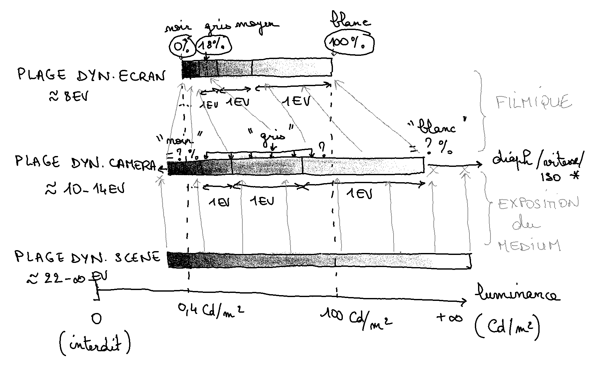

## Introduction

Les gens pensent que les maths sont la science des nombres. En fait, c'est presque un hasard si on utilise des nombres en maths. D'ailleurs, à partir d'un certain niveau, on n'utilise même plus des nombres mais des lettres. Tout ceci parce que les maths ne sont pas la science des nombres, mais celle **des relations entre objets abstraits**.

Les nombres sont une des nombreuses formes que peuvent prendre ces objets. Pour la partie des maths qui nous intéresse dans filmique, c'est à dire l'analyse, on s'intéresse aux liens entre des variables. Ces liens sont formalisés par des équations. Une variable est une abstraction qui peut contenir une valeur spéciale, donc un nombre, ou tout un ensemble de nombres, de façon générale.

On cherche donc à voir comment une variable varie en fonction d'une autre. Cette abstraction simplifie notre travail puisqu'elle va nous permettre de considérer toutes les valeurs possibles pour ces variables, de façon générale, en s'affranchissant des particularités individuelles. Cette abstraction effraie souvent, et les maths paraissent donc complexes, mais en réalité, elles nous permettent de simplifier quantité de problèmes qui seraient simplement insolubles sans elles (et qui le sont restés longtemps).

* * *

Dans filmique, on cherche à projeter une plage dynamique (le contraste maximal de l'image, en quelque sorte) d'entrée sur une plage dynamique de sortie. La plage dynamique de sortie est connue : elle est liée à l'espace RVB de l'écran, où 0% encode le noir le plus noir disponible, 100% encode le blanc le plus blanc possible, et 18% encode le gris dit « moyen ». La plage dynamique d'entrée est inconnue, et relativement imprévisible : c'est pour cela que l'utilisateur doit l'entrer à la main. Elle est imprévisible car elle dépend :

1. du contraste et de la luminance moyenne de la scène d'origine,
2. des réglages d'exposition effectués sur l'appareil photo à la prise de vue,
3. des propriétés du capteur et de son électronique de conditionnement, et de leurs corrections/ajustement apportés par la librairie de décodage de photos brutes (Rawspeed),
4. des réglages effectués au début du pipeline de darktable, car filmique arrive à la fin et hérite de toutes les modifications effectuées par les modules précédents (exposition, niveaux, balance des couleurs, etc.).

Filmique opère une projection de plage dynamique, d'une entrée inconnue vers une sortie connue, donc. Il utilise pour ce faire une projection à 3 points : noir pur, gris moyen et blanc pur. Le gris moyen permet d'ancrer l'exposition générale, le noir et le blanc permettent d'enrouler toute la plage dynamique en conséquence autour du gris, de façon à comprimer le contraste pour rentrer dans les clous en évitant l'écrêtage pur et simple.

Mappage filmique

Sur le schéma ci-dessus, on voit le principe général de la fabrication d'image, de la scène à l'écran. La caméra a une certaine plage dynamique, imposée par ses propriétés physiques et électroniques. La scène a, le plus souvent mais pas toujours, une plage dynamique plus grande. Le réglage de l'exposition (*), sur le boîtier, via l'ouverture, la vitesse et la sensibilité, fait glisser la fenêtre de plage dynamique de gauche à droite, sur l'axe des luminances, de façon à choisir à quelle**s** valeur**s** de luminance on écrête (à la fois à gauche et à droite). Le transfert de luminance scène vers capteur est linéaire (matérialisé par les flèches verticales).

Le principe du mappage filmique (hautement non-linéaire) est mis en évidence par le fait que les flèches représentant le transfert sont clairement non verticales. Le mappage à 3 points permet d'avoir 2 règles de compression/dilation indépendants : une règle pour la zone noir-gris, et une autre pour la zone gris-blanc. On peut donc choisir de dilater ou de comprimer l'un ou l'autre ou les deux. En règle générale, on comprime la zone gris-blanc et on dilate la zone noir-gris, mais rien n'y oblige.

Notez que j'ai représenté les incréments d'EV (ou IL) perceptuels sur une échelle linéaire, pour bien faire apparaître que le premier EV sous le blanc est beaucoup plus large en terme de luminance que le dernier EV avant le noir. Sur une échelle perceptuelle, ils auraient tous la même largeur (fatalement).

Étant donné que le positionnement de la plage dynamique capteur par rapport à la plage dynamique de la scène est arbitraire, via les réglages du triangle d'exposition sur le boîtier, il est impossible de prédire si le 18 % capteur encode un gris moyen sur la scène, ou autre chose. De même, on n'a aucune idée si le 100 % capteur est une surface semi-réfléchissante blanche (donc coïncide avec le blanc du papier, sur le tirage), ou une source de lumière incidente (donc un « blanc spéculaire HDR »), par exemple.

***

(*) Le problème de l'exposition, c'est qu'elle n'a pas le même effet sur la plage dynamique, dans l'appareil photo ou dans le logiciel.

Si vous considérez son influence sur une valeur de luminance isolée, ajoutez un stop sur l'appareil photo ou multipliez la valeur par 2 dans le logiciel, c'est la même chose : vous venez d'ajouter 1 EV ou IL à cette valeur.

La plage dynamique s'étend sur une plage de luminances, physiques, entre une certaine valeur non-nulle et une autre valeur non-nulle. Ces valeurs ne peuvent être nulles car la lumière étant une forme d'énergie, une énergie nulle n'est pas possible sur Terre, et suppose d'être au zéro absolu (− 273°C). Si je multiplie toute la plage dynamique par une valeur, je décale toute la plage dynamique vers la gauche ou vers la droite, sans affecter son amplitude. 12 EV de plage dynamique muliplié par 2 (+1 EV) donne une plage dynamique de 12 EV décalée d'un EV vers la droite.

Mais…

Dans darktable, l'un des premiers modules dans le pipeline est le « point noir/blanc RAW ». Sa fonction est de manipuler l'encodage de l'image RAW de sorte que le bas de la plage dynamique soit calé à 0, et le maximum à 1. De cette façon, on obtient un noir vraiment noir et un blanc vraiment blanc. En effet, pour un écran, 0 % veut dire « éteint complètement les diodes », et pour un tirage, « sature d'encre à fond », ce qui n'est pas un noir absolu, mais le noir le plus dense que le medium peut restituer.

Pour caler le minimum de la plage dynamique, on soustrait aux valeurs RGB une valeur spéciale, appelée le [_dark current_](https://en.wikipedia.org/wiki/Dark_current_(physics)), qui correspond au courant de l'amplificateur qui alimente le capteur. Ce qui veut dire que votre capteur n'enregistre jamais entre 0 % et 100 % de sa plage d'encodage mais entre 3-5 % et 95-100 %. On va donc retrancher 3 à 5 % du signal et le diviser par 92 à 100 %. C'est juste un artifice mathématique appelé normalisation, et on a le droit de l'appliquer car les valeurs RGB sont seulement un encodage numérique, pour représenter une réalité physique.

Sans correction du _dark current_, les noirs seraient systématiquement laiteux. La valeur du _dark current_ est mesurée pour chaque image par le logiciel, sur une partie de l'image que vous ne voyez jamais car elle est recadrée, et qui n'est jamais éclairée par les rayons formés par l'objectifs. En tout temps, les pixels de cette région sont dans le noir et ont donc exactement la valeur du _dark current._

Mais…

Zéro multiplié par n'importe quoi égal zéro. Une fois que la plage dynamique est calée à zéro à gauche, la correction d'exposition ne la translate plus sur l'axe des luminances, mais **l'élargit.** 12 EV de plage dynamique multipliée par 2 (+1 EV) donne une plage dynamique de 13 EV, augmentée d'un EV à droite, mais qui n'a pas bougé à gauche. Souvenez vous… les mathématiques se fichent des nombres, elle ne se préoccupent que des liens entre variables, et ces variables existent dans un intervalle qu'il faut considérer en entier.

Que la plage dynamique soit élargie n'est pas un problème, en soi, puisque l'élargissement est uniforme. En revanche, ce zéro à gauche va poser un problème à filmique, qui utilise un mappage logarithmique, car le logarithme de zéro n'est pas défini. Filmique écrête donc arbitrairement à - 16 EV sous le 100 %, c'est à dire à 0,0015 %. Mais ça va aussi sérieusement nous embêter pour **prévoir les réglages optimaux de filmique** car la plage dynamique qui lui arrive en entrée n'est plus nécessairement celle du capteur, mesurée et tabulée par [DxO Mark](https://www.dxomark.com/category/camera-reviews/) ou [Photons to Photos](https://photonstophotos.net/Charts/PDR.htm).

Ce qui veut donc dire qu'aucun des paramètres de la scène ne peut être prédit à priori, dans filmique. Ça dépend de la scène, du capteur, et de ce que vous avez fait dans le pipeline en amont.

* * *

Là dessus, je retrouve mes utilisateurs à deviser sur la valeur idéale du gris moyen, comme des grecs qui s'extasient devant pi ou le nombre d'or. Puis à dériver des valeurs standard de blanc et de noir, comme s'il suffisait de lire des graphes de plage dynamique des capteurs pour se faire des préréglages aux petits oignons.

Je vais le répéter encore une fois, les maths se fichent des nombres particuliers. Ils apparaissent de façon anecdotique, mais ce ne sont pas eux qui sont intéressants. On s'intéresse à des **variables** et à leurs **connexions**.

Le gris moyen définit la valeur du pivot de la plage dynamique. Et cette valeur, on s'en tape. Ce qui compte, c'est ce qu'elle représente : le centre perceptuel de la plage dynamique.

Si je vous laisse peindre un dégradé de gris allant du noir au blanc, continu et homogène, en vous donnant seulement de la peinture noire et de la peinture blanche, et en vous laissant graduer les proportions pour ajuster la transition tonale du noir au blanc de façon visuellement homogène, je peux déjà vous dire que la proportion sera en gros 80 % de noir et 20 % de blanc au centre du dégradé. La raison est liée à différents effets psychophysiques, qu'on connaît assez bien sans vraiment comprendre leur origine. Donc, pour un medium de nature réflective (en gros, du papier), la valeur du gris moyen est entre 18 et 20 % de la luminance du blanc pur dudit medium. C'est de là que vient la valeur du gris moyen standard.

Mais 20 % de blanc, ça fait combien de lumière ? Ça dépend de l'éclairement que reçoit la feuille. Imaginons qu'elle reçoive 100 Cd/m². Votre gris moyen, c'est 20 Cd/m².

Imaginons maintenant que j'ajoute dans la scène une deuxième feuille, avec le même dégradé de gris, mais éclairée par une autre source de lumière, à 400 Cd/m². Votre gris moyen est à 80 Cd/m².

Faites une photo de cette scène : vous avez deux sources lumineuses, deux valeurs de blanc et deux valeurs de gris, laquelle est la vraie valeur à choisir pour filmique ?

Réponse scientifique : aucune. Réponse pragmatique : on s'en tamponne la nouille avec une babouche. Réponse artistique : n'importe quelle valeur qui met le mieux votre sujet en valeur, qui créée l'ambiance que vous aimez…

Ça n'est rien de plus que le pivot de la transformation, un artifice mathématique, sa valeur ne contient aucune vérité, c'est ce qu'elle représente qui compte : le centre perceptuel de la plage dynamique, qui va servir d'ancrage à la transformation mathématique.

Toute image contient au minimum 2 sources de lumière : la lumière incidente (qui vient directement d'une source primaire : soleil, ampoule), et la lumière réfléchie (qui vient d'une source après avoir rebondit sur une surface : plafond, sol, murs, etc.). Toute image contient donc une infinité de candidats au gris moyen, et c'est une affaire de choix. Arrangez vous simplement pour caler le blanc global de la scène au niveau du blanc le plus lumineux présent dans le cadre pour éviter de perdre les détails des hautes lumières.

Oui, en effet, une image naturelle à contraste modéré va avoir une luminosité moyenne très proche de ce fameux 18 %, mais c'est une réalité statistique et descriptive, pas une règle à suivre nécessairement. Et en cas de high-key ou de contre-jour exposé pour les hautes lumières, cette description devient fausse et il ne faut absolument pas essayer d'y coller.

Idem pour le noir. Ajustez le de façon à récupérer autant de basses lumières que nécessaire sans tomber dans l'effet laiteux, mais ne perdez pas de temps à calculer la plage dynamique à partir de DxOMark, car rien ne garantit que ça soit la plage dynamique effective en entrée de filmique.

* * *

La première opération réalisée dans filmique, c'est log2(RGB / gris), soit une mise à l'échelle logarithmique **conçue/fabriquée/trafiquée** pour que :

- les pixels égaux à cette valeur de gris soient mappés vers 0 EV (car log(1) = 0),
- les pixels plus sombres soient mappées vers des valeurs d'EV négatives,
- les pixels plus clairs soient mappés vers des valeurs d'EV positives.

Pourquoi ? Parce que la pente du logarithme est plus raide entre 0 et 1 qu'entre 1 et l'infini, ce qui permet de dilater les basses lumières beaucoup plus fort qu'on ne comprime les hautes lumières.

Si vous choisissez un gris moyen à 18 %, on divise alors par 0,18, ce qui revient à multiplier par 5,55, ce qui est équivalent à appliquer une correction d'exposition de +2,47 EV. Si vous choisissez un gris moyen à 9 %, on divise par 0,09, ce qui revient à multiplier par 11,11, ce qui est équivalent à appliquer une correction d'exposition de +3,47 EV. Donc, relever l'exposition dans le module exposition ou abaisser le gris de la scène dans filmique revient exactement au même, dans le contexte de cette mise à l'échelle logarithmique.

Mais après la mise à l'échelle logarithmique, vient la courbe en S, qui est une spline que j'ai conçue sur mesure pour se comporter comme les courbes densitométriques de la pellicule argentique. La première contrainte de cette courbe est de mapper le gris de la scène vers le gris de l'écran, peu importe leurs valeurs. Si le gris de la scène utilisé par filmique est égal au gris de l'écran, c'est à dire si vous avez pré-ajusté l'exposition dans le module exposition pour caler ce que vous considérer être les tons moyens autour de 18 %, le gris moyen traverse tout droit à travers le mappage filmique, sans être affectée, ce qui rend le contraste plus facilement contrôlable (ergonomiquement parlant) par effet secondaire, car le gris moyen est alors relativement centré sur le graphe.

Si le gris de la scène utilisé par filmique est loin de 18 %, la courbe est décentrée sur le graphe, déséquilibrée vers la droite. Le contraste disponible se réduit, la courbe est moins souple à contrôler car la plage dynamique est moins symétrique, et les noirs sont moins denses.

Les deux sets de réglages ci-dessous donnent les mêmes résultats pour les tons moyens et les hautes lumières, mais la variante gris 18 % donne des noirs un peu plus denses, car le pied de la courbe est un peu plus bas (et ce, même en réduisant la latitude pour éviter l'écrêtage en bas). À 18 %, la plage dynamique est presque symétrique (blanc ≃ − noir), ce qui est désirable pour des raison purement ergonomiques de contrôle de la courbe (sans lien avec le traitement d'image à proprement parler).



Autre argument en faveur de l'ajustement de l'exposition le plus tôt possible dans le pipeline : le profil de couleur d'entrée. Les matrices utilisées comme profil de couleur d'entrée ne sont pas parfaitement précises sur toute la plage dynamique, et la méthode de profilage par matrice 3×3 est en elle-même relativement grossière. Les matrices sont donc optimisées pour donner une meilleure précision en priorité pour les tons moyens autour des teintes de peau (caucasienne…). Le module exposition, dans darktable, est appliqué par défaut avant le profil d'entrée et permet donc de pousser les tons moyens dans la zone de confort de la matrice, bénéficiant d'un petit supplément de précision à l'application du profil.

Alors pourquoi définir le gris de la scène dans filmique, par défaut à 9 % ? **Par faiblesse**. Las d'être harcelé par les grands Prêtres de la Sainte Église de l'UX intuitive, qui prêchent pour une image conforme au JPEG boîtier en 2 clics®, j'ai cuisiné, pour les faire taire, un réglage par défaut de filmique qui cale le gris à une valeur proche de ce que font la plupart des JPEG de plusieurs constructeurs, et qui donne un résultat médiocrement regardable dès l'activation du module. Là !

Mais on ne m'y reprendra plus, et ça va dégager dans [filmique v4, qui est déjà terminé et en phase de test](https://github.com/darktable-org/darktable/pull/4800). À partir de maintenant, si intuitif n'est pas réconciliable avec rationnel, ça ne sera plus mon problème, parce que rien, mais vraiment rien, en traitement d'image, n'est intuitif de toute façon. Faire une retouche en un minimum d'opérations est un objectif de workflow louable, tant qu'il se soucie de faire la bonne opération au bon endroit du pipeline. Quand ça n'est pas possible, c'est la cohérence des couleurs et du pipeline qui doit primer.

* * *

## Conclusion

Prenez le de la part de quelqu'un qui fait des maths toute la journée : laissez tomber la calculette, et retouchez avec vos yeux. Les maths c'est mon problème, pas le votre. Contentez vous de comprendre ce à quoi le réglage fait référence **dans la vie réelle**, ce qu'il désigne, mais ne restez pas scotchés sur des numéros qui vont passer leur temps à changer d'une image à l'autre.

Il se passe, au cours de la chaîne de traitement d'image, une quantité vertigineuse d'opérations non-intuitives, que vous n'imaginez même pas. J'essaie de vous en expliquer les tenants et les aboutissants en détail, même si ça donne plus de grain à moudre à ceux qui pensent qu'il faut être ingénieur pour utiliser darktable (« La preuve, ses vidéos sont pleines de maths et durent 2 h – Je suis photographe, bordel, pas geek à temps plein »).

Non, il ne faut pas être ingénieur pour l'**utiliser**, mais il faut un certain bagage scientifique pour le **comprendre**. Et le comprendre va vous aider à l'utiliser en allant au devant des problèmes, sans dépendre d'un gourou pour vous dire quoi faire et vous donner des recettes prêtes à l'emploi. Mais rien ne vous empêche de continuer à suivre des recettes si ça marche pour vous. Simplement, dans ce cas, assurez vous que votre gourou ait compris ce dont il cause, ce qui, sur Internet, n'est pas la norme.

Filmique a été conçu pour être robuste, et a été voulu robuste pour pouvoir créer des presets facilement pour un appareil photo donné. Vous faire vos presets maison, en fonction de la sensibilité et de l'appareil utilisés, c'est très bien. Mais assurez vous de baser ces presets sur des hypothèses justes, et non sur des extrapolations de valeurs de DxO Mark, qui en plus d'être probablement gonflées, ne représentent pas ce que filmique voit à son entrée.

La bonne façon de régler filmique, au sens où c'est celle qui va amener le moins de problèmes, c'est de laisser les gris (scène et écran) à 18,45 % et de les oublier. Réglez l'exposition globale jusqu'à ce l'image soit lisible, et son sujet assez clair. Ajustez les niveaux de blanc et de noir de la scène, dans filmique, jusqu'à ce que les ombres soient débouchées, et les hautes lumières non écrêtées. Rappelez vous que ces niveaux définissent les bornes d'écrêtage de la plage dynamique, c'est à dire les valeurs seuil, pas l'intensité de la correction appliqué. Tant que les hautes lumières sont écrêtées, le niveau de blanc est trop bas. Tant que les noirs sont bouchés, le niveau de noir est trop haut. Si les noirs sont laiteux, le niveaux de noir est trop bas.

Vous avez le droit d'ignorer mes conseils tant que vous êtes bien conscient que vous aller le payer à un moment ou à un autre. Jouer avec le gris moyen, c'est se compliquer la vie dans les cas moins sympas, en dégradant l'ergonomie du contrôle de la courbe de contraste. Ce qui ne veut pas dire que ça ne marche pas, mais ça ajoute une difficulté superflue.

**Vous n'êtes pas obligé d'éviter à tout prix l'écrêtage**. Parfois, écrêter les hautes lumières est le meilleur compromis pour préserver un contraste global correct, surtout si les hautes lumières ont déjà été écrêtées par le capteur. Idem, écrêter les basses lumières permet de ne pas sur-amplifier le bruit. Ce qui compte, en photo, c'est que le sujet de la photo soit lisible. Pour le reste, on s'arrange. Tout le secret est dans la douceur de la transition valide/écrêté.

Mais, de grâce, ne cherchez aucune vérité dans des numéros. Vous perdez votre temps, et vous embrouillez vos disciples. Et c'est une faute épistémologique, scientifique, artistique et pratique. Une variable se décrit par sa définition et par sa relation à la réalité, pas par sa valeur. Autrement, c'est de la numérologie que vous faites.
