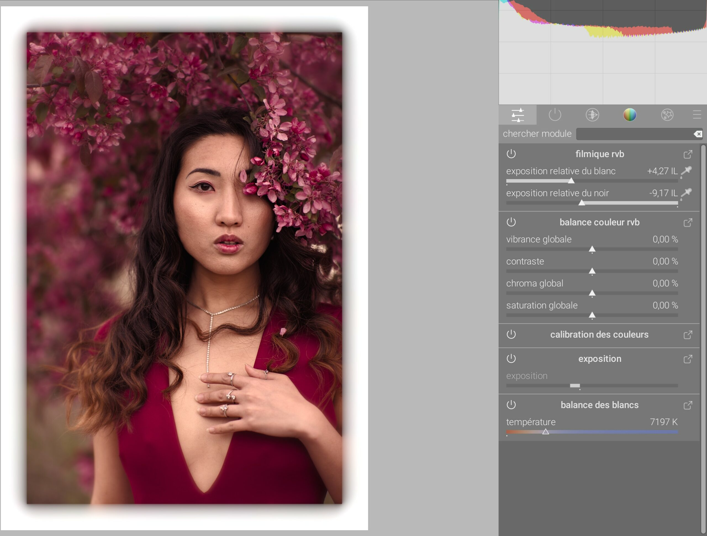
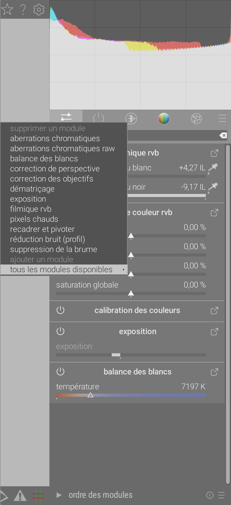
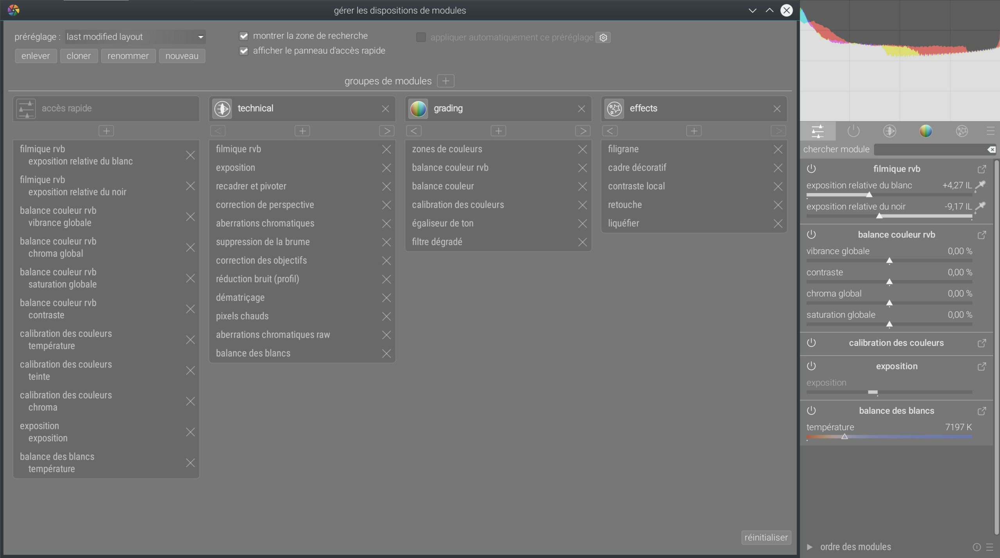
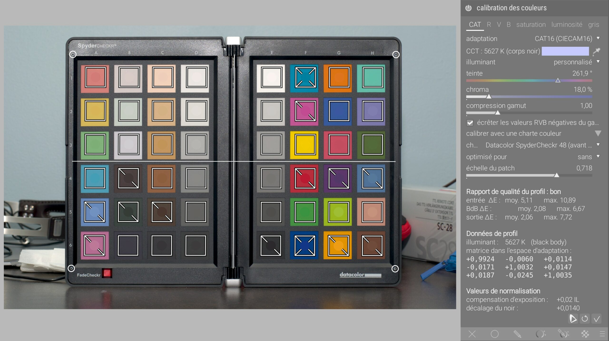
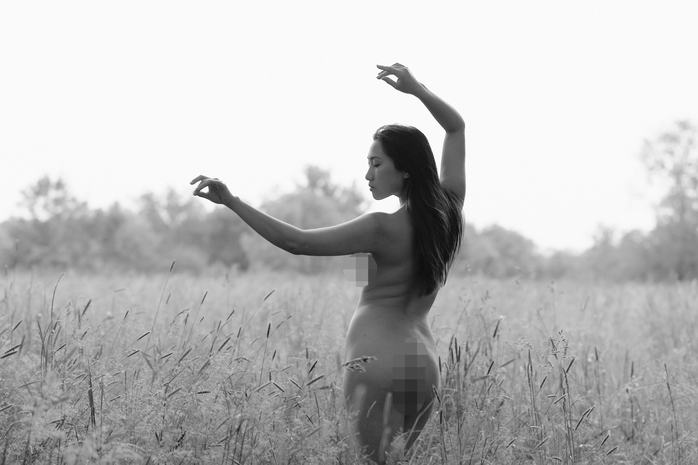
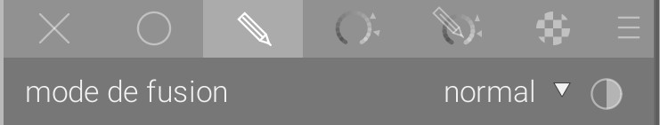
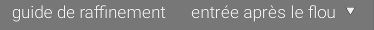

Article original : [anglais](https://www.darktable.org/2021/07/darktable-3-6/). Traductions : [allemand](https://www.bilddateien.de/blog/d2021-07-03-darktable-3-6-weiteres-update.html)

L'équipe de darktable est heureuse de vous annoncer notre seconde édition estivale du logiciel, darktable 3.6. Joyeux Noël (d'été) !

Ceci est la première des deux versions prévues cette année, et nous prévoyons dorénavant sortir deux nouvelles versions chaque année, autour des solstices d'été et d'hiver.

## Documentation

Grâce aux innombrables heures de travail de contributeurs acharnés, toutes les nouvelles fonctionnalités sont entièrement documentées à temps dans le [manuel utilisateur](https://www.darktable.org/usermanual/3.6/en), qui est à présent disponible au format epub, en plus des versions en ligne et pdf. Les liens d'aide à l'intérieur du logiciel ont été mis à jour pour pointer vers le nouveau manuel et l'ancienne version sera officiellement abandonnée. Le manuel utilisateur est cependant seulement en anglais pour l'instant, mais les traductions sont en cours ([ici](https://darktable-org.github.io/dtdocs/)) et nous prévoyons les autres langues à temps pour darktable 3.8.

Cette fois ci, nous lançons aussi une nouvelle version de la documentation lua (qui permet de scripter des extensions), [ici](https://www.darktable.org/lua-docs/3.6/).

## Groupes de modules et panneau d'accès rapide

### Panneau d'accès rapide

Le [_panneau d'accès rapide_](https://darktable.org/usermanual/stable/en/darkroom/organization/quick-access-panel/) est un remplaçant du module _ajustements de base_ et bien plus. Cette fonctionnalité fournit une nouvelle interface aux modules de traitement existants, à un emplacement unique et dans une disposition unifiée. Les utilisateurs peuvent ajouter n'importe quel contrôle de n'importe quel module au panneau d'accès rapide, pour une productivité accrue et une ergonomie améliorée.

Cette nouvelle implémentation ne concerne que l'interface graphique côté utilisateur – les contrôles et les filtres de pixels appartiennent toujours à leur module respectif et peuvent être déplacés dans le pipeline en utilisant leur module original lié.

### Groupes de modules (onglets)

Les modules peuvent à présent être rapidement ajoutés ou retirés des groupes de modules par un clic-droit sur les onglets des groupes. Ceci évite d'avoir à modifier le groupe dans la fenêtre de maintenance, mais gardez à l'esprit que ces changements rapides ne mettent pas à jour vos pré-réglages personnels. Vous pouvez aussi accéder rapidement à la fenêtre _gérer les dispositions de modules_ par un Ctrl +clic sur l'icône des pré-réglages. 

La fenêtre [_gérer les dispositions de modules_](https://darktable.org/usermanual/stable/en/darkroom/organization/manage-module-layouts/) a également été améliorée pour inclure le réglage du panneau d'accès rapide. À présent, vous pouvez aussi appliquer automatiquement un pré-réglage de groupes de modules en fonction du type d'image que vous retouchez/développez.

## Modules de science de la couleur

À présent que le flux de travail relatif à la scène est virtuellement complet en terme de fonctionnalités dans darktable 3.6, il devient le flux de travail par défaut. Le flux de travail hérité (relatif à l'affichage) peut toujours être activé manuellement dans les préférences.

### Nouvelle spline dans filmique RGB

Une nouvelle méthode d'interpolation, appelée _sûre_, est le nouveau réglage par défaut pour construire la courbe de tonalité caractéristique en « S ». Cette méthode utilise un polynôme rationnel (similaire à l'équation de Michaelis-Menten) qui prévient les dépassements et oscillations qui se produisent parfois avec des réglages de contraste et de latitude extrêmes quand les méthodes d'interpolation « dure » et « douce » sont utilisées.

Le compromis est que cette méthode donne un contraste atténué proche du blanc et du noir (sauf si la latitude est augmentée), mais elle permet des réglages bien plus drastiques du côté utilisateur sans effets pervers sur la courbe.

### Balance couleur RGB



La [_balance couleur RGB_](https://darktable.org/usermanual/stable/en/module-reference/processing-modules/color-balance-rgb/) apporte plusieurs innovations uniques pour aider les coloristes à développer des images de façon cinématographique et avec un niveau de contrôle raffiné, dans un flux de travail relatif à la scène et prêt pour le HDR.

Premièrement, il assainit la gamme de couleur dans l'espace RGB de travail, à la sortie du module et à chaque conversion interne d'espace de couleur. Ceci assure que la retouche de couleur ne pousse pas les couleurs hors de la gamme valide, ce qui peut arriver rapidement lorsqu'on augmente la saturation (comme dans l'ancien module _balance couleur_). Les retouches de couleur ambitieuses deviennent donc beaucoup sécuritaires, ce qui permet la création de couleurs riches qui ne se dégraderont pas en artefacts plus tard.

Deuxièmement, il utilise des masques de luminance pour partager explicitement l'image en ombres, tons moyens et haute lumières réels, de sorte que chacun puisse être corrigé en couleur séparément. Le slope/offset/power _(pente, décalage, puissance)_ classique affecte principalement les hautes lumières, ombres et tons moyens, mais implicitement et par un effet secondaire de l'algorithme. L'algorithme interne actuel est toujours le slope/offset/power habituel, mais le slope a été décomposé en deux parties – un lift des ombres et un gain des hautes lumières – chacune étant appliquée séparément sur différents masques de luminance. Les masques de luminance sont définis par l'utilisateur et visualisables pour permettre un contrôle complet et transparent des régions où les réglages s'appliquent.

Troisièmement, ce module introduit un vrai réglage de « saturation » qui respecte la définition de la saturation donnée par Munsell et la CIE (Commission Internationale de l'Éclairage) : la richesse de couleur relative à la luminosité. Il est important de noter que 99 % de ce que les logiciels appellent « saturation » est en réalité un réglage qui affecte la _chroma_ (richesse de couleur indépendante de la luminosité). Alors que désaturer (en saturation réelle) éclaircit également et permet d'atteindre des couleurs pastels (ainsi, rouge désature en rose), réduire la _chroma_ se fait à luminosité constante et permet seulement d'atteindre la valeur de gris ayant la même luminance (rouge dégrade vers gris), ce qui est peu plaisant et incohérent avec la peinture. Un réglage de chroma est également fourni. Les deux réglages de saturation et de chroma peuvent être manipulés globalement ou séparément dans les ombres, tons moyens et hautes lumières, en utilisant les masques de luminance.

Finalement, la retouche de couleur linéaire a lieu dans un espace RGB spécial (publié en 2019) qui présente une répartition uniforme des teintes de Munsell sur l'ensemble de la gamme de luminance. Ceci rend les corrections de couleurs plus uniformes et mieux équilibrées pour toutes les teintes, ce qui n'est généralement pas le cas pour les espaces RGB standards (sRGB/Rec709, Rec2020, ProPhoto RGB, etc.). La partie perceptuelle de la retouche de couleur utilise l'espace JzAzBz (publié en 2017), qui est déjà utilisé par le masques paramétriques relatifs à la scène. C'est un espace de couleur entièrement perceptuel (similaire au CIE Lab 1976) adapté aux signaux HDR jusqu'à 10 000 Cd/m². Pousser la chroma ou la saturation garde la teinte inchangée, ce qui peut facilement être vérifié avec le nouveau graphe vectorscope (voir plus bas), et n'était pas le cas avec les autres réglages de saturation et de chroma de darktable.

Les réglages de vibrance et de contraste ont été portés d'autres modules pour tirer parti de l'espace RGB spécial utilisé dans la balance couleur RGB, ce qui en fait l'organe central pour toute chose relative à la couleur dans darktable 3.6, avec une science de la couleur moderne, cohérente avec la perception et prête pour le HDR.

Le module balance couleur RGB est fourni avec un kernel OpenCL pour externaliser le calcul sur la carte graphique, 6× à 22× plus rapide que l'implémentation pour processeur standard, selon le matériel. Quelques exemples de ce que la balance couleur peut faire pour vous (avant/après) :











### Calibration des couleurs : ajout du support pour color checker

Les _color checkers_ sont des outils bien connus de l'industrie, qui consistent en une charte de patchs de couleurs de référence, à photographier sur le lieu de prise de vue, pour assurer la constance et la précision des couleurs sur une série d'images, peu importent les conditions d'éclairage et l'appareil photo utilisé. 

Une nouvelle interface a été ajoutée au module [_calibration des couleurs_](https://darktable.org/usermanual/stable/en/module-reference/processing-modules/color-calibration/#extracting-settings-using-a-color-checker) qui vous permet d'extraire rapidement la meilleure balance des blancs et les meilleurs réglages de mixage des canaux, à partir de la photo d'un color checker, afin de minimiser la déviation de couleur. Un solveur interne calcule les réglages optimaux en suivant différentes stratégies définies par l'utilisateur, par exemple pour minimiser la déviation colorimétrique en priorité sur certaines teintes ou en moyenne.

Un rapport donne une rétroaction à l'utilisateur sur la qualité du fitting, en montrant le delta E moyen et maximum de la déviation colorimétrique résiduelle après calibration. Les réglages ainsi calculés peuvent ensuite être copiés-collés à toutes les photos prises dans le mêmes conditions d'éclairage ou définies comme pré-réglage, en tant que correction primaire des couleurs.

La même interface peut aussi être utilisée comme contrôle qualité, pour mesurer la déviation colorimétrique sur un color checker. Ceci est utile pour juger la qualité d'un profil ICC générique d'entrée, par exemple.

Les Passport 24 de chez X-Rite/Gretag Macbeth (éditions pré-2014 et post-2014) ainsi que les Spyder ColorCheckr 24 et 48 (éditions pré-2018 et post-2018) sont actuellement supportés. Nous ne prévoyons pas laisser les utilisateurs ajouter leur propres chartes, et seulement des chartes de référence venant de manufacturiers réputés sérieux seront ajoutées dans le futur.

Notez que cet outil est prévu pour raffiner les profils de couleur standard d'entrée des caméras, pas pour les remplacer ou pour créer des profils ICC génériques.

Cette fonctionnalité rend les ajustements de couleur beaucoup plus rapides et fiables, en rendant darktable utilisable dans des chaînes de couleur exigeantes et dans des environnements professionnels, ou simplement en permettant une correction efficace des déviation de couleur parasites et des éclairage à faible indice de rendu des couleurs.

darktable 3.6 également introduit un kernel OpenCL pour la calibration des couleurs, qui devrait être 1,3× à 8× plus rapide que l'implémentation pour processeur standard, suivant le matériel.

Un exemple de ce que la calibration des couleurs peut faire pour vous : à gauche, on se contente de faire la balance des blancs sur la rampe de gris (delta E moyen de 2,23), à droite on fait une calibration complète (delta E moyen de 1,60). On voit que les bleus apparaissent délavés sur la version non calibrée.



## Module censurer

Le module [_censurer_](https://darktable.org/usermanual/stable/en/module-reference/processing-modules/censorize/) vous permet de flouter et de pixéliser rapidement des parties de l'image, d'une façon esthétique, pour des fins d'anonymisation et pour respecter les conditions d'utilisation des réseaux sociaux relatives à l'anatomie. Il applique un flou gaussien et un bruit gaussien physiquement réalistes en RGB linéaire. En tant que tel, il peut aussi être utilisé pour différents effets créatifs, tels que l'effet Orton (_bloom_).

© Aurélien Pierre

Notez que le module _censurer_ n'empêche pas une reconstruction scientifique des parties censurées (en utilisant l'apprentissage machine et l'intelligence artificielle, notamment). Pour une réelle anonymisation, résistante à la reconstruction scientifique, vous devez peindre une couleur solide par dessus les parties sensibles de l'image.

## Recadrage, formes, retouche et déformations du pipeline

Un nombre important d'améliorations ont été réalisées de sorte que le pipeline puisse mieux gérer les modules utilisant les formes et des déformations.

Quand des formes sont dessinées sur l'image, elles sont en réalités dessinées dans l'espace de coordonnées du raw original, et déformées au cours du pipeline avec les transformations appliquées à l'image. Par exemple, ceci signifie que des lignes droites de dégradé peuvent apparaître courbes, ou des masques circulaires peuvent apparaître elliptiques. Dans darktable 3.6, vous verrez ces déformations des masques dessinés _avant_ de les placer sur l'image et pendant que vous éditez les formes déjà positionnées.

Le module _retouche_ a aussi été amélioré pour mieux gérer les déformations des formes source et destination. De plus, le masque gradient peu maintenant avoir sa courbure réglée avant de le placer sur l'image, et avec une meilleure précision.

Le module _recadrer et pivoter_ existant devient excessivement difficile à maintenir, principalement parce qu'il tente de faire 3 choses en même temps (recadrer, pivoter, corriger la perspective), et le code qui réalise ces opérations est devenu très complexe. Un projet en cours consiste à améliorer et à remplacer ce module par des éléments basiques, et un nouveau module, [_recadrer_](https://darktable.org/usermanual/stable/en/module-reference/processing-modules/crop/), a été créé. Ce module est placé après _retouche_ dans le pipeline, de sorte que _retouche_ puisse échantillonner des sources à l'extérieur de la zone recadrée. Il est vivement recommandé d'utiliser ce nouveau module pour le recadrage, et de recourir à l'original _recadrer et pivoter_ seulement pour la rotation et la perspective.

## Dématriçage et masque de détails

### Nouvel algorithme de dématriçage.

Un nouvelle méthode, [Ratio-Corrected Demosaicing](https://github.com/LuisSR/RCD-Demosaicing) (RCD), a été ajoutée au module [_dématriçage_](https://darktable.org/usermanual/stable/en/module-reference/processing-modules/demosaic/) pour les capteurs à matrice de Bayer. Il s'agit essentiellement d'une amélioration de la méthode AMaZE, qui offre pratiquement le même niveau de détails mais avec moins d'artefacts. En particulier, les photos à bas ISO et les clichés d'astrophotographie seront plus lisses et le bruit sera moins granuleux. Cette méthode est aussi significativement plus rapide que AMaZE et une version OpenCL est fournie pour l'exécution sur carte graphique.

Pour tirer parti des avantages de différentes méthodes de dématriçage, de nouvelles méthodes de dématriçage mixte ont aussi été ajoutées, dans la même veine que RawTherapee. Ceci permet de dématricer différentes parties de l'image avec différents algorithmes, en fonction du contenu.

### Amélioration du masque basé sur les détails



Une nouvelle option de masquage paramétrique a été ajoutée pour vous permettre d'inclure ou d'exclure les contours nets et les détails des masques paramétriques. Ceci est spécialement utile pour appliquer des flous et des améliorations de netteté qui ignorent les régions hors focus (bokeh), ou au contraire ne s'appliquent que sur les régions hors focus, pour éviter de sur-accentuer les détails déjà nets. Cette option n'est disponible que pour les fichiers RAW, car elle dépend des détails calculés à l'étape du dématriçage.

## Refactorisation des masques

L'interface graphique des masques a été améliorée. Les modes de fusion “inverses” sont à présent accessibles à partir d'une icône “inverser” et les étapes d'amélioration des masques par floutage (utilisant un flou gaussien) et par raffinement (utilisant un filtre guidé sensible aux bords) peuvent être appliqués dans un ordre défini par l'utilisateur.

Le réglage par défaut des modes de fusion est d'appliquer la sortie du module par dessus son entrée avec une transparence optionnelle (utilisant la classique [composition alpha](https://en.wikipedia.org/wiki/Alpha_compositing) et supposant une entrée complètement opaque). Les modes inverses appliquent l'entrée par dessus la sortie.

Jusqu'à darktable 3.4, le raffinement de masque (utilisant le filtre guidé) était toujours appliqué avant le floutage du masque (utilisant un flou gaussien). Les deux techniques ont pour but d'assurer que des régions contiguës de l'image soient masquées de façon également contiguë, sans trous, notamment en présence de bruit ou lorsque des masques de chromaticité sont utilisés. Cependant, le flou gaussien n'est pas sensible aux bords et peut fuir hors des limites des régions masquées, produisant des halos autour des bords dans certains cas, alors que le filtre guidé est explicitement forcé à suivre les bords de près. Bien que le flou gaussien soit plus efficace pour gérer le bruit, l'utiliser après le filtre guidé annule la sensibilité aux bords de ce dernier. Les appliquer dans l'ordre inverse peut aider à corriger le bruit de façon plus agressive tout en gardant les propriétés du filtre guidé aux bords (utilisez des petits rayons de floutage).

## Aberrations chromatiques

### Ancien module

Le module _aberrations chromatiques_ existant a été renommé [_aberratons chromatiques raw_](https://darktable.org/usermanual/stable/en/module-reference/processing-modules/raw-chromatic-aberrations/) a possède à présent une nouvelle option pour éviter les virages de couleur. Notez que ce module ne fonctionne que pour les capteurs à matrice de Bayer et est donc limité dans son intérêt.

### Nouveau module

Un nouveau module [_aberrations chromatiques_](https://darktable.org/usermanual/stable/en/module-reference/processing-modules/chromatic-aberrations/) a été ajouté. Il opère en RGB après le dématriçage et est donc disponible pour toute image et tout type de capteur. Il amène une nouvelle technique de filtrage (inspirée par les [manifolds adaptatifs](https://www.inf.ufrgs.br/~eslgastal/AdaptiveManifolds/), publiés en 2012) qui permet de guider, de façon plus ou moins proche, deux des canaux RGB avec le troisième, pour assurer que les gradients des 3 canaux soient corrélés.

© Rawfiner – Correction des aberrations chromatiques avec le nouveau module

Notez que les aberrations chromatiques se produisent soit lorsque les gradients des 3 canaux sont légèrement décalés dans le plan, les uns par rapport aux autres, soit parce que les gradients sont plus flous sur un canal que sur les autres. Le rayon du voisinage utilisé pour corriger les gradients et la force de la correction sont définis par l'utilisateur. Ceci fonctionne beaucoup mieux pour les aberrations chromatiques larges (au dessus de f/2.8) que l'ancien module et régularise une partie du bruit par effet secondaire. Il peut aussi être utilisé sur plusieurs instances en utilisant différentes stratégies de guidage pour venir à bout des cas les plus difficiles sans produire de franges grises sur les contours.

### Correction des objectifs

La correction des aberrations chromatique du module _correction des objectifs_ peut à présent être totalement écrasée. Également, un bug dans le remappage des coordonnées a été réglé, où des aberrations étaient en fait _créées_ sur les bords de l'image quand le réglage manuel était utilisé.

## Vectorscope



Une vue [vectorscope](https://darktable.org/usermanual/stable/en/module-reference/utility-modules/shared/histogram/#vectorscope) a été ajoutée en complément de l'histogramme et de la forme d'onde. Le vectorscope est un diagramme teinte/chroma qui montre la [chromaticité](https://fr.wikipedia.org/wiki/Diagramme_de_chromaticit%C3%A9) isolée des informations de luminosité ou de spatialité.

Le graphe représente le volume de couleur en restituant les couleurs les plus fréquentes dans l'image par des points plus lumineux. Les points sont colorés à la chromaticité qu'ils représentent.

Un réticule marque les primaires et secondaires de l'espace de couleur défini par le profil de l'histogramme. Un anneau de teinte représente la chroma maximale admissible pour chaque teinte (en RGB relatif à l'affichage) dans le profil de l'histogramme.

Le vectorscope peut décrire l'image soit dans l'espace [CIE](https://en.wikipedia.org/wiki/CIELUV) [Luv](https://en.wikipedia.org/wiki/CIELUV) (un standard bien connu) ou [JzAzBz](https://www.osapublishing.org/oe/fulltext.cfm?uri=oe-25-13-15131&id=368272) (plus fidèle perceptuellement mais plus lent à calculer). Il peut représenter la chroma sur une échelle linéaire (fidèle au modèle de couleur) ou logarithmique (plus facile à lire pour les images à faible chroma).

Cet outil, à l'origine utilisé dans les éditeurs vidéo, est utile pour ajuster la colorimétrie d'une série de photos de façon cohérente en montrant quelles sont les couleurs dominantes. Il peut aussi être utilisé pour analyser, enseigner et mieux comprendre les effets des réglages des modules sur la couleur des images.

En revanche, il ne faudrait pas surestimer ce que le vectorscope peut faire :

- L'anneau de teinte n'est pas une vérification de gamut, étant donné qu'une couleur peut être représentée à l'intérieur mais se trouver tout de même hors gamut en raison de sa luminance,
- Lorsqu'on ajuste une image en se basant sur un color checker, des résultats plus rapides et plus précis seront obtenus en utilisant le profilage inclus dans le module _calibration des couleurs_.
- Le vectorscope n'a pas de ligne de teinte de peau. Les teintes de peau varient en chromaticité de sorte que toute ligne de ce type représenterait inévitablement une supposition a priori. De plus, cette vue ne fournit aucun guide spécifique pour corriger un contenu spécifique de l'image.
- Le vectorscope représente un encodage colorimétrique de l'image, qui diverge inévitablement de la perception du spectateur.

## Changements dans l'interface utilisateur de la chambre noire

La ligne d'en-tête des modules de traitement a été modifiée pour inclure un indicateur de masque, pour les modules où un masque dessiné ou paramétrique a été utilisé. Vous pouvez cliquer sur cette icône pour montrer ou cacher le masque.

Un certain nombre de modules de traitement incluent des éléments graphiques dessinés (par exemple, les graphhs de _filmique RGB_ ou les courbes de l'_égaliseur de contraste_). Ces éléments ont un ratio d'aspect de 16:9 pas défaut, mais peuvent à présent être redimensionnés par survol de la souris, puis en défilant avec la roulette en maintenant la touche Ctrl.

## Performance

De nombreuses routines de pixels ont été optimisées pour la vitesse sur CPU et GPU, plus particulièrement les conversions intermédiaires d'espaces de couleurs qui surviennent entre les modules Lab et RGB ou dans les masques paramétriques, de même que les transformations de coordonnées des masques dessinés. Dans ces parties du code, vous pouvez attendre une accélération jusqu'à 3×.

Les utilisateurs qui souhaitent un maximum de performance sont invités à compiler darktable eux-même en utilisant le build `Release` de façon à activer la totalité des optimisations disponibles sur leur matériel particulier : voir les explications [courtes](https://github.com/darktable-org/darktable#compile) ou [détaillées](https://www.darktable.org/install/). Notez que les paquets pré-compilés utilisent des optimisations conservatrices et taille-unique dont le fonctionnement est garanti sur tout type de matériel depuis 2004 (Intel Pentium IV), mais ne tireront pas parti de toutes les optimisations disponibles sur votre matériel spécifique.

## Modules dépréciés

Les modules suivant ont été dépréciés parce qu'ils comportent des erreurs de conception fondamentales qui ne peuvent être réglées ou parce qu'ils sont maintenant redondants. Ils ont été remplacés par des alternatives :

- Suppression des taches (c'est un sous-ensemble des fonctionnalités déjà fournies par le module _retouche_),
- Vibrance (intégré dans la _balance couleur RGB_),
- Ajustements de base (remplacé par le _panneau d'accès rapide_),
- Suppression des franges (remplacé par le nouveau module _aberrations chromatiques_).

Ces modules sont conservés pour assurer la compatibilité des anciens traitements mais ne sont plus disponibles pour des nouvelles retouches.

## Changements dans la table lumineuse

### Importation

La version 3.6 de darktable remplace les deux boutons _Image…_ et _Dossier…_ du [module d'import](https://darktable.org/usermanual/stable/en/module-reference/utility-modules/lighttable/import/) par deux nouvelles options :

- l'option _ajouter à la bibliothèque_ prend les images qui existent déjà sur votre système de fichiers et les ajoute simplement à la base de données de la bibliothèque (équivalent de la fonctionnalité précédente),
- l'option _copier et importer_ créée des copies des images avant de les ajouter à la bibliothèque. Ceci sera utilisé la plupart du temps pour des images présentes sur des supports de stockage externe comme une carte mémoire ou un appareil photo, qui doivent être copiées sur votre système de fichier local avant import. Vous pouvez choisir de renommer les images dans le processus de copie.

Les deux options vous proposent une fenêtre qui vous permet de sélectionner individuellement des images ou des dossiers pour l'import, et permet une prévisualisation optionnelle des miniatures avant l'import.

Une nouveauté est la possibilité de spécifier en lot des métadonnées et des mots-clés directement à l'import des images (auparavant accessible dans un sous-menu).

De plus, un problème concernant la notation par étoile à l'import a été réglé. L'utilisateur peut maintenant choisir une note à partir des données Exif de l'image (telles que définies dans l'appareil photo) ou une note arbitraire unique forcée à l'importation pour toutes les images.

## Collections

Le module "collecter" a été renommé [collections](https://www.darktable.org/usermanual/3.6/en/module-reference/utility-modules/shared/collections/) pour fournir plus de clarté et de cohérence avec les autres modules. Vous pouvez désormais permuter entre la vue dossier et la vue pellicule en cliquant sur une entrée en tenant Ctrl + Maj enfoncées.

Dans la vue dossier, vous pouvez permuter entre différentes vues des images, comme suit :

- Double clic pour montrer seulement les images dans le dossier sélectionné,
- Ctrl + clic pour montrer seulement les images des sous-dossiers,
- Maj + clic pour montrer les images du dossier courant et de ses sous-dossiers.

## Changements aux cartes et géolocalisation

Un certain nombre de changements ont été faits à la vue [carte](https://www.darktable.org/usermanual/3.6/en/map/) et la disposition du module [géolocalisation](https://www.darktable.org/usermanual/3.6/en/module-reference/utility-modules/shared/geotagging/) a été mise à jour à la fois dans les vues table lumineuse et carte.

## Autres

- Vous pouvez utiliser des raccourcis clavier pour accéder aux contrôles de fusion dans les modules de traitement,
- Certaines préférences ont été déplacées du menu des préférences globales vers de nouvelles options accessibles depuis le menu "pré-réglages" des modules,
- Changement dans l'attribution des mots-clés : une façon rapide d'organiser la structure des mots-clés est de les glisser-déplacer. Dans le mode de visualisation en arborescence, vous pouvez glisser n'importe quel mot-clé (nœud ou enfant) et le déplacer sur n'importe quel autre mot-clé (nœud ou enfant). Le premier mot-clé et ses enfants, s'il y en a, deviennent alors des descendants du second mot-clé. Déplacer sur un nœud l'ouvre automatiquement,
- Appuyer sur le bouton "exporter" dans le bas de la fenêtre des préférences/préréglages vous permet d'exporter tout vos préréglages vers un dossier,
- Vous pouvez maintenant utiliser le bouton "réinitialiser" sur le module de styles pour supprimer tous les styles,
- À l'intérieur de la vue table lumineuse, vous pouvez à présent permuter entre les modes d'affichages directement depuis une nouvelle suite d'icônes qui remplacent le menu déroulant,
- Le module d'export a été ajouté à la colonne de gauche dans la chambre noire,
- Vous pouvez créer une nouvelle instance d'un module initialisée avec un pré-réglages directement en faisant un clic droit sur le nom du pré-réglage (au lieu de clic milieu, tel que dans la 3.4). Ceci devrait permettre de rendre le raccourci accessible à d'avantage d'utilisateurs. De la même manière, clic droit sur le menu de multi-instanciation créée directement une nouvelle instance du module,
- La boîte de dialogue qui apparaît avant d'exporter une image en mode "ré-écrire" est à présent optionnelle,
- La mise à l'échelle sur les écrans 4K et à haute densité de pixels (_high DPI_) est corrigée, de sorte que le zoom à 100 % est bien 1:1 pixel peu importe la mise à l'échelle de l'affichage global,
- Le contrôle manuel de la mise au point des appareils Nikon en mode connecté (_tethering_) est à présent supporté dans la vue capture
.

## Ce qui vient

La prochaine version est déjà prévue pour décembre. Voici quelques éléments que vous pouvez attendre :

- Une nouvelle méthode pour définir les raccourcis, qui peut être utilisée avec une gamme bien plus large de périphériques d'entrée, incluant des contrôleurs MIDI,
- Un nouveau module de diffusion/netteté, qui utilise un modèle physique de diffusion des particules modifié pour être sensible aux bords. Ce module peut être utilisé pour ajouter ou retirer de la diffusion atmosphérique, du flou d'objectif, prolonger l'image dans les hautes lumières écrêtées et dans les portions d'images endommagées, ou pour créer des effets artistic comme simuler l'aquarelle ou le dessin au trait,
- De nouvelles améliorations du module histogramme,
- Des changements à la vue impression pour permettre l'affichage de plusieurs images,
- D'avantages d'améliorations de la gestion de la couleur à l'intérieur du pipeline de pixels,
- Un nouvel algorithme de dématriçage LMMSE, particulièrement adapté aux images à haut ISO.



_Traduit depuis l'article original en anglais. Images © leurs auteurs respectifs, réutilisation non permise sans autorisation expresse. Image d'en-tête sous licence CC-BY-NC 4.0 par Mica._

**Mentions complémentaires**

Le support des fichiers RAW Canon CR3 n'a pas été terminé à temps pour la release, et la plupart des distributions Linux n'incluent toujours pas la version de Exiv2 qui permet ce support. Le code est cependant presque terminé et en cours de test. Vous pouvez télécharger une version non-officielle de darktable 3.6 incluant le support **expérimental** de CR3 [ici](https://discuss.pixls.us/t/darktable-3-6-0-inofficial-build-with-cr3-support-osx-win10/25703) (**utilisation à vos risques et périls**).
